.. _advancedCFD:

Community level wind simulation: WE-UQ coupled with BRAILS++
==========================================================

**Tanmay Vora, Jieling Jiang, Abiy F. Melaku, Seymour Spence**

+----------------+-----------------------------------------------------------------------------------------------------------+
| Example files  | `WE-UQ/Examples/weuq-0019 <https://github.com/NHERI-SimCenter/WE-UQ/tree/master/Examples//advancedCFD//>`_  |
+----------------+-----------------------------------------------------------------------------------------------------------+

Introduction
^^^^^^^^^^^^^

This module provides a workflow to simulate wind flow inside a community. The building footprints are generated using the  inventory. To install BRAILS++, the user needs to run the command: pip install brails. Additionally, the user needs to install the geopandas, shapely, pyproj, trimesh, rtree, and mapbox-earcut python libraries using the command: ``pip install geopandas shapely pyproj trimesh rtree mapbox-earcut``. To generate the computational domain, the user needs to provide the longitude and latitude of the center point, the bounding radius, and the longitudes and latitudes of the bounding box encompassing the region of interest. The user needs to have  downloaded on their computer. The user needs to input the parameters for the CFD simulation following the workflow shown in :numref:`fig-advanced-cfd-1`, using the developed Python script for this module, then run the wind simulation in OpenFOAM, and finally view the results in Paraview.

.. _fig-advanced-cfd-1:

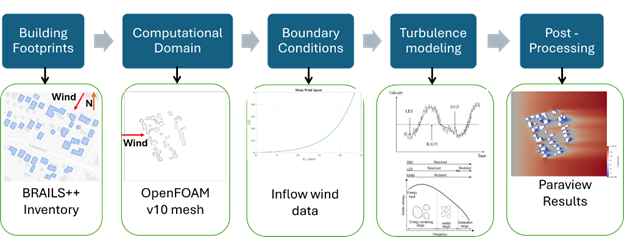

   The WE-UQ and BRAILS++ integration workflow.

Detailed Workflow
^^^^^^^^^^^^^^^^^^^^
Generating the GeoJSON files with building footprints and their heights:

Generating the GeoJSON files with building footprints and their heights
"""""""""""""""""""""""""""""""""""""""""""""""""""""""""""""""""""""""""""""
The BRAILS++ inventory contains the longitudes and latitudes of building footprints with their respective heights and outputs them as a geojson file, which can be viewed in a GIS (Geographic Information System) software such as ArcGIS or QGIS. The user needs to input the center point and the bounding radius around the community of interest as shown in :numref:`fig-advanced-cfd-2`. Then, the user must input two coordinates (minimum and maximum extents) for the bounding box that encompasses the region of interest (ROI) as shown in :numref:`fig-advanced-cfd-3`. The ROI must contain buildings within the bounding radius that are of more importance than others. The latitude and longitude of a specific point can be obtained by clicking at a location on the google maps. For the ROI, the latitude and longitude of the two points marked with red circles in :numref:`fig-advanced-cfd-3` are required as inputs. The user also has an option to choose the footprint scraper (USA, OSM, and Microsoft) to retrieve the building information. The default scraper is USA. These inputs generate two geojson files named “inventoryTotal.geojson” and “inventoryROI.geojson”. The former contains information about all buildings inside the bounding radius, and the latter contains information about buildings inside the bounding box.

.. _fig-advanced-cfd-2:

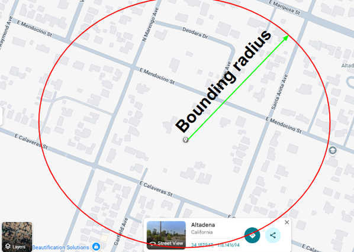

   Center coordinate and the bounding radius of the total region.

.. _fig-advanced-cfd-3:

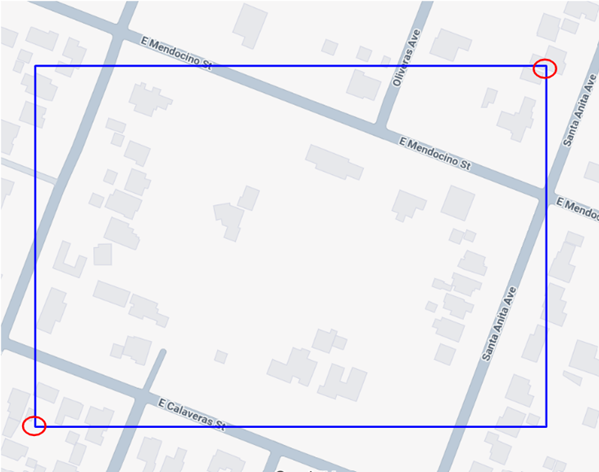

   Bounding box for the region of interest.

Defining the computational domain and creating the mesh
""""""""""""""""""""""""""""""""""""""""""""""""""""""""""

The computational domain consists of 8 boundary faces: inlet, outlet, side1, side2, top, ground, ROI, and Surrounding. The inlet face is where the inflow of wind is defined. According to the COST 732 (Franke et al. 2007) recommendations, the inlet face must be at least a distance of five times the maximum height (5Hmax) of the buildings in the domain, from the outermost footprint coordinate. The orientation of the inlet face shall be perpendicular to the wind direction. The sides will be parallel to the wind direction. The COST recommendations suggest the lateral boundaries to be at least a distance of 5Hmax from the community. The outlet boundary is where the flow leaves the domain. It needs to be at least a distance of 15Hmax from the community. The top boundary of the domain must also be a distance of more than 5Hmax from the top of the building with maximum height. Since the horizontal extents of the domain are much larger than the vertical extent, the default value for the top boundary is 15Hmax from the ground. Ground, ROI, and surrounding boundary faces are wall boundaries where the flow can’t enter and represent the ground, the buildings in ROI, and the buildings surrounding the ROI, respectively. A depiction of computational domain extents is presented in :numref:`fig-advanced-cfd-4`. 

For this step, the user is expected to provide the wind direction in the community, the domain extents (optional, default values are according to the COST 732 recommendations), the nominal computational cell size for blockMesh, the mesh refinement regions, the level of mesh refinement for each region, and the levels of mesh refinement for the ROI and surrounding buildings. Level n mesh refinement would mean the cell size in that region would be . If the user doesn’t define the mesh refinement for the ROI buildings and the Surrounding buildings, the level of refinement for the surrounding would be the minimum level of refinement for the refinement boxes + 1, and the level of refinement for the ROI would be the level of refinement for the surrounding + 1. An example mesh refinement is shown in :numref:`fig-advanced-cfd-5`. The origin (0,0,0) of the computational domain is at the bottom right corner of the inlet plane. The domain extents are defined in terms of Hmax. For example, if the user enters a value of 10 for inlet distance multiplier, the inlet will be 10Hmax from the buildings. The user also has the option to name the OpenFOAM case folder (the default is “case”). The outputs generated from this step are saved in the case/system folder and case/constant/triSurface folder. The blockMeshDict and snappyHexMeshDict files are saved in the case/system folder, while the ROI.stl and Surrounding.stl files are saved in the case/constant/triSurface folder. 

.. _fig-advanced-cfd-4:

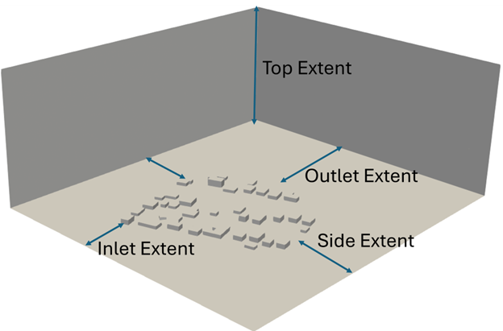

   Domain extents.

.. _fig-advanced-cfd-5:

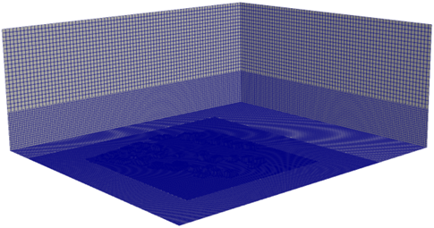

   Levels of mesh refinement.

Defining the Boundary Conditions
""""""""""""""""""""""""""""""""""
The boundary conditions are one of the most important parts of a CFD simulation. Therefore, it is essential that they are defined properly. The user has the choice to use a steady logarithmic velocity profile or generate a time-varying velocity profile using the digital filter method described by the turbulent inflow tool (TInf). For the logarithmic profile, the user needs to provide the reference wind speed (Uref), the reference height (Zref), and the roughness length (zo). On the other hand, if the user chooses turbulent inflow, they must provide a CSV file containing the following information: points in the vertical direction, mean wind speed at those points, the 6 Reynolds stress tensor entries, and the 9 length scales. All of these quantities must occupy a column in the CSV file. The side boundaries could be defined as either slip or cyclic. The slip condition mimics the symmetry boundary condition, i.e., there is no flow through the surface. The top boundary is very far away, and hence a slip condition is applied there. The outlet surface is in a zero-pressure condition. The ground, ROI, and surrounding surfaces are walls; therefore, the velocity is zero at these surfaces. The standard wall functions are applied to other variables. The user can choose between smooth and rough wall functions. 

Choosing the turbulence model and setting up the simulation
"""""""""""""""""""""""""""""""""""""""""""""""""""""""""""""""

There are three ways to model turbulence: Reynolds averaging (RANS), large eddy simulations (LES), and direct numerical simulations (DNS). For atmospheric flow, using DNS is not feasible due to the very high Reynolds number and a large variation in the length scales. Hence, the user has an option to choose between RANS and LES turbulence models. The RANS model predicts the mean flow very well, but models turbulence using a  model (Launder and Spalding 1974), whereas LES models the largest turbulent eddies in the flow and models the subgrid scale (SGS) eddies using a Smagorinsky model (Smagorinsky 1963). 

If the user chooses the RANS model, the inflow velocity profile is automatically chosen to be logarithmic, given by the following equation:

where  is the friction velocity,  is the von Karman constant, z is the vertical coordinate, and  is the roughness length. The initial files with the variables (U, k, epsilon, p, and nut) are saved in the case/0 folder. The turbulence parameters are written in the “turbulenceProperties” file and saved in the case/constant folder. The user has the option to also prescribe the kinematic viscosity of air (default is  m2/s). This value is saved in the “transportProperties” file in the case/constant folder. The user also needs to provide the end time of the simulation and the time step. The number of iterations then becomes . The time step size doesn’t matter as this is a steady-state simulation. The user also needs to specify the interval for writing the files. The output files will be written after the number of iterations mentioned in the interval. The simulation stops either on convergence or if the simulation reaches the end time, whichever comes first. The equations are solved using the “SIMPLE” (Semi-Implicit Method for Pressure Linked Equations) algorithm. These details are outputted in the “controlDict” file saved in the case/system folder. Additional files such as “surfaceFeaturesDict”, “fvSolution”, and “fvSchemes” are also saved in the case/system folder containing details of the building features, solution algorithms to linear system of equations, the convergence criteria, and the discretization schemes for various terms. Convergence is reached when all of the residuals are under .

If the user opts to choose the LES model, the user has an option to choose between TINF and the mean velocity profile as described in the RANS section. If the user chooses TINF, they are expected to provide details on the mean wind profile, Reynolds stresses, and the integral length scales in the format described in section 2.3. An example screenshot of the CSV file is shown in :numref:`fig-advanced-cfd-6`. The TINF files are saved in the case/constant/boundaryData/inlet folder. Even though the user chooses TINF, they need to provide reference wind speed, reference height, and the roughness length for the atmospheric boundary layer (ABL) wall functions used. The user is required to provide the initial time step for the simulation. The size of the time step is very important in LES as it is a transient simulation. The user needs to define the end time of the simulation as well. It takes time for the flow to settle and become independent of the initial conditions; therefore, it is suggested that the user give more time than what is required. Additionally, the user can choose between “PISO” (Pressure-Implicit with Splitting of Operators) and “PIMPLE” (PISO + SIMPLE) solvers for the simulation. Moreover, if the user selects “PIMPLE”, there is an option to automatically adjust the time step according to the maximum Courant number (also prescribed by the user). If the user chooses the “PISO” algorithm, the initial time step will remain constant throughout the simulation (even though there is an option to select the adjusted time step option). As opposed to RANS, in LES mode, the write interval is based on run-time and not the number of iterations. For example, if the user chooses 1 as the write interval for LES, the outputs will be saved at each second rather than each iteration. The user has the option to prescribe several profiles and planes for recording velocity or pressure, or both, at every iteration. The profile contains a line of probes (number is user-defined), with the start and end points of the line defined by the user. For the plane, the user needs to define the point in the plane and the normal vector to the plane. The point must not be on the boundary. The user also needs to provide the number of processors to run the simulation in parallel. If the user doesn’t choose to run in parallel, they can put 1 in the number of processors.

.. _fig-advanced-cfd-6:

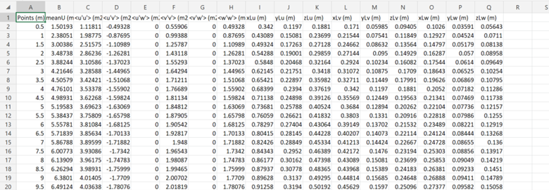

   An example of csv file for TINF.

Running in OpenFOAM
"""""""""""""""""""""
The user is required to have OpenFOAM v10 installed on their computer. Once the user has generated all the required files using the above workflow, they can run the simulation using the following procedure:

1. Open the Linux terminal in which OpenFOAM v10 is installed and go to the case folder.
2. Run the ``blockMesh`` command to generate the background mesh.
3. Run the ``surfaceFeatures`` command to create the building features.
4. Optionally run ``decomposePar`` to decompose the mesh.
5. Run ``snappyHexMesh -overwrite`` command either in serial or parallel mode.
6. If ``snappyHexMesh`` was run in parallel, run reconstructParMesh -constant command to reconstruct the mesh.
7. Optionally run ``decomposePar -force``, to decompose the mesh and run the simulation in parallel.
8. Run the ``simpleFoam`` or ``pimpleFoam``, or pisoFoam command (depending on the algorithm chosen by the user) either in serial or parallel mode.
9. If the user ran the simulation in parallel, then run the ``reconstructPar`` command.

Post-process in Paraview
""""""""""""""""""""""""""

The user is required to have Paraview 5.10, which usually comes with the OpenFOAM v10 installation. The user can open the Community.foam file in the case folder in ParaView and view the simulation results. The profile and plane data can be viewed in case/postProcessing/Profile_no. or Plane_no./time folder. The plane outputs are saved for each time instant in a .vtk file, which can be directly viewed in ParaView, whereas the profile outputs are saved in a text file, and a Python or MATLAB script can be written if the user needs to access the values and plot the time history.

Manipulating the OpenFOAM files for miscellaneous simulations
^^^^^^^^^^^^^^^^^^^^^^^^^^^^^^^^^^^^^^^^^^^^^^^^^^^^^^^^^^^^

The above workflow produces an OpenFOAM workflow specifically for the ABL flow in an urban environment. The same workflow can be used for other types of wind simulations, such as wind flow in a wind tunnel or wind flow over user-defined structures (any geometry). Here’s a breakdown of the parameters and files that can be modified to run any kind of wind simulation.

Domain Extents and boundaries
""""""""""""""""""""""""""""""

The ``blockMeshDict`` file contains the details of the domain extents, the number of cells in each direction, and the boundary type. The users can change the vertices of the domain as per their choice, and also the number of cells in each direction in the blocks section of the file. The boundary patches can be modified in the boundary section. If the user wishes to define faces other than sides as cyclic, they can change the type to cyclic and add another argument as ``neighbourPatch`` with the patch that it’s cyclic with. If the user wishes to make another patch as a wall other than ground, they can just change the type from patch to wall. Make sure to also change the boundary conditions in the ``case/0/field`` variables files. Additionally, users can add more blocks and also define different mesh grading in all directions.

User-defined obstacles
""""""""""""""""""""""""""""""
If the user wants to define the geometry of the obstacles, they need to provide the STL file/s and move them to the ``case/constant/triSurface`` folder. The user needs to modify the surfaceFeaturesDict and the ``snappyHexMeshDict`` files. The user needs to remove the ROI.stl and Surrounding.stl files and put in the name of the user-defined STL file and the user-defined region name. The user can also modify the ``snappyHexMeshDict`` file to change the extent of refinement regions and add more regions if required. Additionally, the level of refinement can also be changed. The user is required to also modify the boundary conditions in the field variables in the ``case/0`` folder. The region of obstacles needs to be added in the boundaryField section.

User-defined initialization and inflow
""""""""""""""""""""""""""""""""""""""
The workflow provides options between a logarithmic wind profile and a TINF wind profile. However, if the user requires a different wind profile, they can modify the case/0/U, k, epsilon files for RANS and the case/0/U file for LES. In the boundaryField section, at the inlet, the user can input the profile of choice. If OpenFOAM v10 has standard profiles available, the user can visit the website and apply the condition as shown on the website. Alternatively, the user can assign the value of a variable at each face of the inlet boundary. This can be done in the following way:

1. In the case folder, after creating the mesh (blockMesh and snappyHexMesh), run the postProcess -func writeCellCentres command to get the coordinates of each face at the boundary and each cell in the domain. The coordinates are saved in the files “C”, “Cx”, “Cy”, and “Cz” files inside the case/0 folder. 

2. Extract the y and z coordinates for the inlet face and then calculate the variables at each of those coordinates using a Python script or a MATLAB script. 

3. The following format can then be used to input into the inlet patch of the boundaryField section of a field variable:

.. code-block:: boundaryField section 

   type     fixedValue;

   value    nonuniform  List<scalar or vector>

   Number of inlet faces

   (
       Values (if vector then (value1 value2 value3)
   );

A similar procedure can be used to input a user-defined initial profile inside the domain. The change would be made in the internalField section. Instead of a uniform, a nonuniform value would have to be described. All three coordinates would be required to calculate the profile values.

Mapping fields
""""""""""""""""
It is common to run a coarser or a RANS simulation before running an LES simulation to initialize the variables for faster convergence. A “mapFieldsDict” file is required to do that. An example of such a file is shown in :numref:`fig-advanced-cfd-3`. The user can modify the dict according to the requirements. The user can then map fields from one folder to another using the following command: 

``mapFields path_to_source_folder -sourceTime -latestTime``. 

Type ``mapFields -help`` for more options. 

.. _fig-advanced-cfd-7:

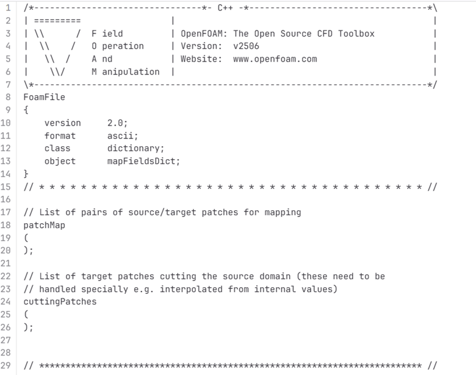

   An example of the mapFieldsDict file.

Turbulence Modeling and wall functions
""""""""""""""""""""""""""""""""""""""""

If the user wishes to use different models, such as DES (Detached Eddy Simulations), RANS , or LES dynamic Smagorinsky, then the user would need to modify the turbulenceProperties file and add or remove field variables depending on the needs of the model. The usage for other turbulence models can be found in the OpenFOAM documentation.

The workflow described above uses standard ABL wall functions. However, different wall functions can be used if the user needs. The nut, k, epsilon files must be modified to implement the wall function. The modification needs to be made in the wall boundaries in the boundaryField section.

Example
^^^^^^^^
This example provides a step-by-step guide for performing a community-level wind simulation using the RANS approach, following the workflow outlined above.

Target region for the simulation
"""""""""""""""""""""""""""""""""
In this example, the coordinate information for both the target region and the ROI is provided in Table 1 below using longitude and latitude. The target region is defined as a circular area centered on the given coordinate with a radius of 100 meters, while the ROI is specified by its bounding coordinates.

.. _tbl-advanced-cfd-1:
.. table:: Input coordinates for the Target region 
   :align: center
    
   +---------------------+----------------------------------------------+---------------------
   |Region               |Longitude                                     |Latitude            | 
   +=====================+==============================================+====================+
   |Total region(center) |-118.1366968745362                            | 34.19605960623262  |
   +---------------------+----------------------------------------------+--------------------+
   |ROI-min extent       |-118.13720649423749                           | 34.196219338557086 | 
   +---------------------+----------------------------------------------+--------------------+
   |ROI-max extent       |-118.13619261925281                           | 34.19641900353716  |
   +---------------------+----------------------------------------------+--------------------+

The user interface for inputting the given data is shown in :numref:`fig-advanced-cfd-8` and the output creating the geojson files is provided in :numref:`fig-advanced-cfd-9`.

.. _fig-advanced-cfd-8:

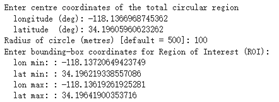

   Inputs for generating the building footprints.

.. _fig-advanced-cfd-9:

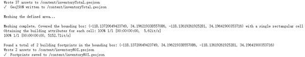

   Output generating the building footprints.

As illustrated in :numref:`fig-advanced-cfd-9`, the total region includes 37 building footprints, while the ROI contains 2 building footprints—consistent with geojson output shown in :numref:`fig-advanced-cfd-10`.

.. _fig-advanced-cfd-10:

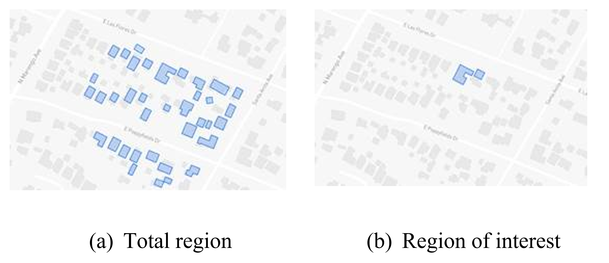

   Visualization of the generated geojson files.

Based on the geojson files, STL files for both the surrounding region and the region of interest (ROI) required for the simulation are generated, as illustrated in :numref:`fig-advanced-cfd-11`.

.. _fig-advanced-cfd-11:

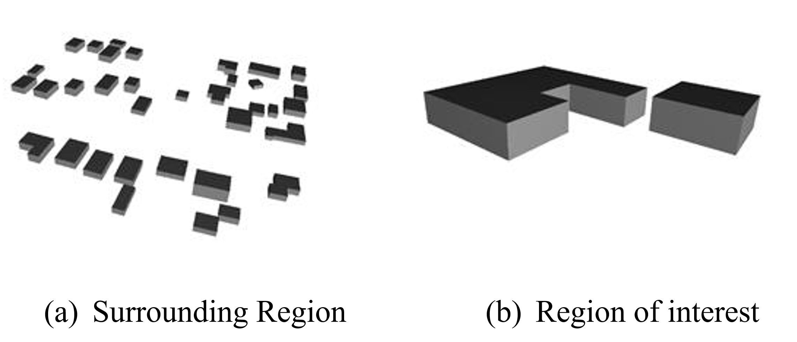

   Visualization of the generated STL file.

Mesh
""""""

**Background mesh**

The wind direction is taken as 225 degrees counterclockwise from East (i.e. in the SW direction). The side boundaries were set to slip for this simulation. An example input snapshot is shown in :numref:`fig-advanced-cfd-12`.

.. _fig-advanced-cfd-12:

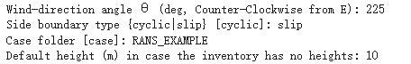

   Inputs for generating background mesh.

The domain extents were defined as shown in :numref:`fig-advanced-cfd-13`. The inlet was a distance of 7.5Hmax from the total region, the outlet was 20Hmax from the total region, the sides were 10Hmax, and the top was 20Hmax from the total region.

.. _fig-advanced-cfd-13:

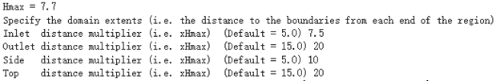

   The domain extents.

The computational cell size for the background mesh was 5 meters in all directions. The output is shown in :numref:`fig-advanced-cfd-14`. The script also outputs the domain extents for the ease of providing mesh refinement regions.

.. _fig-advanced-cfd-14:

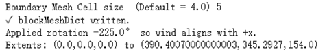

   Output for successfully generating the blockMeshDict and the domain extents.

**Regional refinements**
Three refinement boxes were defined to get a good mesh resolution. The extents and the levels of refinement are presented in :numref:`fig-advanced-cfd-15`.

**Surface refinements**

The surface refinement level was set to 5 for the region of interest (ROI) and to 4 for the surrounding buildings. The number of cells between each refinement level was 10. With these settings, the input configuration for generating the snappyHexMeshDict is complete, as shown in :numref:`fig-advanced-cfd-15` and :numref:`fig-advanced-cfd-16`

.. _fig-advanced-cfd-15:

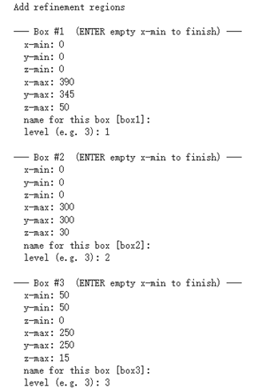

   Inputs to define regional refinement bounding boxes.

.. _fig-advanced-cfd-16:

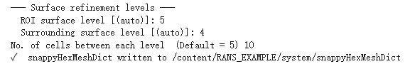

   Output for successfully generating the ``snappyHexMeshDict`` and the mesh.

Transport property
"""""""""""""""""""""

The default kinematic viscosity is used in this example.

.. _fig-advanced-cfd-17:

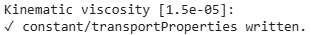

   Output for successfully generating the ``transportProperties``.

Numerical setup
""""""""""""""""

**Wind characteristic**

A wind speed of 20 m/s at a reference height of 50 m, with a terrain roughness length of 1 m is prescribed as shown below in :numref:`fig-advanced-cfd-18`. 

.. _fig-advanced-cfd-18:

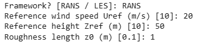

   Inputs to select the turbulence model and define the wind characteristics.

Boundary conditions
"""""""""""""""""""""
At the ground surface, a smooth wall boundary condition is applied whereas, on the building surfaces, a rough wall boundary condition is applied. With these settings, the turbulenceProperties and boundary field files were generated, as illustrated in Figure 19.

.. _fig-advanced-cfd-19:

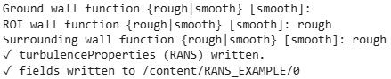

   Inputs and outputs for generating the boundary field file.

Simulation time setup
"""""""""""""""""""""
The simulation duration was 10,000 with a time step of 1, indicating that the RANS simulation will run for 10,000 iterations. The output data was written every 1,000 iterations. With these inputs, the controlDict file was generated, as shown in :numref:`fig-advanced-cfd-20`.

Ten processors were used to run the simulation in parallel. This will automatically generate the decomposeParDict file using the scotch method, allowing the simulation to run in parallel, as :numref:`fig-advanced-cfd-20` shows.

.. _fig-advanced-cfd-20:

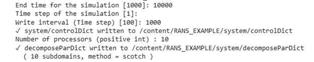

   Snapshot for generating ``controlDict`` and ``decomposeParDict``.

Visualization of the CFD output
"""""""""""""""""""""""""""""""

**Mesh**

:numref:`fig-advanced-cfd-4` shows the perspective view of the computational domain used in the example and :numref:`fig-advanced-cfd-5` shows the mesh refinement levels. It can be seen that the mesh is finer near the buildings and even finer near the buildings in the ROI. A cross section of the mesh levels along the flow direction can be viewed in :numref:`fig-advanced-cfd-21`.

.. _fig-advanced-cfd-21:

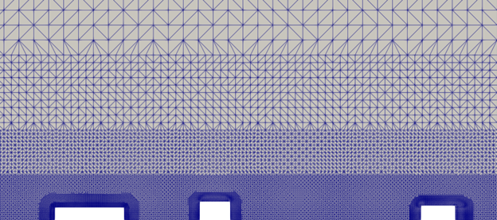

   Typical cross section along the flow direction.

**Wind profile**

:numref:`fig-advanced-cfd-22` shows the mean velocity profile at the inlet at the end of the simulation. The OpenFOAM wind profile is almost the same as the Target wind input.

.. _fig-advanced-cfd-22:

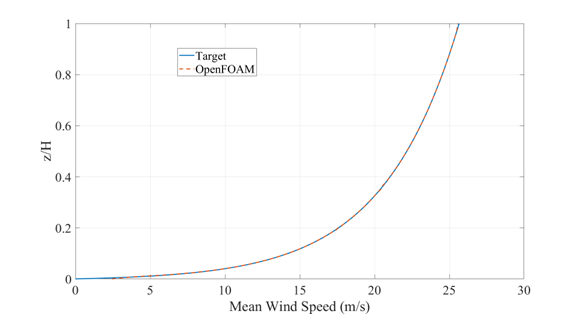

   Typical cross section along the flow direction.

**Pressure and velocity field slices**

:numref:`fig-advanced-cfd-23` shows the pressure and velocity fields at a height of z = 3m at the end of the simulation.  We can see that the boundaries are not much affected by the buildings which shows that the boundaries are far enough to not cause any significant changes to the wind flow in the vicinity of the region.

.. _fig-advanced-cfd-23:

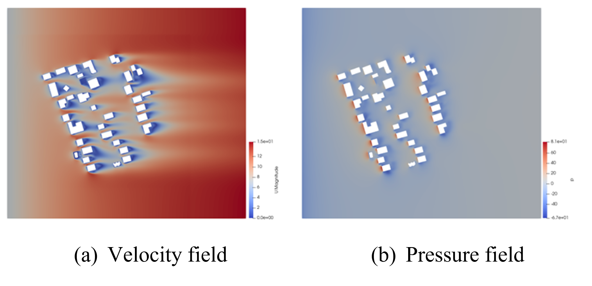

   Velocity and pressure field at z=3m.

.. [Franke2007] Franke, J., Hellsten, A., Schlünzen, K.H. and Carissimo, B., 2007. COST Action 732: Best practice guideline for the CFD simulation of flows in the urban environment.
.. [Spalding1974] B.E. Launder and D.B. Spalding. Computer methods in applied mechanics and engineering, 3(2):269–289, 1974.
.. [Smagorinsky1963] Smagorinsky, J.  General Circulation Experiments with the Primitive Equations I: the Basic Experiment. Monthly Weather Review, 91(3):99-164, 1963..
