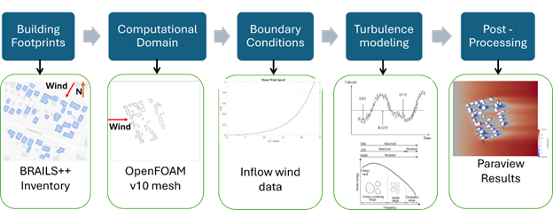
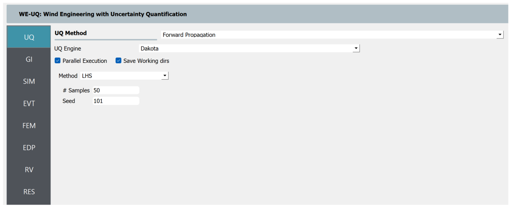
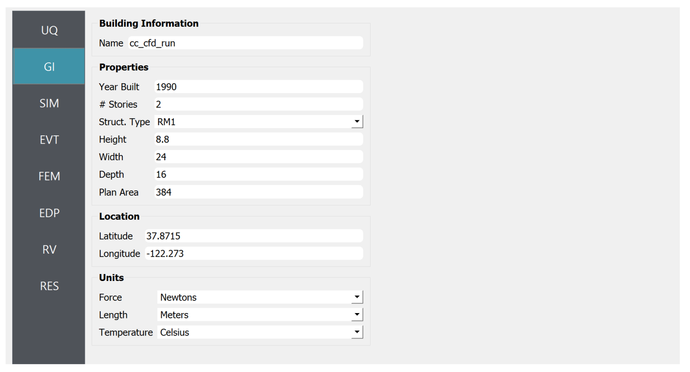
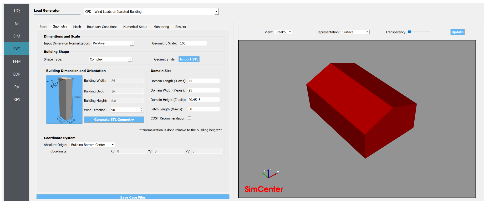

.. _advancedCFD:

Community level wind simulation: WE-UQ coupled with BRAILS++
==========================================================

+----------------+-----------------------------------------------------------------------------------------------------------+
| Problem files  | `WE-UQ/Examples/weuq-0019 <https://github.com/NHERI-SimCenter/WE-UQ/tree/master/Examples//advancedCFD//>`_  |
+----------------+-----------------------------------------------------------------------------------------------------------+

Introduction
^^^^^^^^^^^^^

This module provides a workflow to simulate wind flow inside a community. The building footprints are generated using the  inventory. To install BRAILS++, the user needs to run the command: pip install brails. Additionally, the user needs to install the geopandas, shapely, pyproj, trimesh, rtree, and mapbox-earcut python libraries using the command: pip install geopandas shapely pyproj trimesh rtree mapbox-earcut. To generate the computational domain, the user needs to provide the longitude and latitude of the center point, the bounding radius, and the longitudes and latitudes of the bounding box encompassing the region of interest. The user needs to have  downloaded on their computer. The user needs to input the parameters for the CFD simulation following the workflow shown in Fig. 1, using the developed Python script for this module, then run the wind simulation in OpenFOAM, and finally view the results in Paraview.

.. _fig-advanced_cfd-1:

   The WE-UQ and BRAILS++ integration workflow.

Detailed Workflow
^^^^^^^^^^^^^^^^^^^^
Generating the GeoJSON files with building footprints and their heights:

1. **Generating the GeoJSON files with building footprints and their heights**: The BRAILS++ inventory contains the longitudes and latitudes of building footprints with their respective heights and outputs them as a geojson file, which can be viewed in a GIS (Geographic Information System) software such as ArcGIS or QGIS. The user needs to input the center point and the bounding radius around the community of interest as shown in Fig. 2. Then, the user must input two coordinates (minimum and maximum extents) for the bounding box that encompasses the region of interest (ROI) as shown in Fig. 3. The ROI must contain buildings within the bounding radius that are of more importance than others. The latitude and longitude of a specific point can be obtained by clicking at a location on the google maps. For the ROI, the latitude and longitude of the two points marked with red circles in Fig. 3 are required as inputs. The user also has an option to choose the footprint scraper (USA, OSM, and Microsoft) to retrieve the building information. The default scraper is USA. These inputs generate two geojson files named “inventoryTotal.geojson” and “inventoryROI.geojson”. The former contains information about all buildings inside the bounding radius, and the latter contains information about buildings inside the bounding box.

.. _fig-advanced_cfd-2:

.. figure:: figures/Picture2.png
   :align: center
   :width: 50%

   Center coordinate and the bounding radius of the total region.

.. _fig-advanced_cfd-3:

.. figure:: figures/Picture3.png
   :align: center
   :width: 50%

   Bounding box for the region of interest.

UQ Method
"""""""""""
Specify the details of uncertainty analysis in the **UQ** panel. This example uses forward uncertainty propagation. Select "Forward Propagation" for UQ Method and specify "Dakota" for the UQ Engine driver. For specific UQ algorithms, use Latin Hypercube ("LHC"). Change the number of samples to 500 and set the seed to 101.

   Selection of the Uncertainty Quantification Technique

General Information
"""""""""""""""""""
Next, in the **GI** panel, specify the properties of the building and the unit system. For the **# Stories** use 2 assuming a floor height of approximately 4.0 m. Set the **Height**, **Width** and **Depth** to 8.8, 24.0 and 16.0 with a **Plan Area** of 384.0. Define the units for **Force** and **Length** as "Newtons" and "Meters", respectively. 

   Set the building properties in **GI** panel

Structural Properties
"""""""""""""""""""""
Please leave the **SIM** panel of the workflow as it is, this example does not involve any structural analysis. 

CFD Model
"""""""""""""""""""
To set up the CFD model, in the **EVT** panel, select "CFD - Wind Loads on Isolated Building" for **Load Generator**.  Detailed documentation on how to define the CFD model can be found in :ref:`the user manual<lblIsolatedBuildingCFD>`.   

1. Specify the path to the case directory in *Start* tab, by clicking **Browse** button. Use version 10 for **Version of OpenFOAM Distribution**. 

.. figure:: figures/we19_EVT_Start_tab.svg
   :align: center
   :alt: Image showing error in description
   :width: 75%

   Setting up the case directory and OpenFOAM version in the *Start* tab

2. In the *Geometry* tab, first set the **Input Dimension Normalization** to *Relative* to put the size of the domain relative to the building height. For **Geometric Scale** of the CFD model use 100.0 as the simulation is conducted at model scale. Set the **Shape Type** to *Complex* and import the building geometry by clicking **Import STL** from :github:`here <Examples/weuq-0019/src/buildingGeometry/tpu_building.stl>`. Set the **Wind Direction** to 90.0 to simulate wind incidence normal to the building width. See :numref:`fig-we19-geometry-tab` for the details.

.. _fig-we19-geometry-tab:

   Defining the domain dimensions and the building geometry.  

2. Define the computational in *Mesh* tab with *Background Mesh*, *Regional Refinements*, *Surface Refinements*, *Edge Refinements* and *Edge Refinements* as shown bellow.
   
   .. figure:: figures/we19_EVT_Mesh_tab.svg
      :align: center
      :width: 75%

      Define the computational grid in the *Mesh* tab

   .. figure:: figures/we19_EVT_Mesh_RegionalRefinement_tab.svg
      :align: center
      :width: 75%

      Create regional refinements

   .. figure:: figures/we19_EVT_Mesh_SurfaceRefinement_tab.svg
      :align: center
      :width: 75%

      Create surface refinements
   
   .. figure:: figures/we19_EVT_Mesh_EdgeRefinement_tab.svg
      :align: center
      :width: 75%

      Apply further refinements along the building edges

   **Run Mesh**
   
   To generate the computational grid with all the refinements applied, click the **Run Final Mesh** button in the *Mesh* tab. Once meshing is done, in the side window, the model will be updated automatically displaying the generated grid. 

   .. figure:: figures/we19_EVT_Mesh_View.svg
      :align: center
      :width: 85%

      Breakout View of the Mesh
   
4. To define initial and boundary conditions, select *Boundary Conditions* tab. 

   * Based on the values given in :numref:`tbl-we19-1`, set the boundary conditions as shown in the following figure. Here the **Wind Speed Scaling Factor** is defined as a random variable and the uncertainties will be propagated in the wind load calculation. At the **Inlet** of the domain use *TInf* with the specified inflow generation method (DFM). Then, select *Table* for the **Wind Profile** and import the wind characteristics from :github:`here <Examples/weuq-0019/src/wind_profile.csv>`

   .. figure:: figures/we19_EVT_BoundaryConditions.svg
      :align: center
      :width: 75%

      Setup the *Boundary Conditions*  

5. Specify turbulence modeling, solver type, duration and time step options in the *Numerical Setup* tab as shown bellow. 

.. _fig-we19-CFD-num-setup:

.. figure:: figures/we19_EVT_NumericalSetup.svg
   :align: center
   :alt: Image showing error in description
   :width: 75%

   Edit inputs in the *Numerical Setup* tab

6. Monitor wind loads from the CFD simulation in the *Monitoring* tab. Leave this tab options as shown bellow. 

   .. figure:: figures/we19_EVT_Monitoring.svg
      :align: center
      :width: 75%

      Select the outputs from CFD in the *Monitoring* tab

Finite Element Analysis
"""""""""""""""""""""""""
Please leave this panel to the default values, since no structural analysis is needed. We are mainly interested in evaluating wind loads on components and cladding. 

Engineering Demand Parameter
"""""""""""""""""""""""""""""
Next, specify Engineering Demand Parameters(EDPs) in the **EDP** panel. Select *Component and Cladding EDP* option which allows the user to define the geometry of components. In the current workflow this is done using JSON file, which is provided in :github:`here <Examples/weuq-0019/src/ComponentDefinition.json>`.

.. figure:: figures/we19_EDP_panel.svg
   :align: center
   :width: 75%

   Select the EDPs to measure

Once specifying the path to this file in **Component Geometry JSON Path**, click **Map Component Geometry onto Building Surface**. This will map the comonent geometries on to the building surface as shown in the following figure.  

.. figure:: figures/we19_EDP_panel_components.svg
   :align: center
   :width: 75%

   Map components to the building geometry.  

Random Variables
"""""""""""""""""
Since the wind speed scaling factor is defined as a random variable, it will show up this panel. Now for the radom variable **wsF** set *Normal* for its probability **Distribution**  with :math:`1.0` **Mean** value and :math:`0.2` **Standard Dev**. 

.. figure:: figures/we19_RV_panel.svg
   :align: center
   :alt: Image showing error in description
   :width: 75%

   Define the Random Variable (RV)

Running the Simulation 
"""""""""""""""""""""""
The CFD simulation for this example is already run, and results are collected. The users can run the remain part of the workflow locally by clicking **RUN** button.

Results
"""""""""
Once the example is run, the results will aromatically show up . Then, the results will be displayed in the **RES** tab. The responses qualitative reported for *Standard* EDP include statistics of floor displacement, acceleration and inter-story drift, e.g.,    

      * 1-MP-zone1: represents **mean pressure** on a cladding/component element named **zone1** 
      * 1-RP-zone2: represents **root-mean-square pressure** on a cladding/component element named **zone2** 
      * 1-PP-zone1: represents **peak pressure** on a cladding/component element named **zone1** 
      * 1-MF-dr1: represents **mean force** on a component element named **dr1** 
      * 1-RP-wd1: represents **root-mean-square force** on a component element named **wd1** 
      * 1-PF-wd1: represents **peak force** on a component element named **wd1** 

The *Summary* tab of the panel shows the four statistical moments of the EDPs which include *Mean*, *StdDev*, *Skewness* and *Kurtosis*. 

.. figure:: figures/we19_RES_Summary.svg
   :align: center
   :width: 75%

   Summary of the recorded EDPs in **RES** panel

By switching to the *Data Values* tab, the user can also visualize all the realizations of the simulation. The figure below shows the variation of the peak pressure variation with the wind speed used in the simulation. 

.. figure:: figures/we19_RES_DataValues.svg
   :align: center
   :width: 75%
   :figclass: align-center

   (scatter-plot) Peak pressure vs wind speed, (table) Report of EDPs for all realizations   

.. [Franke2007] Franke, J., Hellsten, A., Schlünzen, K.H. and Carissimo, B., 2007. COST Action 732: Best practice guideline for the CFD simulation of flows in the urban environment.

