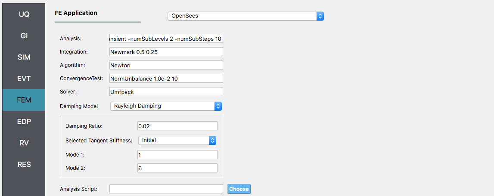
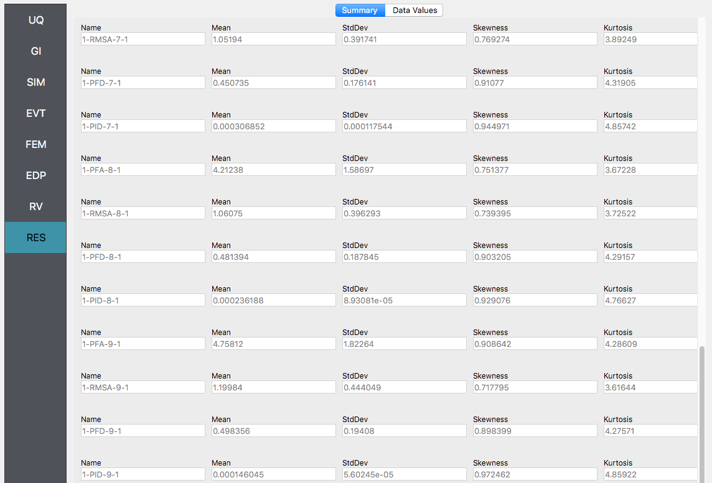
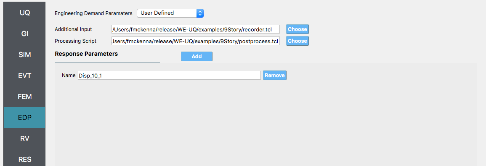

.. _weuq-0001:

9 Story Building: Sampling Analysis
===================================

Consider the problem of uncertainty quantification in a nine story steel building. The building being modelled is the 9 story LA building presented in the FEMA-355C report. From the description in Appendix B of the FEMA document the building is a **150** ft square building with a height above ground of **120** ft with a weight of approx. **19,800** kips. Eigenvalues are shown in Table 5.1. of the FEMA document to be between **2.3** sec and **2.2** sec depending on connection detals. For this example (and for demonstrative purposes only), this building will be modelled as a shear building with **10** nodes and **9** elements, as shown in following figure. For loading, the Stochastic Wind Generation tool will be used with the gust wind speed being treated as a random variable with a normal distribtion described by a mean :math:`\mu_{gustWS}=20 \mathrm{mph}` and standard deviation :math:`\sigma_{gustWS} =3 \mathrm{mph}`. 

.. figure:: figures/9Story.png
   :align: center
   :width: 600
   :figclass: align-center

   Nine Story Downtown LA Building from FEMA-355C

The structure has uncertain properties that all follow normal distribution:

1. Weight of Typical Floor(``w``): mean :math:`\mu_w=2200 \mathrm{kip}` and standard deviation :math:`\sigma_w =200 \mathrm{kip}` (COV = 10%)
2. Story Stiffness(``k``): mean :math:`\mu_k=1600 \mathrm{kip/in}` and standard deviation :math:`\sigma_k =160 \mathrm{kip/in}` (COV = 10%)

.. note::

   #. For the mean values provided the natural period of the structure is **2.27** sec.
   #. The choice of COV percentages is for demonstrative purposes only.

   #. The exercise will use both the MDOF, :numref:`lblMDOFSIM`,  and OpenSees, :numref:`lblOpenSeesSIM`, structural generators. For the OpenSees generator the following model script, :weuq-0001:`Frame9Model.tcl <src/Frame9Model.tcl>`.

   .. literalinclude:: src/Frame9Model.tcl
      :language: tcl

   #. The first lines containing ``pset`` will be read by the application when the file is selected and the application will auto-populate the random variables ``w`` and ``k`` in the **RV** panel with this same variable name. It is of course possible to explicitly use random variables without the ``pset`` command by "RV.**variable name" in the input file. However, no random variables will be auto-populated if user chooses this route.

.. warning::

   Do not place the file in your root, downloads, or desktop folder as when the application runs it will copy the contents on the directories and subdirectories containing this file multiple times (a copy will be made for each sample specified). If you are like us, your root, Downloads or Documents folders contains and awful lot of files and when the backend workflow runs you will slowly find you will run out of disk space!

Sampling Analysis
^^^^^^^^^^^^^^^^^

+----------------+-------------------------+
| Problem files  | :weuq-0001:`/`          |
+----------------+-------------------------+

To perform a Sampling or Forward propagation uncertainty analysis the user would perform the following steps:

1. Start the application and the UQ Selection will be highlighted. In the panel for the UQ selection, keep the UQ engine as that selected, i.e. Dakota, and the UQ Method Category as Forward Propagation, and the Forward Propagation method as LHS (Latin Hypercube). Change the #samples to 500 and the seed to 20 as shown in the figure.

.. figure:: figures/9story-UQ.png
   :align: center
   :figclass: align-center

#. Next select the **GI** panel. In this panel the building properties and units are set. For this example enter **9** for the number of stories, **1400** for building height, and **1600** for building breadth and depth

.. figure:: figures/9story-GI.png
   :align: center
   :figclass: align-center

#. Next select the **SIM** panel from the input panel. This will default in the MDOF model generator. We will use this generator (the NOTE below contains instruction on how to use the OpenSees scipt instead). In the building information panel, the number of stories should show **9** and the story heights **160**. In the building Information box specify **w** for the floor weights and **k** for story stiffness (in both x and y directions). 

.. figure:: figures/9story-SIM1.png
   :align: center
   :figclass: align-center

.. note::

   To specify instead to use the OpenSees script instead, from thee Model Generator pull down menu select ``OpenSees``. For the fields in the panel presented enter the path to the :weuq-0001:`Frame9Model.tcl <src/Frame9Model.tcl>` script. For both the Centroid  Nodes (those nodes were the floor loads will be applied) the Response Nodes (those nodes from which the reponse quantities will be evaluated) as **1 2 3 4 5 6 7 8 9 10** in the panel. The Response nodes will tell model generator which nodes correspond to nodes at the 4 floor levels for which responses are to be obtained when using the standard earthquake EDP's.

   .. figure:: figures/9story-SIM2.png
      :align: center
      :figclass: align-center

#. Next select the **EVT** panel. From the Load Generator pull down menu select the **Stochastic Wind** option. Leave the exposure condition as **B**. Set the drag coefficient as **1.3** and enter ``gustWS`` for the 3 sec gust wind speed at the 33 ft height.

.. figure:: figures/9story-EVENT.png
   :align: center
   :figclass: align-center

#. Next choose the **FEM** panel. Here we will change the entries to use Rayleigh damping, with rayleigh factor chosen using **1** and **6** modes. For the **MDOF** model generator, because it generates a model with two translational and 1 rotational degree-of-freedom in each direction and because we have provided the same **k** values in each translational direction, i.e. we will have duplicate eigenvalues, we specify as shown in the figure modes **1** and **6**.

4. We will skip the **EDP** panel leaving it in it's default condition, that being to use the **Standard Wind** EDP generator.

5. For the **RV** panel, we will enter the distributions and values for our random variables. Because of the steps we have followed and entries we have made, the panel when we open it should contain the **3** random variables and they should all be set constant. For the w, k and wS random variables we change the distributions to normal and enter the values given for the problem, as shown in figure below. 

.. figure:: figures/9story-RV.png
   :align: center
   :figclass: align-center

.. warning::   

   The user cannot leave any of the distributions for these values as constant for the Dakota UQ engine.

5. Next click on the **Run** button. This will cause the backend application to launch dakota. When done the **RES** panel will be selected and the results will be displayed. The results show the values the mean and standard deviation. The peak displacement of the roof, is the quantity **1-PFD-9-1** (first event (tool to be extended to multiple events), 9th floor (in US ground floor considered 0), and 1 dof direction). the **PFA** quantity defines peak floor acceleration, the **RMSA** quantity the root mean square of floor accelerations, and the **PID** quantity corresponds to peak interstory drift.

If the user selects the "Data" tab in the results panel, they will be presented with both a graphical plot and a tabular listing of the data. By left- and right-clicking with the mouse in the individual columns the axis change (left mouse click controls vertical axis, right mouse click the horizontal axis).

.. figure:: figures/9story-RES2.png
   :align: center
   :figclass: align-center

Various views of the graphical display can be obtained by left and right clicking in the columns of the tabular data. If a singular column of the tabular data is pressed with both right and left buttons a frequency and CDF will be displayed, as shown in figure below.

.. figure:: figures/9story-RES6.png
   :align: center
   :figclass: align-center

User Defined Output
^^^^^^^^^^^^^^^^^^^

+----------------+--------------------+
| Problem files  | :weuq-0002:`/`     |
+----------------+--------------------+

In this section we will demonstrate the use of the user defined output option for the EDP panel. In the previous example we got the standard output, which can be both a lot and also limited (in sense you may not get the information you want). In this example we will present how to obtain results just for the roof displacement, the displacement of node **10** in both the **MDOF** and **OpenSees** model generator examples and shear force at the base of the structure. For the OpenSees model, it is also possible to obtain the overturning moment (something not possible in MDOF model due to fact it is modelled using spring elements). The examples could be extended to output for example the element end rotations, plastic rotations, ...

For this example you will need two additional files, :weuq-0002:`FrameRecorder.tcl <src/FrameRecorder.tcl>`. 

The recorder script as shown will record the envelope displacements and RMS accelerations in the first two degrees-of-freedom for the nodes in the modes. The script will also record the element forces. The file is as shown below:

.. literalinclude:: ../weuq-0002/src/FrameRecorder.tcl
   :language: tcl

The ``FramePost.tcl`` script shown below will accept as input any of the 10 nodes in the domain and for each of the two DOF directions and element forces.

.. literalinclude:: ../weuq-0002/src/FramePost.tcl
   :language: tcl

.. note::

   The user has the option when using the OpenSees SIM application to provide no postprocess script (in which case the main script must create a ``results.out`` file containing a single line with as many space separated numbers as QoI) or the user may provide a Python script that also performs the postprocessing. An example of a postprocessing Python script is :weuq-0002:`FramePost.py <src/FramePost.py>`. The Python script at present only responds to nodal displacements.

   .. literalinclude:: ../weuq-0002/src/FramePost.py
      :language: python

The steps are the same as the previous example, with exception of step 4 defining the **EDP**.
   
#. For the **EDP** panel, we will change the generator to **User Defined**. In the panel that presents itself the user must provide the paths to both the recorder commands and the postprocessing script. Next the user must provide information on the response parameters they are interested in. The user presses the **Add** button and the enters ``Disp_10_1``, ``RMSA_10_1``, and ``Force_1_1`` in the entry field as shown in figure below.

   .. figure:: figures/9story-EDP-USER.png
      :align: center
      :figclass: align-center

#. Next click on the **Run** button. This will cause the backend application to launch dakota. When done the **RES** panel will be selected and the results will be displayed. The results show the values the mean and standard deviation as before but now only for the one quantity of interest.

   .. figure:: figures/9story-RES-USER.png
      :align: center
      :figclass: align-center

Reliability Analysis
^^^^^^^^^^^^^^^^^^^^

+----------------+-----------------------+
| Problem files  | :weuq-0003:`/`        |
+----------------+-----------------------+

If the user is interested in the probability that certain response measure will be exceeded an alternative strategy is to perform a reliability analysis. To perform a reliability analysis the steps above would be repeated with the exception that the user would select a reliability analysis method instead of a Forward Propagation method. To obtain reliability results using the Global Reliability methose presented in Dakota choose the **Global Reliability** methods from the methods drop down menu. In the response levels enter a values of **0.5** and **0.8**, specifying that we are interested in the value of the CDF for a displacement of the roof of 0.5in and 0.8in, i.e. what is probability that displacement will be less than 0.8in.

.. figure:: figures/9story-UQ-Reliability.png
   :align: center
   :figclass: align-center

After the user fills in the rest of the tabs as per the previous section, the user would then press the **RUN** button. The application (after spinning for a while with the wheel of death) will present the user with the results, which as shown below, indicate that the probabilities as **52%** and **92%**.

.. figure:: figures/9story-RES-Reliability.png
   :align: center
   :figclass: align-center

.. warning::

   Reliability analysis can only be performed when there is only one EDP.

