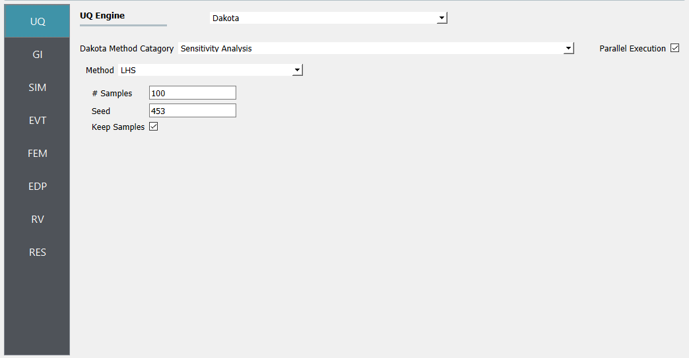
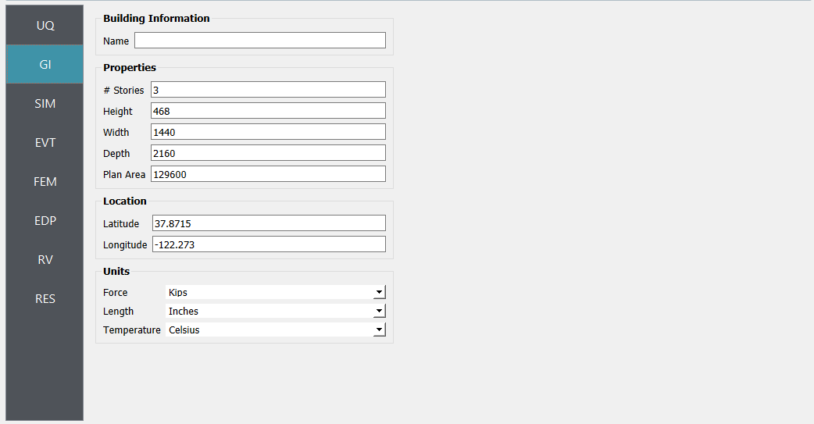

3-Story Building - Sensitivity, LowRiseTPU
==========================================

   Uncertainty panel inputs. 

   The general information panel. 

#. The :ref:`SIM-user_manual` panel is configured to use the **OpenSees** backen for structural analysis.

    .. figure:: figures/weuq-0007-SIM.png
       :width: 600
       :align: center

       Simulation panel inputs.

#. Next, the **EVT** panel is used to define a loading scenario.

    .. figure:: figures/weuq-0007-EVT.png
       :width: 600
       :align: center

       Event panel inputs. 

#. Next the **FEM** panel is used to configure a transient analysis procedure. 

    .. figure:: figures/weuq-0007-FEM.png
       :width: 600
       :align: center

       FEM panel inputs. 

    .. figure:: figures/weuq-0007-FEM.png
       :width: 600
       :align: center

       Event panel inputs. 
