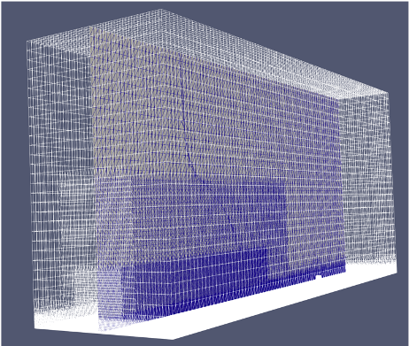
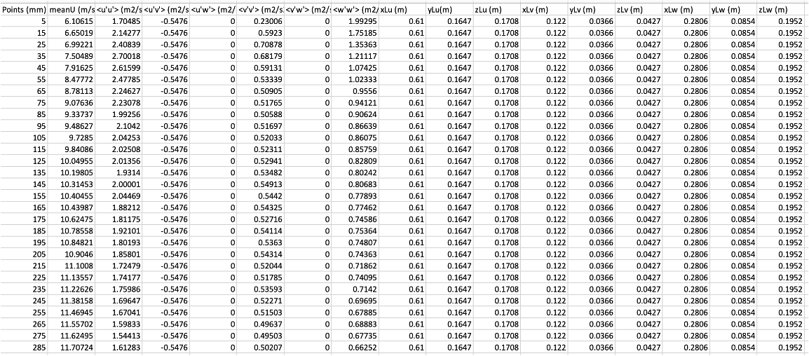

.. _weuq-0011:

Digital Wind Tunnel
===================================

+----------------+-------------------------+
| Problem files  | :weuq-0011:`/`          |
+----------------+-------------------------+

Digital Wind Tunnel is implemented in WE-UQ Version 2.3.0. This feature aims to provide the users with the computational tool to run CFD simulations with the user-defined atmospheric boundary layer inflow conditions.

This project is collaborated with the University of Florida (UF) NHERI Experimental Facility (EF). Multiple roughness element fields were generated by changing the orientation and height of the Terraformer in the wind tunnel, and the mean flow structure in each inflow condition was captured downstream [#Catarelli2020]_. 

In the Digital Wind Tunnel, the empty domain analysis enables the users to simulate the atmospheric boundary layer flows with the user-defined inflow characteristics. The mean flow structure can be captured downstream, which can be validated through the wind tunnel data.

.. figure:: figures/DWT
   :align: center
   :width: 600
   :figclass: align-center

   Schematic diagram for the Digital Wind Tunnel.

CFD modeling
^^^^^^^^^^^^
The digital wind tunnel allows users to upload their own model to run CFD simulations. To prepare the OpenFOAM case directory, three directories need to be included: *0*, *constant* and *system*. To run the simulation in the Digital Wind, select the **EVT** panel. From the Load Generator, pull down menu and select the **CFD - Digital Wind Tunnel**. The CFD model can be uploaded by pressing the **Browse** button in the **OpenFOAM Parameters**.

The user interface of the Digital Wind Tunnel is included in 

.. figure:: figures/User-interface
   :align: center
   :width: 600
   :figclass: align-center

   User interface of the digital wind tunnel.

The alternative is that users can run the CFD simulation using the benchmark CFD model by default. For basic information, *snappyHexMesh* was used to create and refine the mesh in the computational domain. Large eddy simulation (LES) was employed to model the turbulent flow. The CFD model can be downloaded from `github website <https://github.com/NHERI-SimCenter/WE-UQ/tree/master/Resources/DigitalWindTunnel/>`_.

   Mesh generation of the benchmark CFD model.

Set up the inflow configurations in the Digital Wind Tunnel
^^^^^^^^^^^^^^^^^^^^^^^^^^^^^^^^^^^^^^^^^^^^^^^^^^^^^^^^^^^

Generating inflow turbulence that satisfies the prescribed atmospheric boundary layer flows is an important step in setting up a CFD model for simulating atmospheric flows with a wide range of length and time scales. One common approach to generating inflow turbulence is to use synthetic inflow generation, which involves synthesizing turbulent fluctuations at the inflow boundary based on statistical properties of the turbulence. 

In the Digital Wind Tunnel, the inflow turbulence generation is enabled by the Turbulence Inflow Tool (TInF) developed by the SimCenter. Several synthetic inflow generation approaches are implemented in TInF, including the Digital Filtering Method and Synthetic Eddy Method. The statistical properties can be input into the TInF tool to generate a time series of turbulent fluctuations at the inflow boundary and incorporated into WE-UQ to run the CFD simulations. The TInF tool can be downloaded from `github website <https://github.com/NHERI-SimCenter/SimCenterDocumentation/>`_.

The user-defined inflow boundary conditions that characterize the atmospheric boundary layer flows can be defined in two ways: *direct specification* and *specification via prescribed functions*.

Input of the inflow turbulence properties through direct specification
^^^^^^^^^^^^^^^^^^^^^^^^^^^^^^^^^^^^^^^^^^^^^^^^^^^^^^^^^^^^^^^^^^^^^^

The digital wind tunnel enables the users to directly specify the inflow turbulence properties measured in the wind tunnel, including the mean velocity, Reynolds stress and length scales at the inflow boundary. Those values can be directly specified in the OpenFOAM dictionaries. If the Digital Filtering Method is used, the related entries are in the form of

.. code-block:: none

        boundaryField
        {
            inlet
            {
                type            turbulentDFMInlet;
                filterType      exponential;
                gridFactor      1;
                filterFactor    4;
                periodicInY     false;
                periodicInZ     false;
                cleanRestart    false;
                value           $internalField;
            }
        }

In the *boundaryData* inside the *constant* directories, the mean velocity profiles, Reynolds stress and length scales along the height are specified with the names *U*, *R*, *L* and *points*, respectively for the *inlet* dictionary. The user interface of the Digital Wind Tunnel allows users to upload a CSV file containing the necessary inflow turbulence properties, and the tool can automatically generate the inlet files for running the CFD model.

   Direct specification of the inflow turbulence properties.

Specification via prescribed functions
^^^^^^^^^^^^^^^^^^^^^^^^^^^^^^^^^^^^^^
If the wind tunnel data is not available, the user can also specify the inflow conditions through the embedded functions in the Digital Wind Tunnel. There are three functions to characterize the atmospheric inflow profiles: uniform function, exponential function and logarithmic function. The uniform function assumes a constant wind velocity over the entire simulation domain, but may not accurately represent the complex nature of atmospheric boundary layer flows. The exponential function is often used to represent the vertical profile of wind velocity in the atmospheric boundary layer. The logarithmic function is another commonly used function that also represents the vertical profile of wind speed in the atmospheric boundary layer, based on the assumption of a logarithmic variation of wind velocity with height.

.. figure:: figures/TInF_function
   :align: center
   :width: 600
   :figclass: align-center

Running a CFD simulation in the Digital Wind Tunnel
^^^^^^^^^^^^^^^^^^^^^^^^^^^^^^^^^^^^^^^^^^^^^^^^^^^
After the computational model is set up, the next step is to run the CFD simulations. Press the **RUN at DesignSafe** button to submit the job to TACC Frontera HPC resources. Once the simulation is completed, download the data from **GET from DesignSafe**. Post-processing tools including paraView can be used to visualize and analyze the flow simulations.

.. [#Catarelli2020] Catarelli, R. A., Fernández-Cabán, P. L., Masters, F. J., Bridge, J. A., Gurley, K. R., & Matyas, C. J. (2020). Automated terrain generation for precise atmospheric boundary layer simulation in the wind tunnel. Journal of Wind Engineering and Industrial Aerodynamics, 207, 104276.
