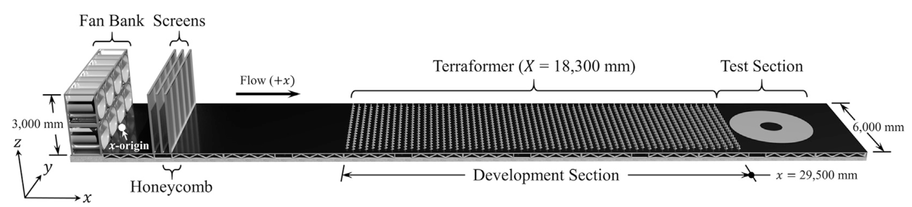
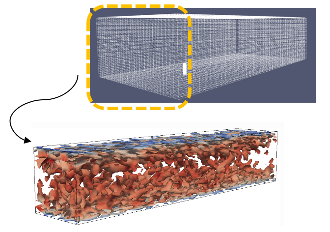
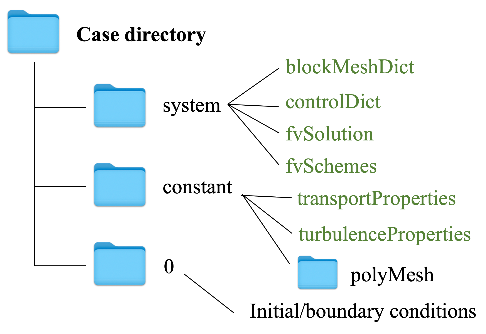
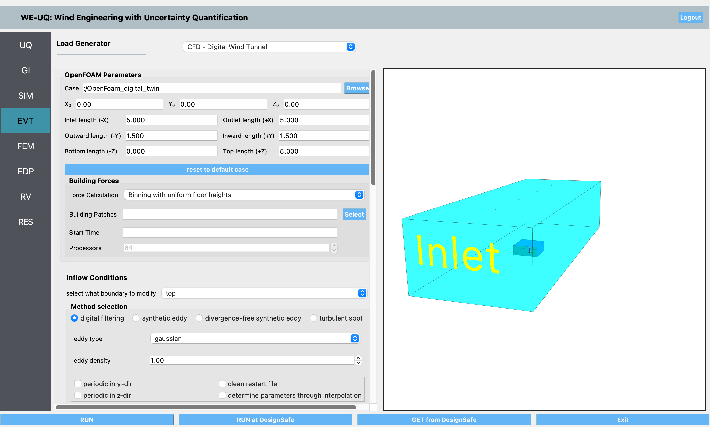
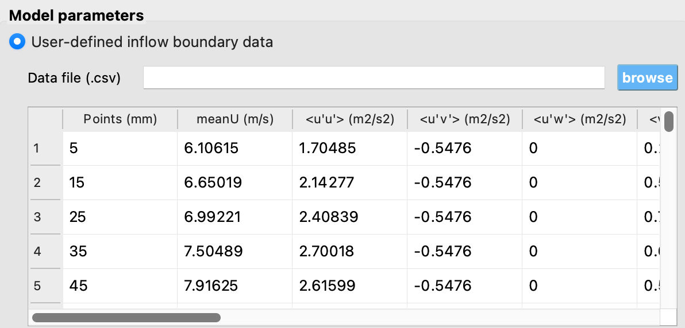
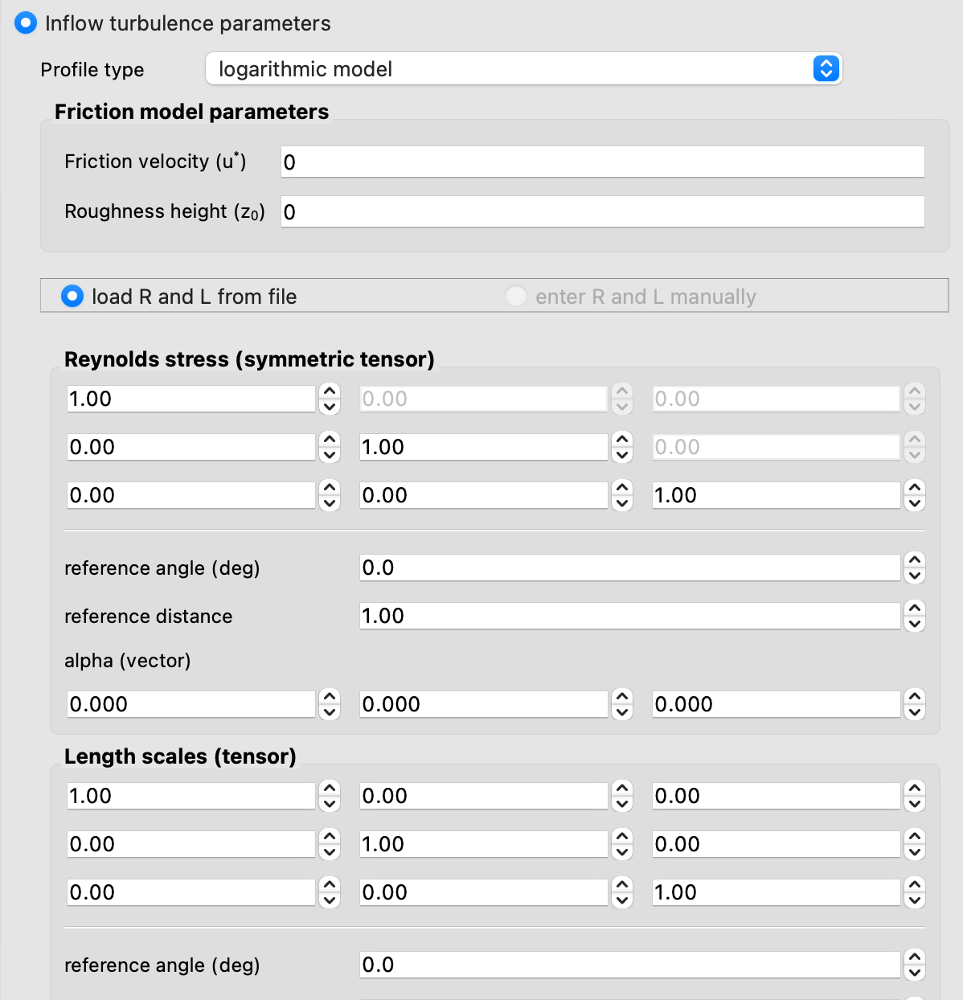
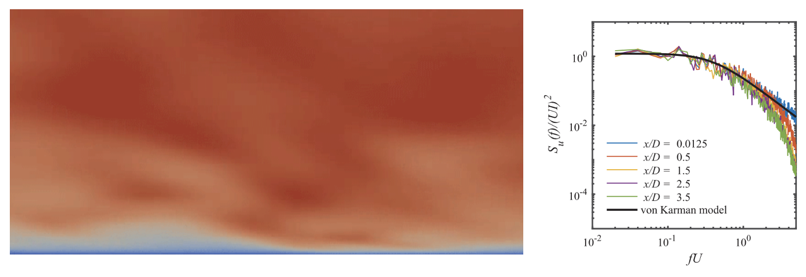

.. _weuq-0011:

Digital Wind Tunnel I: Empty Domain Simulation 
===================

+----------------+-------------------------+
| Problem files  | :weuq-0011:`/`          |
+----------------+-------------------------+

Digital Wind Tunnel is implemented in WE-UQ Version 2.3.0. This feature aims to provide the users with the computational tool to run CFD simulations with the user-defined atmospheric boundary layer inflow conditions and the user-defined OpenFOAM model.

This project collaborates with the University of Florida (UF) NHERI Experimental Facility (EF). Multiple inflow conditions characterized by the roughness height and friction velocity were generated by changing the orientation and height of the Terraformer in the wind tunnel. The mean flow structure at each inflow condition is captured by velocity probes downstream [#Catarelli2020]_. 

   UF's BLWT facility [#Catarelli2020]_.

The Digital Wind Tunnel would allow users to edit the geometric information and inflow conditions through a user interface of WE-UQ, and run the CFD simulations to obtain the aerodynamic loads on structures aided by the open-source CFD software named OpenFOAM and structural responses aided by OpenSees. Compared to traditional physical wind tunnel, the digital wind tunnel would allow for great flexibility in testing different designs and wind scenarios, and has free access to the TACC Frontera computing nodes. In particular, in the Digital Wind Tunnel, the empty domain analysis enables users to simulate the atmospheric boundary layer flows with the user-defined inflow wind characteristics including mean wind velocity profiles, Reynolds stress tensor and length scales. The mean flow structure can also be captured downstream using the sampling functions in OpenFOAM, which can be further validated through the wind tunnel data.

   Schematic diagram for the Digital Wind Tunnel.

CFD modeling
^^^^^^^^^^^^
The first step to run a CFD simulation in the Digital Wind Tunnel is to set up an OpenFOAM case which involves creating a directory structure with specific files that define the simulation settings, such as the geometry, mesh, and boundary conditions. The Digital Wind Tunnel allows users to upload their own model to run CFD simulations. To prepare the OpenFOAM case directory, three sub-directories are needed: *0*, *constant* and *system*. 

   Directory structure for an OpenFOAM case.

To run a simulation in the Digital Wind Tunnel, select the **EVT** panel in the user interface. From the Load Generator, pull down menu and select the **CFD - Digital Wind Tunnel**. The CFD model can be uploaded by pressing the **Browse** button in the section of **OpenFOAM Parameters**.

   User interface of the digital wind tunnel.

Alternatively, users can run a CFD simulation using the benchmark CFD model embedded in the Digital Wind Tunnel for empty domain analyses. The following table provides the basic information about the CFD modeling. Large eddy simulation (LES) was employed to model the turbulent flow. The CFD model can be downloaded from `github website <https://github.com/NHERI-SimCenter/WE-UQ/tree/master/Resources/DigitalWindTunnel/>`_.

.. _table_benchmark:

.. table:: Model parameters for the benchmark CFD simulation
    :align: center
    
    +------------------+---------------------------------------------------------------+
    |Parameter         |descriptions                                                   |
    +==================+===============================================================+
    |Domain size       |10*5*3                                                         |
    +------------------+---------------------------------------------------------------+
    |Grid number       |5,638,659                                                      |
    +------------------+---------------------------------------------------------------+
    |Mesh generator    |snappyHexMesh                                                  |
    +------------------+---------------------------------------------------------------+
    |Turbulence model  |Large eddy simulation                                          |
    +------------------+---------------------------------------------------------------+

.. figure:: figures/Mesh.png
   :align: center
   :width: 400
   :figclass: align-center

   Mesh generation for the benchmark CFD model.

Inflow configurations in the Digital Wind Tunnel
^^^^^^^^^^^^^^^^^^^^^^^^^^^^^^^^^^^^^^^^^^^^^^^^

After the mesh generation and basic configurations for CFD modeling have been established, it is crucial to generate inflow turbulence that conforms to the desired atmospheric boundary layer flows. This step is essential in setting up a CFD model that can accurately simulate atmospheric flows across a broad spectrum of length and time scales. One common approach to generating inflow turbulence is to use synthetic inflow generation, which involves synthesizing turbulent fluctuations at the inflow boundary based on statistical properties of the turbulence. 

In the Digital Wind Tunnel, the synthetic inflow turbulence generation is enabled by the Turbulence Inflow Tool (TInF) developed by the NHERI SimCenter. Multiple synthetic inflow generation approaches are implemented in TInF, including the Digital Filtering Method and Synthetic Eddy Method. The TInF tool can utilize the statistical properties defined by users to produce a time series of turbulent fluctuations at the inflow boundary, which can then be integrated into WE-UQ for running a CFD simulations. The TInF tool can be directly downloaded from `github website <https://github.com/NHERI-SimCenter/SimCenterDocumentation/>`_.

There are two ways to specify the user-defined inflow boundary conditions that characterize the desired atmospheric boundary layer flows: *direct specification* and *specification via prescribed functions*.

Direct specification of inflow turbulence through uploading a table
~~~~~~~~~~~~~~~~~~~~~~~~~~~~~~~~~~~~~~~~~~~~~~~~~~~~~~~~~~~~~~~~~~~

In the context of *direct specification*, the Digital Wind Tunnel allows users to specify the inflow turbulence properties obtained from wind tunnel measurements, such as mean velocity, Reynolds stress, and length scales at the inflow boundary for a CFD simulation. For example, the following table Specifies one inflow condition based on wind tunnel measurements at the UF BLWT facility:

.. figure:: figures/table.png
   :align: center
   :width: 1000
   :figclass: align-center

   Inflow turbulence properties based on the wind tunnel measurements.

.. note::

   Users need to adhere to the following table format when inputting the inflow parameters.

.. _table_directinput:

.. table:: Inputs of inflow parameters through *direct specification*
	   :align: center

    +-----------------+------------------------+---------------------------------------+-------------------------------+
    | Column 1 points | Column 2 mean velocity | Columns 3 to 8 Reynolds STress Tensor | Columns 9 to 17 Length Scales |
    +=================+========================+=======================================+===============================+
    |                 |                        |                                       |                               |
    +-----------------+------------------------+---------------------------------------+-------------------------------+
    

Users can upload the table with the *.csv* format by pressing the **Browse** button in the section of **Model Parameters**.

The Digital Wind Tunnel will modify the corresponding OpenFOAM case files based on the user's inputs. In particular, the *boundaryData/inlet* directory inside the *constant* directory will be generated, which contains the information of the mean velocity profiles, Reynolds stress, and length
scales along the height based on the uploaded table.

   
   Specifying inflow turbulence through uploading a table.

Specification via prescribed functions
~~~~~~~~~~~~~~~~~~~~~~~~~~~~~~~~~~~~~~

If the wind tunnel data is not available, the user can also specify the inflow conditions through the embedded functions in the Digital Wind Tunnel. There are three functions to characterize the atmospheric inflow profiles: uniform function, exponential function and logarithmic function. The uniform function assumes a constant wind velocity over the entire simulation domain, but may not accurately represent the complex nature of atmospheric boundary layer flows. The exponential function is often used to represent the vertical profile of wind velocity in the atmospheric boundary layer. The logarithmic function is another commonly used function that also represents the vertical profile of wind speed in the atmospheric boundary layer, based on the assumption of a logarithmic variation of wind velocity with height.

   Inflow configuration using embedded functions.

The Digital Wind Tunnel offers several methods to generate synthetic turbulence at the inflow boundary, including digital filtering method. When a user selects a particular method, the Digital Wind Tunnel will modify the corresponding OpenFOAM case files based on the user's inputs. For instance, if the digital filtering approach is selected, WE-UQ will automatically modify the inflow file *U* in the OpenFOAM case directory to set up the basic parameters for the approach.

The related entries are in the form of

.. code-block:: none

        boundaryField
        {
            inlet
            {
                type            turbulentDFMInlet;
                filterType      exponential;
                gridFactor      1;
                filterFactor    4;
                periodicInY     false;
                periodicInZ     false;
                cleanRestart    false;
                value           $internalField;
            }
        }

Running a CFD simulation in the Digital Wind Tunnel
^^^^^^^^^^^^^^^^^^^^^^^^^^^^^^^^^^^^^^^^^^^^^^^^^^^
After the CFD model is set up, the next step is to run the CFD simulations. Press the **RUN at DesignSafe** button to submit the job to TACC Frontera HPC resources. Once the simulation is completed, download the data from **GET from DesignSafe**. Post-processing tools including paraView can be used to visualize and analyze the flow simulations. Once the CFD simulation with the specified inflow conditions has been performed, the velocity profiles downstream can be computed from the resulting data and compared with experimental measurements to validate the accuracy of the simulation. This validation step is important to ensure that the simulated results are reliable and can be used for further analysis including building design.

   Post-processing tools for visualizing and validating the inflow turbulence profiles.

To further process the velocity profiles downstream, users can utilize the OpenFOAM embedded sampling functions such as *probe* to gather the velocity data and validate the profile. Additionally, users can refer to the `Jupyter Notebooks project <https://www.designsafe-ci.org/data/browser/public/designsafe.storage.published/PRJ-3918/>`_ published in DesignSafe to visualize and plot the velocity profile downstream.

.. [#Catarelli2020] Catarelli, R. A., Fernández-Cabán, P. L., Masters, F. J., Bridge, J. A., Gurley, K. R., & Matyas, C. J. (2020). Automated terrain generation for precise atmospheric boundary layer simulation in the wind tunnel. Journal of Wind Engineering and Industrial Aerodynamics, 207, 104276.
