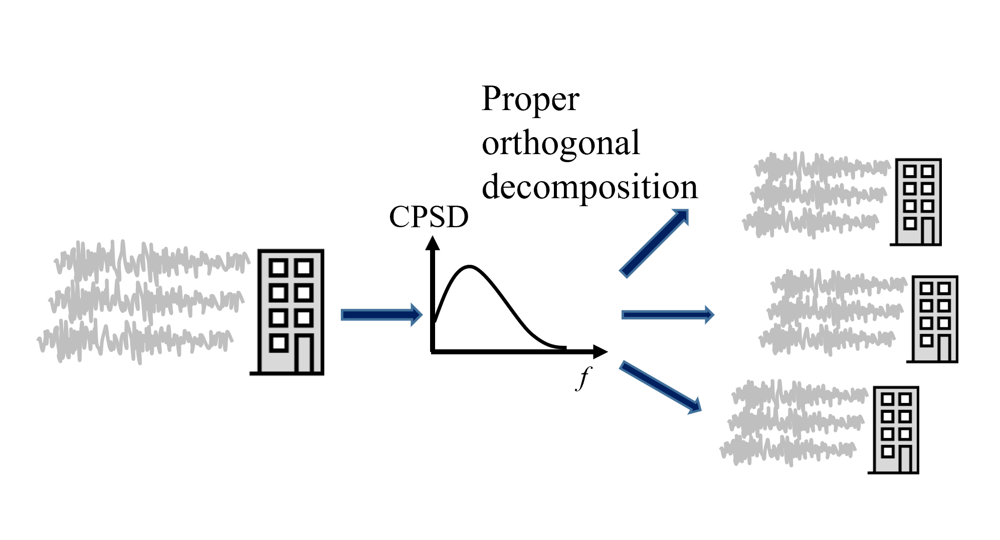
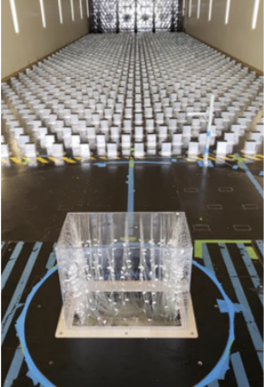
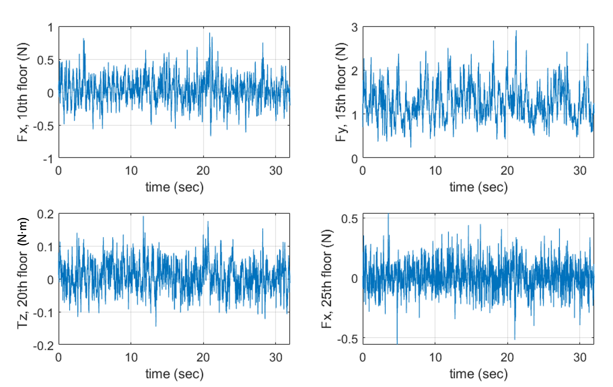
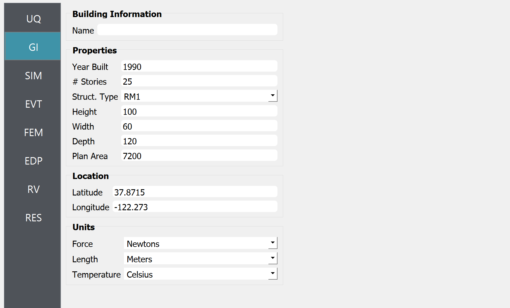
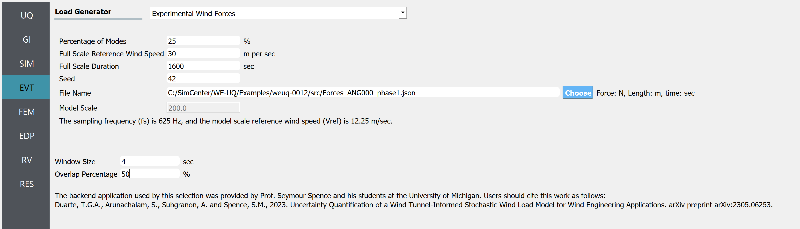

.. _weuq-0012:

Wind Tunnel-Informed Stochastic Wind Load Generation
==================================================

+----------------+-----------------------------------------------------------------------------------------------------------+
| Problem files  | `WE-UQ/Examples/weuq-0012 <https://github.com/NHERI-SimCenter/WE-UQ/tree/master/Examples//weuq-0012//>`_  |
+----------------+-----------------------------------------------------------------------------------------------------------+

This example estimates the probabilistic response of a building model excited by wind tunnel-informed stochastic wind loads. This example uses the experimental data obtained at the University of Florida (UF) NHERI Experimental Facility (EF) and applies the simulated wind loads to a 25-story rectangular-shaped building model for response simulation.

.. _fig-we12-1:

h waveform is followed by an arrow pointing down towards another waveform with variations, and each slightly varying waveform is located next to a representation of the same building. The flow of the diagram suggests a process or transformation being applied to the initial waveform, resulting in different outcomes each with the same visual representation of the building.
   :figclass: align-center
   :width: 50%

   Generating full-scale wind force time series from a model-scale wind force time series obtained from wind tunnel experiments.

This example uses the data presented in [Duarte2023]_.

.. [Duarte2023] Duarte, T.G., Arunachalam, S., Subgranon, A. and Spence, S.M., (2023). Uncertainty Quantification and Simulation of Wind-Tunnel-Informed Stochastic Wind Loads. Wind, 3(3), pp.375-393.

Preparation of "Wind Force Time History File"
^^^^^^^^^^^^^^^^^^^^^^^^^^^^^^^^^^^^^^^^^^^^^^
The experimental records should first be reformatted by the user such that **wind force time histories recorded at each floor in x-, y-, and z- directions (Fx, Fy, and Tz, respectively)** can be directly imported in WE-UQ in the EVT tab. The dataset can be imported as either a MATLAB binary file or a json file. Additionally, the model-scale dimensions and additional information on the experiment should be provided. Please refer to :ref:`the User Manual<lblExperimentalWindForce>` for the list of variables the file should contain. In this example, the variables in the table below are imported as a JSON file. Note that the x- and y- y-directional forces and z-directional moments at each of the 25 stories are recorded for 32 sec with dt=0.0016 sec (20,000 time steps). The reference wind speed (Vref) was measured at the top of the building model.

.. table:: Variables imported to WE-UQ
   :align: center
    
   +---------+------------------+---------------+
   |Variable |Values            |Units          |
   +=========+==================+===============+
   |B        |0.3               | m             |
   +---------+------------------+---------------+
   |D        |0.6               | m             |
   +---------+------------------+---------------+
   |H        |0.5               | m             |
   +---------+------------------+---------------+
   |fs       |625               | Hz            |
   +---------+------------------+---------------+
   |Vref     |12.25             | m/s           |
   +---------+------------------+---------------+
   | Fx      | [25x20000] array | N             |
   +---------+------------------+---------------+
   | Fy      | [25x20000] array | N             |
   +---------+------------------+---------------+
   | Tz      | [25x20000] array | N·m           |
   +---------+------------------+---------------+
   | t       | [1x20000] array  | sec           |
   +---------+------------------+---------------+

.. _fig-we12-2:

   The experiment was performed at UF [Duarte2023]_.

.. _fig-we12-3:

ts variability and fluctuation in the respective measured quantities.
   :figclass: align-center
   :width: 800

   Examples of Wind Force Time Series in Fx, Fy, Tz arrays [Duarte2023]_.

The json file used in this example is named ``Forces_ANG000_phase1.json``, and it can be found at :weuq-0012:`/src`. Using this information, WE-UQ will generate the stochastic wind loads that apply to a full-scale building model with **scaling factor of 200**.

Workflow
^^^^^^^^^^^^

.. note::
   This example can be directly loaded from the menu bar at the top of the screen by clicking "Examples"-"E4: Wind Tunnel-Informed Stochastic Wind Load Generation". The user may want to increase the number of samples in the UQ tab for more stable results.

1. In the UQ tab, click "forward propagation" to perform the Monte Carlo simulation. Set the number of samples to 50.

.. figure:: figures/we12_UQ.png
   :align: center
   :alt: Screenshot of a software interface featuring a section titled "UQ Method" with options for "Forward Propagation" and "UQ Engine" set to "Dakota". Two checkboxes are marked "Parallel Execution" and "Save Working dirs". Below, there is a drop-down menu set to "LHS" for method, a numeric field for "# Samples" with the number 50, and another field for "Seed" with the number 716. On the left, there is a vertical navigation bar with the highlighted option "UQ" and other options labeled "GI", "SIM", "EVT", and "FEM".
   :width: 700
   :figclass: align-center

   UQ tab

2. In the GI tab, set **# Stories** 25 as our dataset is for a 25-story building. Multiply the building scaling factor 200 by the model dimensions (0.5m x 0.3m x 0.6m; this information should be imported into "Wind Force Time History File" at the EVT tab as shown in the previous section) and specify the full-scale building dimension at **Height, Width, and Depth**, which respectively are 100, 60, and 120. Define the **Force and Length Units** of Newtons and Meters.

tude and longitude. Also present are dropdown menus for units of force, length, and temperature set to Newtons, meters, and Celsius respectively. A column on the left side shows abbreviated menu items such as UQ, GI, SIM, EVT, FEM, EDP, RV, and RES, with the GI menu item highlighted.
   :width: 700
   :figclass: align-center

   GI tab

3. In the SIM tab, the building properties are specified. We used the floor weights of 1.e7 across the floors, and the stiffness values in each story are given as

.. figure:: figures/we12_SIM.png
   :align: center
   :alt: Screenshot of an interface labeled "Building Model Generator" with various input fields for building information and parameters. The parameters include number of stories, floor weights, stiffness, yield strength, damping ratio, and more, with numerical values provided in different fields. The interface appears to be part of a software tool used for simulating or analyzing building structures.
   :width: 700
   :figclass: align-center

   SIM tab

.. table:: Stiffness of the structure
    
    +---------+---------+
    |Floors   |Stiffness|
    +=========+=========+
    |1-5      |8.e8     |
    +---------+---------+
    |6-11     |5.e8     |
    +---------+---------+
    |12-14    |4.e8     |
    +---------+---------+
    |15-17    |3.e8     |
    +---------+---------+
    |18-19    |2.5e8    |
    +---------+---------+
    |20-21    |1.7e8    |
    +---------+---------+
    |20-21    |1.7e8    |
    +---------+---------+
    |22-24    |1.2e8    |
    +---------+---------+
    |25       |0.7e8    |
    +---------+---------+

4. In the EVT tab, select the "Experimental Wind Forces" option for the Load Generator. Let us consider 25% of modes for the principal orthogonal decomposition (POD). The Full Scale Reference Wind Speed at the top of the building is set to 30 m/s. The duration of the generated wind loads is set to 1600 sec. The "Wind Force Time History File" shown in the previous section is imported next. The model scale is auto-populated only if the datasets are provided in a JSON file (instead of a Matlab binary file). For estimating the cross-power spectrum density function (CPSD), a window size of 4 sec, and an overlap percentage of 50 % are used. Please refer to :ref:`the user manual<lblExperimentalWindForce>` for more details of those parameters. 

itional information is provided like Model Scale, sampling frequency, model scale reference wind speed, Window Size, Overlap Percentage, and a reference to a backend application used by the selection provided by Prof. Seymour Spence and students at the University of Michigan with a citation for their work.
   :width: 700
   :figclass: align-center

   EVT tab

5. The FEM and EDP tabs are kept as default. Under the **Standard Wind** EDP, in this example, the structural model will automatically output peak floor acceleration (PFA), peak floor displacement respective to the ground (PFD), Peak inter-story drift ratio (PID), root-mean-squared acceleration (RMSA). 

6. In the RV tab, only a ``dummy`` variable that is not used in the UQ analysis is specified. This is because, in this example, we are only interested in the uncertainty (stochasticity) that arises in the wind load time histories.

.. figure:: figures/we12_RV.png
   :align: center
   :alt: Screenshot of a user interface for inputting random variables, with a navigation sidebar on the left with options labeled UQ, GI, SIM, EVT, FEM, EDP, and RV highlighted. The main panel shows a form titled "Input Random Variables" where a variable named "dummy" with a "Normal" distribution is listed, with a mean value of "10" and a standard deviation of "5". There are buttons for "Add", "Clear All", and "Correlation Matrix," as well as "Export" and "Import" options in the upper right corner. Additionally, a button labeled "Show PDI" is visible next to the standard deviation field.
   :width: 700
   :figclass: align-center

   RV tab

.. note::
   The user can additionally specify random variables for structural parameters by putting a string for some of the structural properties in the GI tab (e.g. "W" for the floor weight instead of 1.e7) and specifying the corresponding probability distribution at the RV tab (e.g. name: W, distribution: Normal, Mean: 1.e7, Standard Dev: 1.e6).

7. Once all the information is provided, click the Run or Run at DesignSafe button to run the analysis.

Results
^^^^^^^^^^^^^^^^^^^^^^^^^^^^^^^^^^^^^^^^^^^^^^

Once the analysis is done, the sampling results will be displayed in the RES tab. Note that the EDP name consists of the quantity of interest, story number, and the direction of interest - for example:

      * 1-PFA-0-1 : **peak floor acceleration** at the **ground floor**, **component 1** (x-dir)
      * 1-PFD-1-2 : **peak floor displacement** (respective to the ground) at the **1st floor** ceiling, **component 2** (y-dir)
      * 1-PID-3-1 : **peak inter-story drift ratio** of the **3rd floor**, **component 1** (x-dir)   
      * 1-RMSA-10-1 : **root-mean-squared acceleration** of the **10th floor**, **component 1** (x-dir)   

The response statistics are first displayed.

.. figure:: figures/we12_RES1.png
   :align: center
   :alt: A screenshot displaying a statistical data table with several rows under different categories such as UQ, SIM, EVT, FEM, EDP, RV, and RES. Each row contains an entry with columns labeled Name, Mean, StdDev (Standard Deviation), Skewness, and Kurtosis. The names include identifiers like 1-PFA-1-1, 1-RMSA-1-2, and others with corresponding numerical values in their respective columns. The table is part of a larger interface with tabs for 'Summary' and 'Data Values' visible at the top.
   :width: 700
   :figclass: align-center

   RES tab - statistics

Additionally, the user can browse the sample realization values and inspect the correlation between various components. 

.. figure:: figures/we12_RES2.png
   :align: center
   :alt: A screenshot displaying a data analytics software interface with a scatter plot and a data table. The plot is labeled "Data Values" with points representing samples, and a highlighted "Run # 9" is visible. The correlation coefficient is noted as 0.96. A table to the right contains numerous columns with numerical values, some cells highlighted in blue, indicating selected data points. Various tabs and options such as "Save Table" are available, suggesting functionalities to manipulate and store the data.
   :width: 700
   :figclass: align-center

   RES tab - scatter plots

.. note::

   The user can interact with the plot as follows.

   - Windows: left-click sets the Y axis (ordinate). right-click sets the X axis (abscissa).
   - MAC: fn-clink, option-click, and command-click all set the Y axis (ordinate). ctrl-click sets the X axis (abscissa).

