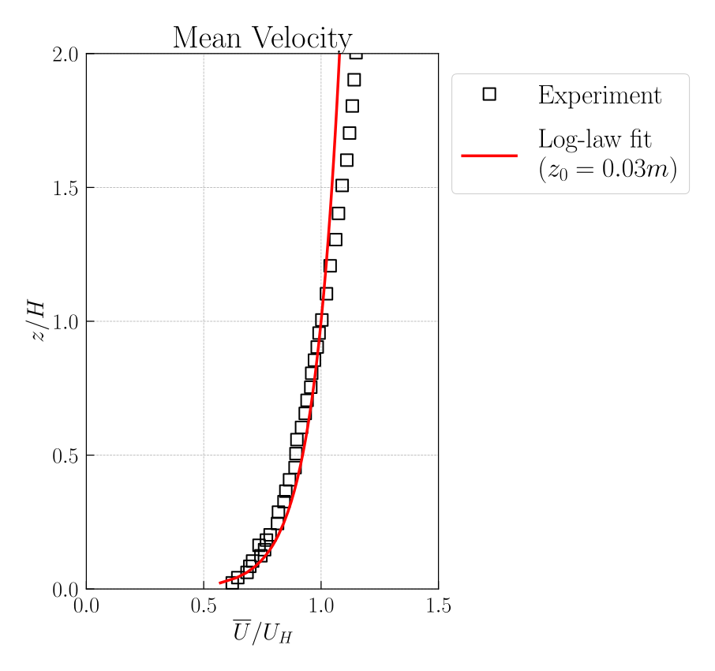
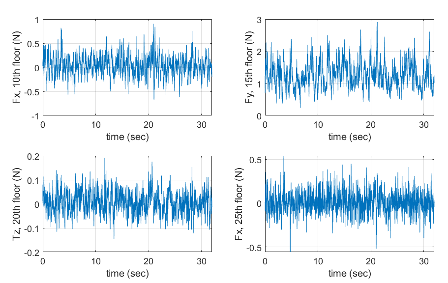
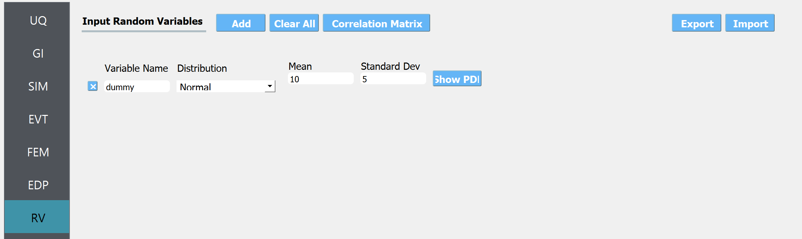
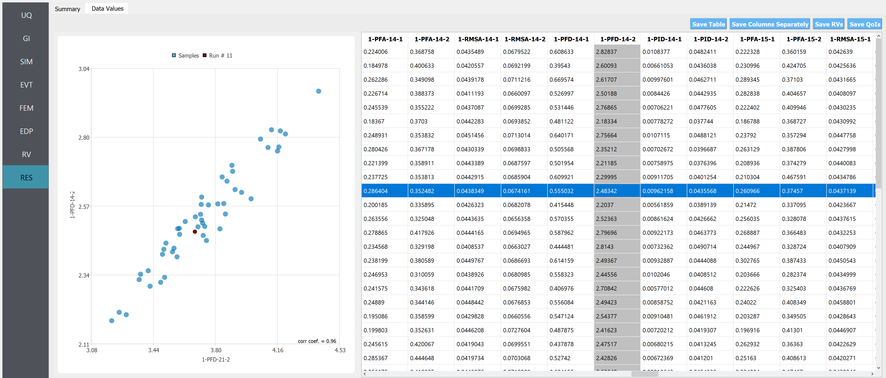

.. _weuq-0013:

Wind Load Evaluation on Isolated Building using CFD
==================================================

+----------------+-------------------------+
| Problem files  | :weuq-0013:`/`          |
+----------------+-------------------------+

This example demonstrates Computational Fluid Dynamics (CFD) based procedure for estimating the response of a building subjected to wind loading. The example demonstrates a step-by-step processes for defining the CFD model based on a target experimental setup. The target experimental model is taken from Tokyo Polytechnic University (TPU) aerodynamic database. For ease of demonstration, in this example, some simplifying assumptions are taken to model the approaching wind condition. Once the CFD simulation are completed, the recorded wind loads are applied to a 45-story building for estimating the responses. 

.. _fig-we13-1:

.. figure:: figures/we13_schematic_wind_building_domain.svg
   :align: center
   :figclass: align-center
   :width: 600

   Setup of the CFD model: approaching wind, computational domain and the study building.

Target Experimental Measurement 
^^^^^^^^^^^^^^^^^^^^^^^^^^^^^^^^^^^^^^^^^^^^^^
Relevant geometric and flow properties taken from TPU database are provided :numref:`tbl-we13-1`. These parameters are then specified in WE-UQ as demonstrated in :ref:`workflow-section`. In full-scale, the study building measures 200 m high with a 40 m square plan dimension. However, for simplicity, the CFD model is created in model scale (at 1:400 geometric scale) resembling that of the experimental version. The upwind condition chosen for this example is open exposure type with a power-law coefficient :math:`\alpha = 1/6`, which approximately translates to a log-law aerodynamic roughness length of :math:`z_0 = 0.03` m. :numref:`fig-we13-2` shows the log-law fit of the mean velocity profile extracted from the experiment. The logarithmic mean velocity profile shown in the figure is expressed as: 

.. math::
   :name: Log-law wind profile

   \overline{U}(z)
    = \frac{u_*}{\kappa} \log\left[\frac{z - d}{z_0}\right].
where --- 

The fit is good for lower part of the domain and not good for uper part (Ref Deavn and Harris paper ) Specilally for z < 200. This works fine 

For ease of demonstration, in this example, the wind is assumed to a smooth flow with no significant upcoming turbulence.    

.. _fig-we13-2:

   Log-law fitting of the mean velocity profile from the experimental measurement.

The experiment was run for a duration :math:`T = 32.768s`. But for the CFD model, considering the computational cost of running long duration simulation, we used :math:`T = 10s`.   

.. _tbl-we13-1:
.. table:: Parameters needed to define the CFD model
   :align: center
    
   +---------------------+----------------------------------------------+------------------+---------------+
   |Parameter            |Description                                   |Value             | Unit          |
   +=====================+==============================================+==================+===============+
   |:math:`B`            |Building width                                | 0.1              | m             |
   +---------------------+----------------------------------------------+------------------+---------------+
   |:math:`D`            |Building depth                                | 0.1              | m             | 
   +---------------------+----------------------------------------------+------------------+---------------+
   |:math:`H`            |Building height                               | 0.5              | m             | 
   +---------------------+----------------------------------------------+------------------+---------------+
   |:math:`\lambda_L`    |Geometric scale of the model                  | 1/400            |               | 
   +---------------------+----------------------------------------------+------------------+---------------+
   |:math:`\lambda_V`    |Velocity scale of the model                   | 1/4              |               | 
   +---------------------+----------------------------------------------+------------------+---------------+
   |:math:`\lambda_T`    |Time scale of the model                       | 100              |               | 
   +---------------------+----------------------------------------------+------------------+---------------+
   |:math:`U_H`          |Roof-height mean wind speed                   | 11.2518          | m/s           | 
   +---------------------+----------------------------------------------+------------------+---------------+
   |:math:`T`            |Duration of the simulation in model scale     | 10               | s             | 
   +---------------------+----------------------------------------------+------------------+---------------+
   |:math:`\theta`       |Wind direction                                | 0                |degrees        | 
   +---------------------+----------------------------------------------+------------------+---------------+
   |:math:`z_0`          |Aerodynamic roughness length in full scale    | 0.03             | m             | 
   +---------------------+----------------------------------------------+------------------+---------------+
   |:math:`\rho_{air}`   |Air density                                   | 1.225            | kg/m^3        | 
   +---------------------+----------------------------------------------+------------------+---------------+
   |:math:`\nu_{air}`    |Kinematic viscosity of air                    | :math:`1.5e^{-5}`| m^2/s         | 
   +---------------------+----------------------------------------------+------------------+---------------+
..
   |:math:`H_{dom}`      |Domain height                                 | 0.4              | m             | 
   +---------------------+----------------------------------------------+------------------+---------------+
   |:math:`B_{dom}`      |Domain width                                  | 0.4              | m             | 
   +---------------------+----------------------------------------------+------------------+---------------+
   |:math:`L_{dom}`      |Domain length                                 | 0.4              | m             | 
   +---------------------+----------------------------------------------+------------------+---------------+

.. _fig-we12-2:

.. figure:: figures/we12_2.png
   :align: center
   :figclass: align-center
   :width: 300

   The experiment was performed at UF [Duarte2023]_.

.. _fig-we12-3:

   Examples of Wind Force Time Series in Fx, Fy, Tz arrays [Duarte2023]_.

The json file used in this example is named ``Forces_ANG000_phase1.json``, and it can be found at :weuq-0012:`/src`. Using this information, WE-UQ will generate the stochastic wind loads that apply to a full-scale building model with **scaling factor of 200**.

.. _workflow-section:

Workflow
^^^^^^^^^^^^

.. note::
   This example can be directly loaded from the menu bar at the top of the screen by clicking "Examples"-"E4: Wind Tunnel-Informed Stochastic Wind Load Generation". The user may want to increase the number of samples in the UQ tab for more stable results.

1. In the UQ tab, click "forward propagation" to perform Monte Carlo simulation. Set the number of samples 50.

.. figure:: figures/we12_UQ.png
   :align: center
   :width: 700
   :figclass: align-center

   UQ tab

2. In the GI tab, set **# Stories** 25 as our dataset is for a 25-story building. Multiply the building scaling factor 200 by the model dimensions (0.5m x 0.3m x 0.6m; this information should be imported in "Wind Force Time History File" at the EVT tab as shown in the previous section) and specify the full-scale building dimension at **Height, Width, and Depth**, which respectively are 100, 60, and 120. Define the **Force and Length Units** of Newtons and Meters.

.. figure:: figures/we12_GI.png
   :align: center
   :width: 700
   :figclass: align-center

   GI tab

3. In the SIM tab, the building properties are specified. We used the floor weights of 1.e7 across the floors, and the stiffness values in each story are given as

.. figure:: figures/we12_SIM.png
   :align: center
   :width: 700
   :figclass: align-center

   SIM tab

.. table:: Stiffness of the structure
    
    +---------+---------+
    |Floors   |Stiffness|
    +=========+=========+
    |1-5      |8.e8     |
    +---------+---------+
    |6-11     |5.e8     |
    +---------+---------+
    |12-14    |4.e8     |
    +---------+---------+
    |15-17    |3.e8     |
    +---------+---------+
    |18-19    |2.5e8    |
    +---------+---------+
    |20-21    |1.7e8    |
    +---------+---------+
    |20-21    |1.7e8    |
    +---------+---------+
    |22-24    |1.2e8    |
    +---------+---------+
    |25       |0.7e8    |
    +---------+---------+

4. In the EVT tab, select the "Experimental Wind Forces" option for the Load Generator. Let us consider 25% of modes for the principal orthogonal decomposition (POD). The Full Scale Reference Wind Speed at the top of the building is set 30 m/s. The duration of the generated wind loads is set to 1600 sec. The "Wind Force Time History File" shown in the previous section is imported next. The model scale is auto-populated only if the datasets are provided in a json file (instead of a matlab binary file). For estimating the cross-power spectrum density function (CPSD), a window size of 4 sec, and an overlap percentage of 50 % are used. Please refer to :ref:`the user manual<lblExperimentalWindForce>` for more details of those parameters. 

.. figure:: figures/we12_EVT.png
   :align: center
   :width: 700
   :figclass: align-center

   EVT tab

5. The FEM and EDP tabs are kept as default. Under the **Standard Wind** EDP, in this example, the structural model will automatically output peak floor acceleration (PFA), peak floor displacement respective to the ground (PFD), Peak inter-story drift ratio (PID), root-mean-squared acceleration (RMSA). 

6. In the RV tab, only a ``dummy`` variable that is not used in the UQ analysis is specified. This is because, in this example, we are interested in only the uncertainty that comes from the stochasticity of the wind time history. 

   RV tab

.. note::
   The user can additionally specify random variables for structural parameters by putting a string for some of the structural properties in GI tab (e.g. "W" for the floor weight instead of 1.e7), and specifying the corresponding probability distribution at the RV tab (e.g. name: W, distribution: Normal, Mean: 1.e7, Standard Dev: 1.e6).

7. Once all the information is provided, click the Run or Run at DesignSafe button to run the analysis.

Preparation of "Wind Force Time History File"
^^^^^^^^^^^^^^^^^^^^^^^^^^^^^^^^^^^^^^^^^^^^^^

Once the analysis is done, the sampling results will be displayed in the RES tab. Note that the EDP name consists of the quantity of interest, story number, and the direction of interest - for example:

      * 1-PFA-0-1 : **peak floor acceleration** at the **ground floor**, **component 1** (x-dir)
      * 1-PFD-1-2 : **peak floor displacement** (respective to the ground) at the **1st floor** ceiling, **component 2** (y-dir)
      * 1-PID-3-1 : **peak inter-story drift ratio** of the **3rd floor**, **component 1** (x-dir)   
      * 1-RMSA-10-1 : **root-mean-squared acceleration** of the **10th floor**, **component 1** (x-dir)   

The response statistics are first displayed.

.. figure:: figures/we12_RES1.png
   :align: center
   :width: 700
   :figclass: align-center

   RES tab - statistics

Additionally, the user can browse the sample realization values and inspect the correlation between various components. 

   RES tab - scatter plots

.. note::

   The user can interact with the plot as follows.

   - Windows: left-click sets the Y axis (ordinate). right-click sets the X axis (abscissa).
   - MAC: fn-clink, option-click, and command-click all set the Y axis (ordinate). ctrl-click sets the X axis (abscissa).

https://www.collaborate.wind.t-kougei.ac.jp/en/facility/
http://www.wind.arch.t-kougei.ac.jp/system/contents/code/tpu