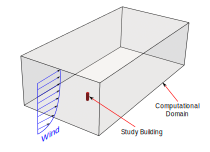
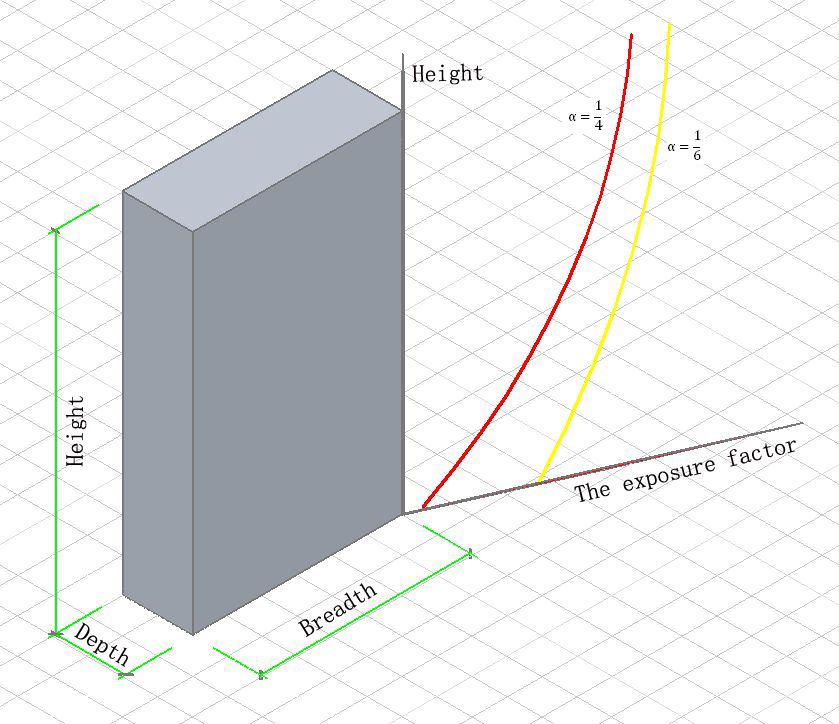
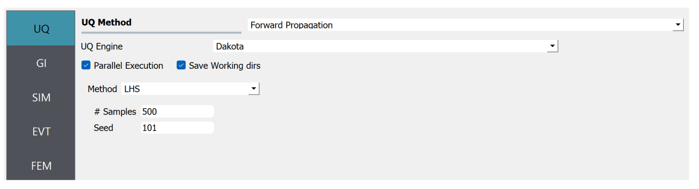
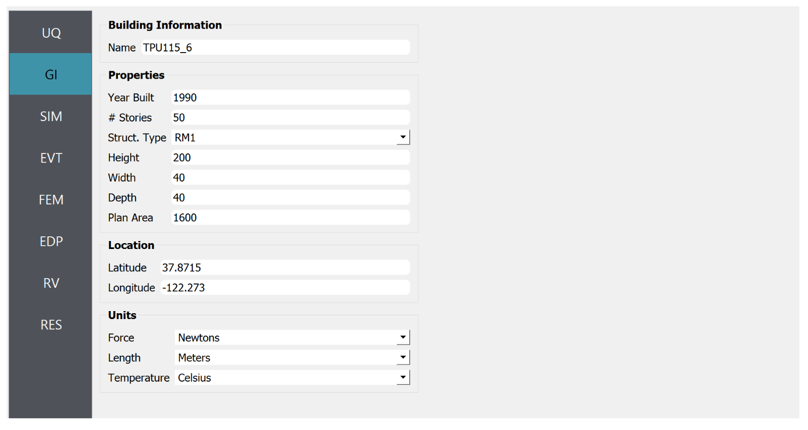
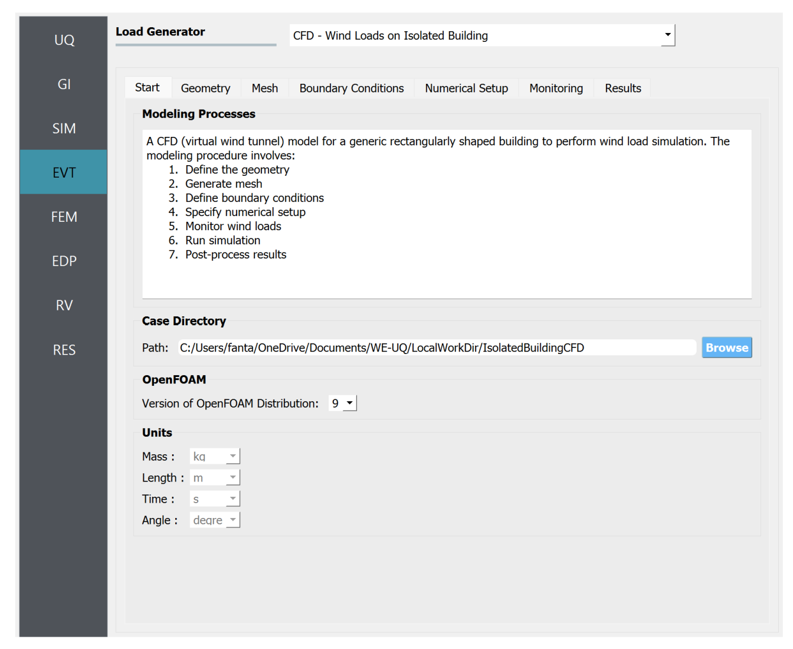

.. _weuq-0013:

Digital Wind Tunnel II: Wind Loads on Isolated Building
==================================================

+----------------+-------------------------+
| Problem files  | :weuq-0013:`/`          |
+----------------+-------------------------+

This example demonstrates a Computational Fluid Dynamics (CFD) based procedure for estimating the response of a building subjected to wind loading. The example demonstrates a step-by-step process for defining the CFD model based on a target experimental setup. The target experimental model is taken from Tokyo Polytechnic University (TPU) aerodynamic database. For ease of demonstration, in this example, some simplifying assumptions are taken to model the approaching wind condition. Once the CFD simulation are completed, the recorded wind loads are applied to a 45-story building for estimating the responses. 

.. _fig-we13-1:

   Setup of the CFD model: approaching wind, computational domain and the study building.

Target Experimental Measurement 
^^^^^^^^^^^^^^^^^^^^^^^^^^^^^^^^^^^^^^^^^^^^^^
Relevant geometric and flow properties taken from TPU database are provided :numref:`tbl-we13-1` . These parameters are then specified in WE-UQ as demonstrated in :ref:`workflow-section`. In full-scale, the study building measures 200 m high with a 40 m square plan dimension. However, for simplicity, the CFD model is created in model scale (at 1:400 geometric scale) resembling that of the experimental version. 

.. _fig-we13-tpu-model:

.. _tbl-we13-1:

.. table:: Parameters needed to define the CFD model (taken from TPU database)
   :align: center
    
   +---------------------+----------------------------------------------+------------------+---------------+
   |Parameter            |Description                                   |Value             | Unit          |
   +=====================+==============================================+==================+===============+
   |:math:`B`            |Building width                                | 0.1              | m             |
   +---------------------+----------------------------------------------+------------------+---------------+
   |:math:`D`            |Building depth                                | 0.1              | m             | 
   +---------------------+----------------------------------------------+------------------+---------------+
   |:math:`H`            |Building height                               | 0.5              | m             | 
   +---------------------+----------------------------------------------+------------------+---------------+
   |:math:`\lambda_L`    |Geometric scale of the model                  | 1/400            |               | 
   +---------------------+----------------------------------------------+------------------+---------------+
   |:math:`\lambda_V`    |Velocity scale of the model                   | 1/4              |               | 
   +---------------------+----------------------------------------------+------------------+---------------+
   |:math:`\lambda_T`    |Time scale of the model                       | 100              |               | 
   +---------------------+----------------------------------------------+------------------+---------------+
   |:math:`U_H`          |Roof-height mean wind speed                   | 11.2518          | m/s           | 
   +---------------------+----------------------------------------------+------------------+---------------+
   |:math:`T`            |Duration of the simulation in model scale     | 10               | s             | 
   +---------------------+----------------------------------------------+------------------+---------------+
   |:math:`\theta`       |Wind direction                                | 0                |degrees        | 
   +---------------------+----------------------------------------------+------------------+---------------+
   |:math:`z_0`          |Aerodynamic roughness length in full scale    | 0.03             | m             | 
   +---------------------+----------------------------------------------+------------------+---------------+
   |:math:`\rho_{air}`   |Air density                                   | 1.225            | kg/m^3        | 
   +---------------------+----------------------------------------------+------------------+---------------+
   |:math:`\nu_{air}`    |Kinematic viscosity of air                    | :math:`1.5e^{-5}`| m^2/s         | 
   +---------------------+----------------------------------------------+------------------+---------------+
   |:math:`f_{s}`        |Sampling frequency (rate)                     | 1000             | Hz            | 
   +---------------------+----------------------------------------------+------------------+---------------+

..
   |:math:`H_{dom}`      |Domain height                                 | 0.4              | m             | 
   +---------------------+----------------------------------------------+------------------+---------------+
   |:math:`B_{dom}`      |Domain width                                  | 0.4              | m             | 
   +---------------------+----------------------------------------------+------------------+---------------+
   |:math:`L_{dom}`      |Domain length                                 | 0.4              | m             | 
   +---------------------+----------------------------------------------+------------------+---------------+

   Setup of the experimental model taken from TPU database [TPU2005]_.

The upwind condition chosen for this example is open exposure type with a power-law coefficient :math:`\alpha = 1/6`, which approximately translates to a log-law aerodynamic roughness length of :math:`z_0 = 0.03` m. :numref:`fig-we13-2` shows the log-law fit of the mean velocity profile extracted from the experiment. The logarithmic mean velocity profile shown in the figure is expressed by: 

.. math::
   :name: Log-law wind profile

   \overline{U}(z)
    = \frac{u_*}{\kappa} \log\left[\frac{z-d}{z_0}\right], 
where :math:`u_*`, :math:`\kappa = 0.4` and :math:`d` are the shear friction velocity, von Karman constant and displacement height, respectively. The value of :math:`d` is set to zero, considering it is open exposure (for rough terrains it needs to be higher than 0). The shear friction velocity is determined by evaluating the log-law profile at the reference location (building height). Thus, :math:`u_*` is computed as

.. math::
   :name: Log-law wind profile

   u_* = \frac{\kappa U_H}{\log(H/z_0)}. 

As shown in :numref:`fig-we13-2`, the log-law fit is reasonable for most part of the boundary layer height. However, in the upper part of the domain i.e., :math:`z > H(200 m)` it shows some deviation. For cases with larger deviations from log-law, a more accurate wind profiles developed by Deaves and Harris (D&H model) need to be used ([Cook1997]_). These profiles present a better description of the ABL turbulence and are also adopted in [ESDU2001]_ standards.  

.. _fig-we13-2:

.. figure:: figures/we13_mean_velocity_profile_fitting.svg
   :align: center
   :width: 500

   Log-law fitting of the mean velocity profile from the experimental measurement.

.. note::
   For ease of demonstration, in this example, the wind is assumed to a smooth flow with no significant upcoming turbulence. However, realistic wind load simulation needs to account the turbulence in the upcoming flow using appropriate inflow boundary conditions. 

The experiment was run for a duration :math:`T = 32.768s`. But for the CFD model, considering the computational cost of running long duration simulation, we used :math:`T = 10s`. Also, since we used smooth inflow boundary conditions at the inlet, the wind loads will converge faster as compared to the case with a turbulent inlet. For monitoring the forces from the CFD model, we will specify the same sampling rate used in experimental measurement (:math:`f_{s} = 1000 Hz`).    

.. _workflow-section:

Workflow
^^^^^^^^^^^^
In this example, the overall workflow is demonstrated by introducing uncertainty in the structural model. No uncertainties were considered in the wind parameters or CFD simulations. The user needs to go through the following procedure to define the Uncertainty Quantification (UQ) technique, building information, structural properties, and CFD model parameters. 

   .. note::
      This example can be directly loaded from the menu bar at the top of the screen by clicking "Examples"-"E5: Wind Load Evaluation on an Isolated Building using CFD with Uncertainty Quantification". 

UQ Method
"""""""""""
Specify the details of uncertainty analysis in the **UQ** panel. This example uses forward uncertainty propagation. Select "Forward Propagation" for UQ Method and specify "Dakota" for UQ Engine driver. For the UQ algorithm, use Latin Hypercube ("LHC"). Change the number of samples to 500 and set the seed to 101.

   Selection of the Uncertainty Quantification Technique

General Information
"""""""""""""""""""
Next, in the **GI** panel, specify the properties of the building and the unit system. For the **# Stories** use 50 assuming a floor height of 4 m. Set the **Height**, **Width** and **Depth** to 200, 40 and 40 with a **Plan Area** of 1600. Define the units for **Force** and **Length** as "Newtons" and "Meters", respectively. 

   .. warning::
      Note that the CFD model is created at a reduced or model scale (i.e., 1 to 400) just like the target wind tunnel model. However, the building dimensions specified here need to be in full-scale (actual building dimensions). 

   Set the building properties in **GI** panel

Structural Properties
"""""""""""""""""""""
In the SIM panel, the structural properties are defined. For the structural model, select "MDOF" generator. The number of stories and floor height are automatically populated based on **GI** panel. For the **Floor Weights** put :math:`1.5 \times 10^7`. Replace the **Story Stiffness** with **k** to designate it as a random variable. Later the statistical properties of this random variable will be defined in **RV** panel. Then, input damping, yield strength, hardening ratio and other parameters as shown in :numref:`fig-we13-SIM-panel`. 

.. _fig-we13-SIM-panel:
   

.. figure:: figures/we13_SIM_panel.svg
   :align: center
   :width: 1000

   Define the structural properties in **SIM** panel

CFD Model
"""""""""""""""""""
In the **EVT** panel, for the **Load Generator** select "CFD - Wind Loads on Isolated Building" option to create the CFD model. Here, a brief instruction to define the CFD parameters is provided. For a detailed procedure to setup the CFD model, the user is advised to refer :ref:`the user manual<lblIsolatedBuildingCFD>`.   

1. In the *Start* tab, specify the path where your CFD model will be saved by clicking **Browse** button. It is recommended to put it in the default path i.e., ``Documents\WE-UQ\LocalWorkDir\IsolatedBuildingCFD``. Select the **Version of OpenFOAM Distribution** to 9. Use the steps outlined in **Modeling Process** box to guide you through procedure. 

   .. note::
      The CFD model are defined in metric system. Here after please use kilograms for **Mass**, meters for **Length**, second for **Time** and degrees for **Angle**. 

   Setup the path and version of OpenFOAM in *Start* tab

2. Specify geometric details related to the building and computational domain in the *Geometry* tab. Set **Input Dimension Normalization** to *Relative* to size of the domain relative to the building height. Change the **Geometric Scale** of the CFD simulation to 1 to 400 based on the experimental setup (see :numref:`tbl-we13-1`). Set the **Building Shape** to *Simple* as the study building is a simple square building. In the **Building Dimension and Orientation** box specify the **Wind Direction** as 0 to simulate wind incidence normal to the building face. Check the **COST Recommendation** to automatically calculate the domain dimensions based on the COST [Franke2007]_ recommendations. For the coordinate system, specify the **Absolute Origin** as *Building Bottom Center*.

   .. note::
      If the objective is to replicate a target wind tunnel setup fully, one might need to set the **Domain Length**, **Domain Width**, **Domain Height** and **Fetch Length** manually matching the dimensions of the actual testing facility.

.. figure:: figures/we13_EVT_Geometry_tab.svg
   :align: center
   :width: 1100

   Define the building and domain geometry in *Geometry* tab

3. Generate the computational grid in the *Mesh* tab. Follow these steps to set the mesh parameters:
   
   **Background Mesh:**

   Define the background (base) mesh as a structured grid with **No. of Cells** in *X-axis*, *Y-axis* and *Z-axis* set to 80, 40, 24. The grid size in each direction needs to be approximately the same. 

   .. figure:: figures/we13_EVT_Mesh_tab.svg
      :align: center
      :width: 1100

      Define the computational grid in *Mesh* tab

   **Regional Refinements:**
   
   Create 4 boxes to set different refinement regions using the table shown below. Each refinement box needs to have name, refinement level, min and max coordinates. Set the **Level** with successive increments of 1 (i.e., 1 for *Box1*, 2 for *Box2*, etc.). The **Mesh Size** for each region is automatically calculated and provided in the last column of the table.

   .. figure:: figures/we13_EVT_Mesh_RegionalRefinement_tab.svg
      :align: center
      :width: 800

      Create regional refinements

   **Surface Refinements:**
   
   In the *Surface Refinements* sub-tab, check the *Add Surface Refinements* box. Set the **Refinement Level** to 6 adding an additional 2 levels of refinement from the last refinement box (*Box4*). These refinements are automatically applied to the *building* surface. For the **Refinement Distance**, use 0.1 which restricts the near-surface refinements within :math:`0.1 \times H` distance from the building.  **Approx. Smallest Mesh Size** gives the estimated size of the smallest mesh element(cell) near the surface of the building.

   .. figure:: figures/we13_EVT_Mesh_SurfaceRefinement_tab.svg
      :align: center
      :width: 800

      Create surface refinements
   
   **Edge Refinements:**
   
   Select *Edge Refinements* sub-tab and check *Add Edge Refinements* box. For the **Refinement Level** use 7 effectively making the building edges have one level finer refinement than the rest of the building surface. Similarly, the estimated smallest cell size is given in **Approx. Smallest Mesh Size**.

   .. figure:: figures/we13_EVT_Mesh_EdgeRefinement_tab.svg
      :align: center
      :width: 800

      Apply further refinements along the building edges

   **Prism Layers:**
   
   For this example no prism layers are added. Thus, in the *Prism Layers* sub-tab, uncheck *Add Prism Layers* box. However, for more accurate CFD simulation it is recommended to have prism layers.

   .. figure:: figures/we13_EVT_Mesh_PrismLayers_tab.svg
      :align: center
      :width: 800

      Adding Prism Layers

   **Advanced Options:**
   
   Use the default values for parameters in *Advanced Options* group. If you want to use more transition (buffer) cells between each refinement level, change **Number of Cells Between Levels** to a higher value. 

   .. figure:: figures/we13_EVT_Mesh_AdvancedOptions.svg
      :align: center
      :width: 800

      Set *Advanced Options*

   **Run Mesh**
   
   Once all mesh parameters are defined, click **Run snappyHexMesh** button to generate the final mesh. The progress of the mesh generation can be monitored on **Program Output**. When the mesh generation finishes successfully, the *Model View* window on the right side will get updated and the user can visualize the mesh. You can actively zoom, rotate and pan the generated mesh in 3D for a detailed view. The following figure shows an inside view of the computational domain after selecting a *Breakout* **View** option in the *Model View* panel. 

   .. figure:: figures/we13_EVT_Mesh_Run.svg
      :align: center
      :width: 800

      Running the mesh

   .. figure:: figures/we13_EVT_Mesh_View.svg
      :align: center
      :width: 800

      Breakout View of the Mesh
   
4. In the *Boundary Conditions* tab, define properties of the approaching wind and boundary fields. 

   * First, configure parameters in the **Wind Characteristics** group. Set the **Velocity Scale** to 4, the same value given in :numref:`tbl-we13-1`. The **Time Scale** will be automatically calculated using velocity and length scale information. Similarly, for the **Wind Speed At Reference Height** put :math:`11.25 m/s`, and set the **Reference Height** as building height, which is :math:`0.5 \, m` in model scale. Specify the roughness of the surrounding terrain by changing **Aerodynamic Roughness Length** to a full-scale value of :math:`0.03 m`. For physical properties of the air, use :math:`1.225 \, kg/m^3` for **Air Density** and :math:`1.5 \times 10^{-5} \, m^2/s` for **Kinematic Viscosity**. The Reynolds number (:math:`Re`) of the flow that uses the reference wind speed and height can be computed by clicking the **Calculate** button.

   * Then, define the boundary fields on each face of the domain including the building surface in **Boundary Conditions** group. At the **Inlet** use *MeanABL* which specifies a mean velocity profile based on the logarithmic profile shown in :numref:`fig-we13-2`. For **Outlet** use a *zeroPressureOutlet* which sets the pressure at the outlet to zero, and helps to maintain the reference pressure in the domain around zero. On the **Side** and **Top** faces of the domain use *symmetry* boundary conditions. For the **Ground** surface, apply *roughWallFunction* to account for the roughness of the surrounding terrain prescribed by **Aerodynamic Roughness Length** (:math:`z_0`). Whereas, on the **Building** surface, use *smoothWallFunction* assuming the building has a smooth surface.   

   .. figure:: figures/we13_EVT_BoundaryConditions.svg
      :align: center
      :width: 800

      Setup the *Boundary Conditions*  

5. Specify turbulence modeling, solver type, duration and time step options in *Numerical Setup* tab. 
   
   * For this example, since time-series of the wind forces are needed for the structural solver, we use transient CFD simulation. Thus, in **Turbulence Modeling** group, set **Simulation Type** to *LES* and select *Smagorinsky* for the **Sub-grid Scale Model**. The coefficients of the standard *Smagorinsky* model are printed in the following text box. 
  
   * For the **Solver Type** select *pisoFoam* in **Solver Selection** group . Set the **Number of Non-Orthogonal Correctors** to 1 to add additional solver iteration. This option will give better stability to the solver as the generated mesh is non-orthogonal (irregular) near the building surface.   
  
   * Specify :math:`10 s` for the **Duration** of the simulation based on what is determined in :numref:`tbl-we13-1`. Compute the approximate **Time Steep** needed for a stable simulation by clicking **Calculate** button. Then, you can change the calculated time step to a slightly lower or higher value avoiding the use of long significant digits. For this example, the calculated value was :math:`8.67919 \times 10^{-05}` but it was changed to :math:`1.0 \times 10^{-04}` to make it a workable time step. Chose the **Constant** time step option. 

   * Check the **Run Simulation in Parallel** option and specify the **Number of Processors** to the 32. Depending on the number of grids used, the number of processors can be increased to a higher value. 

.. _fig-we13-CFD-num-setup:

.. figure:: figures/we13_EVT_NumericalSetup.svg
   :align: center
   :width: 800

   Edit the *Numerical Setup* options

6. Select quantities of interest to record from the CFD simulation in the *Monitoring* tab.  
 
   * Check **Monitor Base Loads** and set the corresponding **Write Interval** to 10, which sets the data to be written at every 10 time-step of the CFD solver.       
  
   * The integrated story forces are always monitored as the whole workflow needs that. Similarly, here set the **Write Interval** to 10 which writes the story loads with a time interval of :math:`\Delta t \times 10 = 0.001s`. Note that this value is the same as the sampling rate (:math:`f_s = 1000 Hz`) used in the experimental model. Ultimately, this is the time step the structural solver will see. 
  
   * Uncheck the **Sample Pressure Data on the Building Surface** option as we only need integrated loads for this example. 
  
   .. figure:: figures/we13_EVT_Monitoring.svg
      :align: center
      :width: 800

      Specify the CFD outputs in the *Monitoring* tab

Finite Element Analysis
"""""""""""""""""""""""""
To set the finite element analysis options, select the **FEM** panel. Here we will keep the default values as seen in :numref:`fig-we13-FEM-panel`. 

.. Here we will change the entries to use Rayleigh damping, with rayleigh factor chosen using 1 and 6 modes. For the MDOF model generator, because it generates a model with two translational and 1 rotational degree-of-freedom in each direction and because we have provided the same k values in each translational direction, i.e. we will have duplicate eigenvalues, we specify as shown in the figure modes 1 and 6.

.. _fig-we13-FEM-panel:

.. figure:: figures/we13_FEM_panel.svg
   :align: center
   :width: 1000

   Setup the Finite Element analysis options

Engineering Demand Parameter
""""""""""""""""""""""""""""""
Next, select the quantity of interest from the analysis in the **EDP** panel. The Engineering Demand Parameters (EDPs) are structural response quantities that can be used to evaluate the performance of the structure under wind. Here select the *Standard Wind* EDPs which include floor displacement, acceleration and inter-story drift.  

.. figure:: figures/we13_EDP_panel.svg
   :align: center
   :width: 800

   Select the EDPs to measure

Random Variables
"""""""""""""""""
The random variables are defined in **RV** tab. Here, the floor stiffness named as :math:`k` in **SIM** tab is automatically assigned as a random variable. Select *Normal* for the probability **Distribution** of the variable. Then, specify :math:`4 \times 10^{8}` for the **Mean** and :math:`4 \times 10^{7}` for **Standard Dev**. The user can also click **Show PDF** to inspect the probability density function of the variable as shown in :numref:`fig-we13-RV-panel` 

.. _fig-we13-RV-panel:

.. figure:: figures/we13_RV_panel.svg
   :align: center
   :width: 800

   Define the Random Variable (RV)

Running the Simulation 
"""""""""""""""""""""""
Considering the high cost of running the CFD simulation, the whole workflow can only be run remotely. Thus, once setting up the workflow is completed, the user needs to first login to *DesignSafe* with their credential by clicking **Login** button at the top right corner of the window as seen :numref:`fig-we13-submit-job`. Then, by pressing **RUN at DesignSafe** information needed for submitting the job to the remote server is specified. Put a meaningful identifier for the **Job Name** e.g., "TPU_LES_Example1". Set **Num Nodes** to 1 and **# Processes Per Node** to 32. For **Max Run Time**, specify *17:00:00* which requests a total of 17 hours 0 minutes and 0 seconds. Finally, click the **Submit** button to send the job to *DesignSafe*   

   .. note::
      We know 17 hours is a really long time!! This is quite common in most LES-based wind loads evaluation studies. If you only want to test the example, please set **Duration** of the simulation in **Numerical Setup** tab of the **EVT** panel to a smaller value, say :math:`0.1s`, and submit the simulation.

   .. warning::
      Note that the total number of processors used in the simulation equals **Num Nodes** :math:`\times` **# Processes Per Node**. This value must be the same as what is specified for **Number of Processors** in **Numerical Setup** tab of the CFD model (see :numref:`fig-we13-CFD-num-setup`). 

   .. warning::
      If the simulation cannot finish within the allocated time, it will be terminated and none of your remote simulation data can be retried. Thus, it is recommended to make **Max Run Time** slightly longer than what is needed to be safe.

.. _fig-we13-submit-job:

.. figure:: figures/we13_RunJob.svg
   :align: center
   :width: 1100

   Submit the simulation to the remote server (DesignSafe-CI)

**Monitor the Simulation**

The progress (status) of the submitted job can be tracked by clicking **GET from DesignSafe**. A new window pops up showing all the jobs run on *DesignSafe*. Here right-click the name of your job, and select **Refresh Job** option to update the status of the job. If the job started the table will show *RUNNING* for the status. When the simulation is completed it will show *FINISHED*.   

.. _fig-we13-monitor-job:

.. figure:: figures/we13_MonitorJob.svg
   :align: center
   :width: 800

   Monitor the submitted job

Results
"""""""""
Once the remote job finishes, the results can be reloaded by clicking **Retrieve Data** option in :numref:`fig-we13-monitor-job`. Then, the results will be displayed in **RES** tab. For the *Standard* EDP chosen the responses monitored are displayed for each floor and direction. For example, the naming of the EDPs with:  

      * 1-PFA-0-1: represents **peak floor acceleration** at the **ground floor** for **component 1** (x-dir)
      * 1-PFD-1-2: represents **peak floor displacement** (relative to the ground) at the **1st floor** ceiling for **component 2** (y-dir)
      * 1-PID-3-1: represents  **peak inter-story drift ratio** of the **3rd floor** for **component 1** (x-dir) and
      * 1-RMSA-50-1: represents **root-mean-squared acceleration** of the **50th floor** for **component 1** (x-dir).   

The four statistical moments of the EDPs which include *Mean*, *StdDev*, *Skewness* and *Kurtosis* are provided in the *Summary* tab of the panel. 

.. figure:: figures/we13_RES_Summary.svg
   :align: center
   :width: 800

   Summary of the recorded EDPs in **RES** panel

In addition, by switching to *Data Values* tab, you can see all the realizations of the simulation and inspect the relationships between different entries. For instance, if you want to visualize the variation of the top-floor acceleration with floor stiffness, right-click "1-RMSA-50-2" column in the table. This will show the root-mean-squared acceleration in the cross-wind direction for all runs as shown on the left side of :numref:`fig-we13-RES-scatter`. As you might expect, the floor acceleration generally decreases as the building becomes more stiff.   

.. _fig-we13-RES-scatter:

.. figure:: figures/we13_RES_DataValues.svg
   :align: center
   :width: 1000

   (scatter-plot) Top-floor acceleration vs floor stiffness, (table) Report of EDPs for all realizations   

.. note::

   The user can interact with the plot as follows.

   - Windows: left-click sets the Y axis (ordinate), while right-click sets the X axis (abscissa).
   - MAC: fn-clink, option-click, and command-click all set the Y axis (ordinate). ctrl-click sets the X axis (abscissa).

Visualizing the CFD Output
^^^^^^^^^^^^^^^^^^^^^^^^^^^
The simulated case directory can be directly accessed on the *DesignSafe* data depot and visualized remotely using Paraview. The following plots show sample visualization of the instantaneous flow field.  

In :numref:`fig-we13-CFD-result1`, the streamlines of the approaching flow, as it passes around the building, are shown. On the building surface, the result pressure coefficient are displayed. It also shows the inside view of the mesh underlying.    

.. _fig-we13-CFD-result1:

.. figure:: figures/we13_CFD_Results_StreamLines.svg
   :align: center
   :width: 800

   Streamlines of the instantaneous velocity field around the building.

Similarly, in :numref:`fig-we13-CFD-result2`, the instantaneous velocity contours on the horizontal and vertical sections taken in the vicinity of the building are shown. The figure also shows the flow structure (bottom right plot) around the building. It can be seen that important flow features such as vortex shading, turbulence at the wake, and horseshoe vortex in the front of the building are captured. We recommend the user first inspect the CFD output before proceeding with results in the **RES** panel. This type of qualitative check constitutes the first step of verification (quality assurance) for the predicted wind loads.     

.. _fig-we13-CFD-result2:

.. figure:: figures/we13_CFD_Results.svg
   :align: center
   :width: 1000

   Instantaneous velocity field around the building.

.. [Cook1997] Cook, N.J., 1997. The Deaves and Harris ABL model applied to heterogeneous terrain. Journal of wind engineering and industrial aerodynamics, 66(3), pp.197-214.

.. [ESDU2001] ESDU, I., 2001. Characteristics of Atmospheric Turbulence Near the Ground—Part II: Single Point Data for Strong Winds (Neutral Atmosphere). Engineering Sciences Data Unit, IHS Inc., London, UK, Report No. ESDU, 85020.

.. [TPU2005] Tokyo Polytechnic University: http://www.wind.arch.t-kougei.ac.jp/info_center/windpressure/highrise/Homepage/homepageHDF.htm

.. [Franke2007] Franke, J., Hellsten, A., Schlünzen, K.H. and Carissimo, B., 2007. COST Action 732: Best practice guideline for the CFD simulation of flows in the urban environment.

