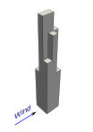
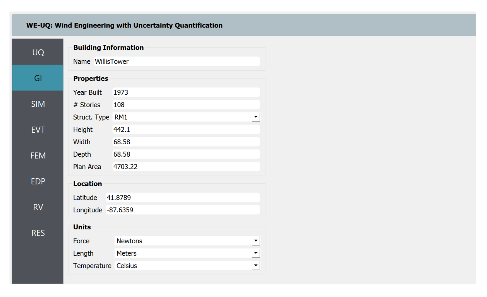
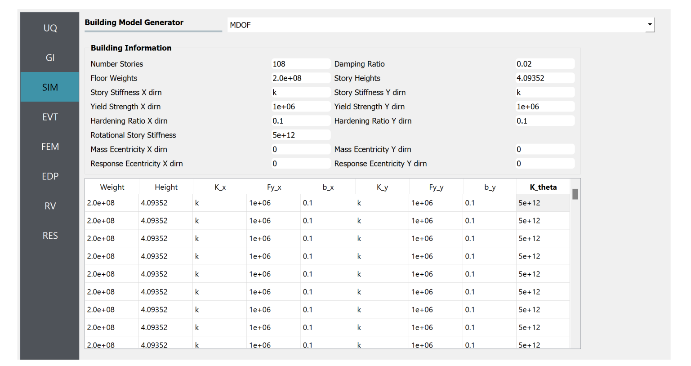

.. _weuq-0014:

Digital Wind Tunnel II: Wind Loads on Isolated Building with Complex Geometry
==================================================

+----------------+-------------------------+
| Problem files  | :weuq-0014:`/`          |
+----------------+-------------------------+

In this example, the CFD-based workflow for determining the wind-induced response of a building with arbitrary geometry is demonstrated. The shape of the study building resembles a landmark tall building i.e., Willis Tower (formerly known as Sears Tower) located in Chicago, Illinois, United States. In full-scale, the building measures 442.1 m high after some geometric simplification. :numref:`fig-we14-1` shows the STL representation of the building to be imported to the workflow. Except for the building geometry, most of the input parameters used in this example are similar to the example in :numref:`weuq-0013`.  

.. _fig-we14-1:

   Geometry and configuration of the study building

In this example, the simulation is conducted in full-scale. The geometric and flow properties are given in :numref:`tbl-we14-1`. The detailed CFD-based workflow is illustrated in :ref:`workflow-section`.  

.. _tbl-we14-1:
.. table:: Parameters needed to define the CFD model 
   :align: center
    
   +---------------------+----------------------------------------------+------------------+---------------+
   |Parameter            |Description                                   |Value             | Unit          |
   +=====================+==============================================+==================+===============+
   |:math:`B`            |Building width                                | 68.58            | m             |
   +---------------------+----------------------------------------------+------------------+---------------+
   |:math:`D`            |Building depth                                | 68.58            | m             | 
   +---------------------+----------------------------------------------+------------------+---------------+
   |:math:`H`            |Building height                               | 442.1            | m             | 
   +---------------------+----------------------------------------------+------------------+---------------+
   |:math:`\lambda_L`    |Geometric scale                               | 1.0              |               | 
   +---------------------+----------------------------------------------+------------------+---------------+
   |:math:`\lambda_V`    |Velocity scale                                | 1.0              |               | 
   +---------------------+----------------------------------------------+------------------+---------------+
   |:math:`\lambda_T`    |Time scale                                    | 1.0              |               | 
   +---------------------+----------------------------------------------+------------------+---------------+
   |:math:`U_H`          |Roof-height mean wind speed                   | 60.00            | m/s           | 
   +---------------------+----------------------------------------------+------------------+---------------+
   |:math:`T`            |Duration of the simulation                    | 1200             | s             | 
   +---------------------+----------------------------------------------+------------------+---------------+
   |:math:`\theta`       |Wind direction                                | 0                |degrees        | 
   +---------------------+----------------------------------------------+------------------+---------------+
   |:math:`z_0`          |Aerodynamic roughness length in full scale    | 0.03             | m             | 
   +---------------------+----------------------------------------------+------------------+---------------+
   |:math:`\rho_{air}`   |Air density                                   | 1.225            | kg/m^3        | 
   +---------------------+----------------------------------------------+------------------+---------------+
   |:math:`\nu_{air}`    |Kinematic viscosity of air                    | :math:`1.5e^{-5}`| m^2/s         | 
   +---------------------+----------------------------------------------+------------------+---------------+
   |:math:`f_{s}`        |Sampling frequency (rate)                     | 10               | Hz            | 
   +---------------------+----------------------------------------------+------------------+---------------+

The upwind condition chosen for this example is open exposure type with aerodynamic roughness length of :math:`z_0 = 0.03` for wind direction :math:`\theta = 0^o`. For simplicity, the effect of the surrounding buildings is neglected and a smooth inflow boundary condition is adopted at the inlet.  
    

.. _workflow-section:

Workflow
^^^^^^^^^^^^
In this example, the overall workflow is demonstrated by introducing uncertainty in the structural model. No uncertainties were considered in the wind parameters or CFD simulations. The user needs to go through the following procedure to define the Uncertainty Quantification (UQ) technique, building information, structural properties, and CFD model parameters. 

   .. note::
      This example can be directly loaded from the menu bar at the top of the screen by clicking "Examples"-"E6: Wind Load Evaluation on a Complex Shape Isolated Building Using CFD". 

UQ Method
"""""""""""
Specify the details of uncertainty analysis in the **UQ** panel. This example uses forward uncertainty propagation. Select "Forward Propagation" for UQ Method and specify "Dakota" for UQ Engine driver. For specific UQ algorithm, use Latin Hypercube ("LHC"). Change the number of samples to 500 and set the seed to 101.

.. figure:: figures/we14_UQ_panel.svg
   :align: center
   :width: 80%
   :figclass: align-center

   Selection of the Uncertainty Quantification Technique

General Information
"""""""""""""""""""
Next, in the **GI** panel, specify the properties of the building and the unit system. For the **# Stories** use 108 assuming a floor height of approximately 4 m. Set the **Height**, **Width** and **Depth** to 442.1, 68.58 and 68.58 with a **Plan Area** of 4703.22. Define the units for **Force** and **Length** as "Newtons" and "Meters", respectively. 

   Set the building properties in **GI** panel

Structural Properties
"""""""""""""""""""""
In the SIM panel, select "MDOF" generator. Specify the **Floor Weights** based on the distribution given in :numref:`tbl-we14-2`. Replace the **Story Stiffness** with **k** to designate it as a random variable. Later the statistical properties of this random variable will be defined in **RV** panel. Then, input damping, yield strength, hardening ratio and other parameters as shown in :numref:`fig-we14-SIM-panel`. 

.. _tbl-we14-2:
.. table:: Floor mass distribution
   :align: center
    
   +---------+---------+
   |Floors   |Mass     |
   +=========+=========+
   |1-50     |2.0e8    |          
   +---------+---------+
   |51-66    |1.5e8    |          
   +---------+---------+
   |67-90    |1.0e8    |          
   +---------+---------+
   |91-108   |0.5e8    |          
   +---------+---------+

.. _fig-we14-SIM-panel:
   

   Define the structural properties in **SIM** panel

CFD Model
"""""""""""""""""""
To set up the CFD model, in the **EVT** panel, select "CFD - Wind Loads on Isolated Building" for **Load Generator**.  Detailed documentation on how to define the CFD model can be found in :ref:`the user manual<lblIsolatedBuildingCFD>`.   

1. Specify the path to the case directory in *Start* tab, by clicking **Browse** button. Use version 9 for **Version of OpenFOAM Distribution**. 

.. figure:: figures/we14_EVT_Start_tab.svg
   :align: center
   :width: 75%

   Setting up the case directory and OpenFOAM version in the *Start* tab

2. In the *Geometry* tab, first set the **Input Dimension Normalization** to *Relative* to put the size of the domain relative to the building height. For **Geometric Scale** of the CFD model use 1 as the simulation is conducted in full scale. Set the **Shape Type** to *Complex* and import the building geometry by clicking **Import STL** as shown in :numref:`fig-we14-import-stl`. Set the **Wind Direction** to 0 to simulate wind incidence normal to the building face. To automatically determine the building dimensions, check the **COST Recommendation** option. For the coordinate system, specify the **Absolute Origin** as *Building Bottom Center*. See :numref:`fig-we14-geometry-tab` for the details.

.. _fig-we14-import-stl:

.. figure:: figures/we14_EVT_Import_stl.svg
   :align: center
   :width: 100%

   Import the building geometry 

.. _fig-we14-geometry-tab:
.. figure:: figures/we14_EVT_Geometry_tab.svg
   :align: center
   :width: 100%

   Defining the domain dimensions and the building geometry.  

2. Follow the steps below to set up the computational grid in the *Mesh* tab.
   
   **Background Mesh:**

   In the *Background Mesh* subtab, first create a structured grid with **No. of Cells** in *X-axis*, *Y-axis* and *Z-axis* set to 80, 40 and 24. 

   .. figure:: figures/we14_EVT_Mesh_tab.svg
      :align: center
      :width: 100%

      Define the computational grid in *Mesh* tab

   **Regional Refinements:**
   
   Create regional refinements by adding 4 boxes as shown in the table below. The **Mesh Size** relative to building height is given in the last column of the table.
   
   .. figure:: figures/we14_EVT_Mesh_RegionalRefinement_tab.svg
      :align: center
      :width: 75%

      Create regional refinements

   **Surface Refinements:**
   
   In the *Surface Refinements* sub-tab, check the *Add Surface Refinements* box. Set the **Refinement Level** and **Refinement Distance** as shown in the figure.  

   .. figure:: figures/we14_EVT_Mesh_SurfaceRefinement_tab.svg
      :align: center
      :width: 75%

      Create surface refinements
   
   **Edge Refinements:**
   
   Create additional refinements along the building edges by checking *Add Edge Refinements* option. See the figure below for the details.

   .. figure:: figures/we14_EVT_Mesh_EdgeRefinement_tab.svg
      :align: center
      :width: 75%

      Apply further refinements along the building edges

   **Prism Layers:**
   
   In the *Prism Layers* sub-tab,  uncheck *Add Prism Layers* option.

   .. figure:: figures/we14_EVT_Mesh_PrismLayers_tab.svg
      :align: center
      :width: 75%

      Adding Prism Layers

   **Run Mesh**
   
   To generate the computational grid with all the refinements applied, click **Run Final Mesh** button in *Mesh* tab . Once meshing is done, in the side window, the model will be updated automatically displaying the generated grid. 

   .. figure:: figures/we14_EVT_Mesh_View.svg
      :align: center
      :width: 100%

      Breakout View of the Mesh
   
4. To define initial and boundary conditions, select *Boundary Conditions* tab. 

   * Based on the values given in :numref:`tbl-we14-1`, set the **Velocity Scale** to 1, **Wind Speed At Reference Height** to :math:`60 m/s`, and the **Reference Height** as building height, which is :math:`442.1 m`. For the **Aerodynamic Roughness Length** use :math:`0.03 m`. Set  **Air Density** and **Kinematic Viscosity** to :math:`1.225 \, kg/m^3` and :math:`1.5 \times 10^{-5} \, m^2/s`, respectively. The Reynolds number (:math:`Re`) can be determined by clicking **Calculate** button, which gives :math:`1.77 \times 10^{9}`.

   * At the **Inlet** of the domain use *MeanABL* which specifies a mean velocity profile based on the logarithmic profile. For **Outlet** set a *zeroPressureOutlet* boundary condition. On the **Side** and **Top** faces of the domain use *slip* wall boundary conditions. For the **Ground** surface, apply *roughWallFunction*. Finally, the **Building** surface, use *smoothWallFunction* assuming the building has a smooth surface.   

   .. figure:: figures/we14_EVT_BoundaryConditions.svg
      :align: center
      :width: 75%

      Setup the *Boundary Conditions*  

5. Specify turbulence modeling, solver type, duration and time step options in *Numerical Setup* tab. 
   
   * In **Turbulence Modeling** group, set **Simulation Type** to *LES* and select *Smagorinsky* for the **Sub-grid Scale Model**.
  
   * For the **Solver Type**, specify *pisoFoam* and put 1 for **Number of Non-Orthogonal Correctors** to add an additional iteration for the non-orthogonal gird close to the building surface.  
  
   * For the **Duration** of the simulation, use :math:`1200 s` based on what is defined in :numref:`tbl-we14-1`. Determined the approximate **Time Steep** by clicking **Calculate** button. For this example, the estimated time step that give a Courant number close to unity is :math:`0.0143913 s`, which is changed to :math:`0.01 s` for convenience.  

   * Check the **Run Simulation in Parallel** option and specify the **Number of Processors** to the 56. 

.. _fig-we13-CFD-num-setup:

.. figure:: figures/we14_EVT_NumericalSetup.svg
   :align: center
   :width: 75%

   Edit inputs in *Numerical Setup* tab

6. Monitor wind loads from the CFD simulation in the *Monitoring* tab.  
 
   * Check **Monitor Base Loads** to record integrated loads at the base of the building, and set the **Write Interval** to 10.
  
   * Change the **Write Interval** for story loads to 10, which gives records the loads at an interval of :math:`\Delta t \times 10 = 0.1s`. 
  
   * Since only integrated loads are needed for the analysis, uncheck the **Sample Pressure Data on the Building Surface** option. 
  
   .. figure:: figures/we14_EVT_Monitoring.svg
      :align: center
      :width: 75%

      Select the outputs from CFD in the *Monitoring* tab

Finite Element Analysis
"""""""""""""""""""""""""
The finite element analysis options, specified the **FEM** panel. For this example, keep the default values as seen in :numref:`fig-we14-FEM-panel`. 

.. _fig-we14-FEM-panel:

.. figure:: figures/we14_FEM_panel.svg
   :align: center
   :width: 75%

   Setup the Finite Element analysis options

Engineering Demand Parameter
""""""""""""""""""""""""""""""
Next, specify Engineering Demand Parameters (EDPs) in the **EDP** panel. Select *Standard Wind* EDPs which include floor displacement, acceleration and inter-story drift.  

.. figure:: figures/we14_EDP_panel.svg
   :align: center
   :width: 75%

   Select the EDPs to measure

Random Variables
"""""""""""""""""
The random variables are defined in **RV** tab. Here, the floor stiffness named as :math:`k` in **SIM** panel is automatically assigned as a random variable. Select *Normal* for its probability **Distribution**  with :math:`5 \times 10^{8}` for the **Mean** and :math:`5 \times 10^{7}` for **Standard Dev**. 

.. figure:: figures/we14_RV_panel.svg
   :align: center
   :width: 75%

   Define the Random Variable (RV)

Running the Simulation 
"""""""""""""""""""""""
 To run the CFD simulation, first login to *DesignSafe* with your credential. Then, run the job remotely by clicking **RUN at DesignSafe**. Give the simulation a **Job Name**.  Set **Num Nodes** to 1 and **# Processes Per Node** to 56. For the **Max Run Time**, specify *20:00:00*. Finally, click the **Submit** button to send the job to *DesignSafe*.  

.. figure:: figures/we14_RunJob.svg
   :align: center
   :width: 80%

   Submit the simulation to the remote server (DesignSafe-CI)

Results
"""""""""
The status of the remote job can be tracked by clicking **GET from DesignSafe**. Once the remote job finishes, the results can be reloaded by selecting **Retrieve Data** option right-click clicking on the job name. Then, the results will be displayed in **RES** tab. The responses qualitative reported for *Standard* EDP include statistics of floor displacement, acceleration and inter-story drift, e.g.,    

      * 1-PFA-0-1: represents **peak floor acceleration** at the **ground floor** for **component 1** (x-dir)
      * 1-PFD-1-2: represents **peak floor displacement** (relative to the ground) at the **1st floor** ceiling for **component 2** (y-dir)
      * 1-PID-3-1: represents  **peak inter-story drift ratio** of the **3rd floor** for **component 1** (x-dir) and
      * 1-RMSA-108-1: represents **root-mean-squared acceleration** of the **106th floor** for **component 1** (x-dir).   

The *Summary* tab of the panel, shows the four statistical moments of the EDPs which include *Mean*, *StdDev*, *Skewness* and *Kurtosis*. 

.. figure:: figures/we14_RES_Summary.svg
   :align: center
   :width: 75%

   Summary of the recorded EDPs in **RES** panel

By switching to *Data Values* tab, the user can also visualize all the realizations of the simulation. The figure below shows the variation of the top-floor acceleration with floor stiffness. 

.. figure:: figures/we14_RES_DataValues.svg
   :align: center
   :width: 75%
   :figclass: align-center

   (scatter-plot) Top-floor acceleration vs floor stiffness, (table) Report of EDPs for all realizations   

Flow visualization 
^^^^^^^^^^^^^^^^^^^^^^^^^^^
The full simulation data can be retrieved from *DesignSafe* and visualized remotely using Paraview. :numref:`fig-we14-CFD-result` shows the streamlines and velocity contour taken on a vertical stream-wise section. From the plots, it is clearly visible that important flow features such as vortex shading and turbulence at the wake are captured.  

.. _fig-we14-CFD-result:

.. figure:: figures/we14_CFD_Results.svg
   :align: center
   :width: 100%
   :figclass: align-center

   Instantaneous velocity field around the building.

.. [Franke2007] Franke, J., Hellsten, A., Schlünzen, K.H. and Carissimo, B., 2007. COST Action 732: Best practice guideline for the CFD simulation of flows in the urban environment.

