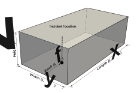
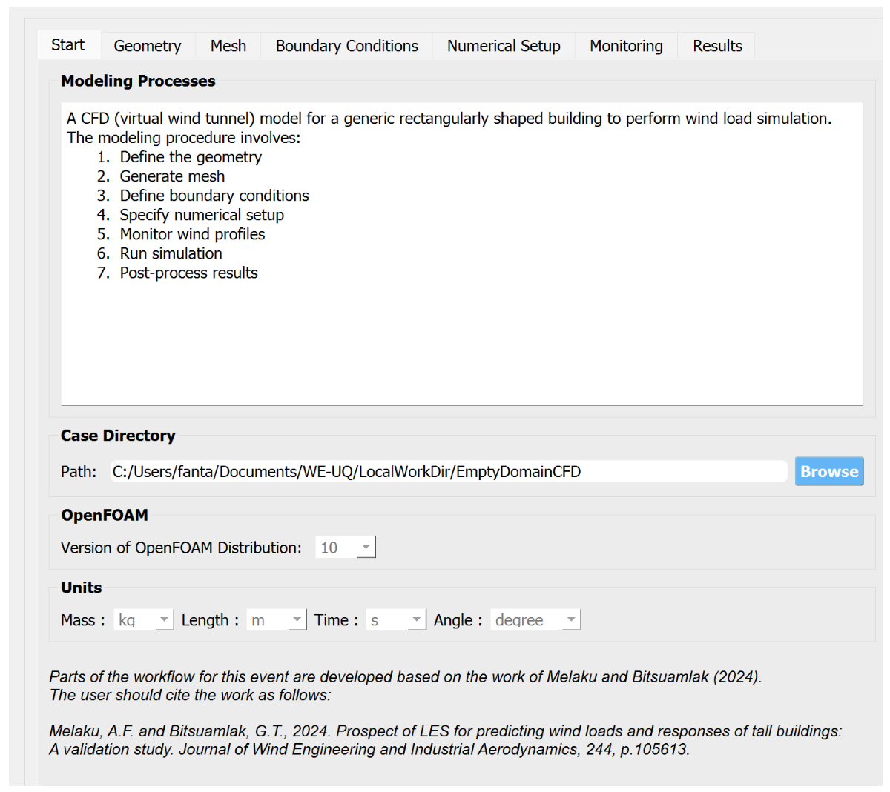
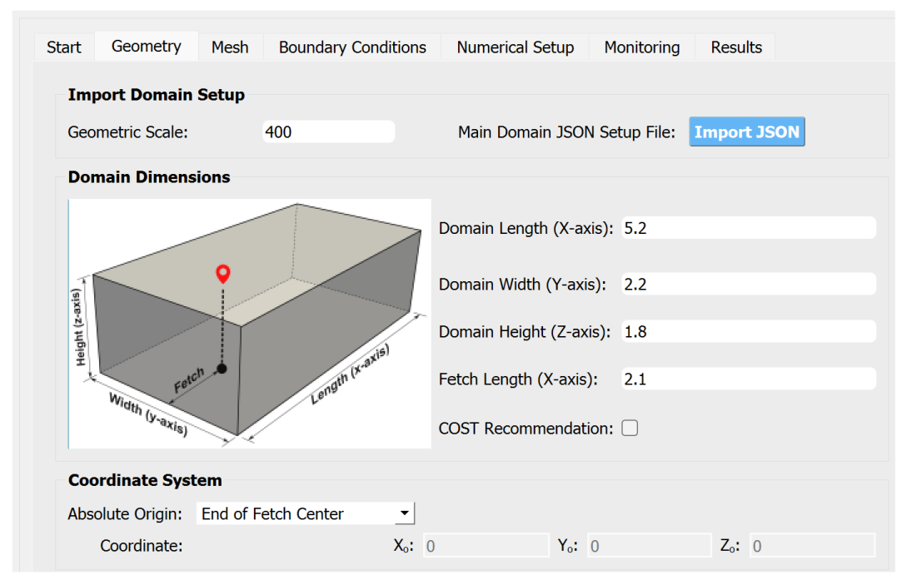
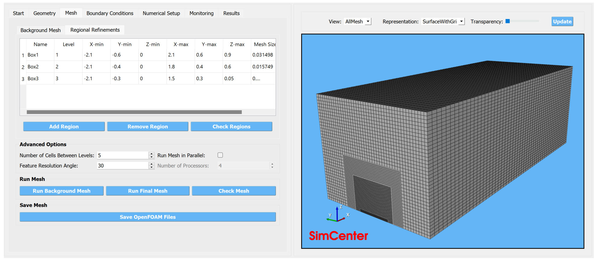
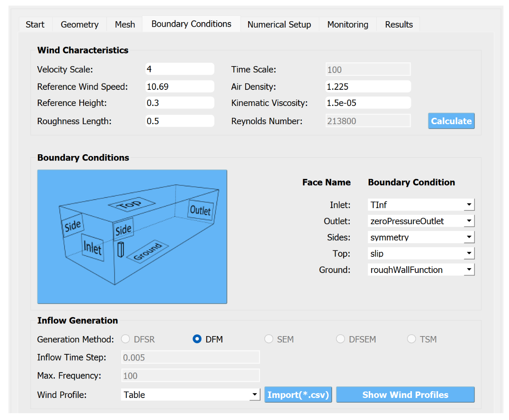
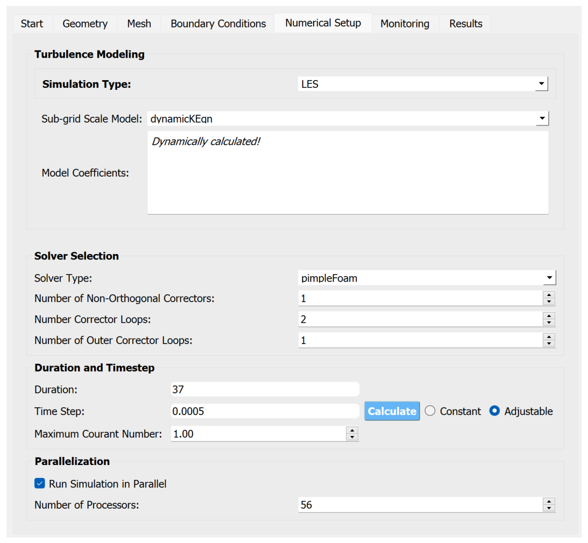
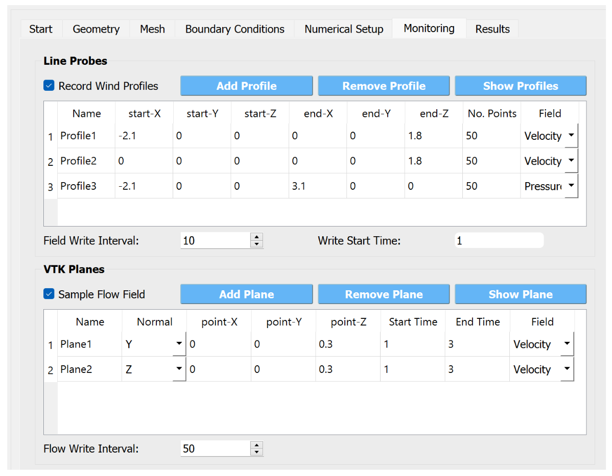

.. _weuq-0015:

Digital Wind Tunnel II: Characterizing ABL Flows using Large-eddy Simulation
=======================================================================

+----------------+----------------------------------------+
| Problem files  | :github:`Download <Examples/weuq-0015/>` |
+----------------+----------------------------------------+

This example uses the Digital Twin capability implemented in WE-UQ Version 3.2.0. It demonstrates the procedure for calibrating Atmospheric Boundary Layer (ABL) flows using large eddy simulation in empty domain configuration. For creating the CFD model, the inputs are taken from a wind tunnel experiment conducted at the boundary layer wind tunnel of Tokyo Polytechnic University (TPU). The cross-section dimensions of the CFD model are set to match the wind tunnel dimensions in the test section. :numref:`fig-we15-dmn` shows the extent of the computational domain with dimensions. Fetch distance measures the distance between the inlet anticipated location of the structure. At this location, the characteristics of the approaching wind will be examined. This example is developed based on the works of [Chew2024]_ and [Melaku2024]_. Detailed instructions to set up the CFD model can be found in the documentation of :ref:`Empty Domain CFD Simulation <lblEmptyDomainCFD>`. 

.. _fig-we15-dmn:

   Configuration of the computational domain for empty domain analysis

The simulation for this example is run at 1:400 geometric scale similar to the wind tunnel study. Details about the geometry the CFD model and the target flow characteristics are given in :numref:`tbl-we15-1`. 

.. _tbl-we15-1:
.. table:: Parameters needed to define the CFD model 
   :align: center
   :width: 75%

   +---------------------+----------------------------------------------+------------------+---------------+
   |Parameter            |Description                                   |Value             | Unit          |
   +=====================+==============================================+==================+===============+
   |:math:`L_x`          |Domain length                                 | 5.2              | m             |
   +---------------------+----------------------------------------------+------------------+---------------+
   |:math:`L_y`          |Domain width                                  | 2.2              | m             | 
   +---------------------+----------------------------------------------+------------------+---------------+
   |:math:`L_z`          |Domain height                                 | 1.8              | m             | 
   +---------------------+----------------------------------------------+------------------+---------------+
   |:math:`L_f`          |Wind fetch distance                           | 2.1              | m             | 
   +---------------------+----------------------------------------------+------------------+---------------+
   |:math:`\lambda_L`    |Geometric scale                               | 1:400            |               | 
   +---------------------+----------------------------------------------+------------------+---------------+
   |:math:`\lambda_V`    |Velocity scale                                | 1:4              |               | 
   +---------------------+----------------------------------------------+------------------+---------------+
   |:math:`\lambda_T`    |Time scale                                    | 1:100            |               | 
   +---------------------+----------------------------------------------+------------------+---------------+
   |:math:`U_{ref}`      |Reference wind speed                          | 10.69            | m/s           | 
   +---------------------+----------------------------------------------+------------------+---------------+
   |:math:`T`            |Duration of the simulation                    | 37               | s             | 
   +---------------------+----------------------------------------------+------------------+---------------+
   |:math:`z_0`          |Aerodynamic roughness length in full scale    | 0.5              | m             | 
   +---------------------+----------------------------------------------+------------------+---------------+
   |:math:`\rho_{air}`   |Air density                                   | 1.225            | kg/m^3        | 
   +---------------------+----------------------------------------------+------------------+---------------+
   |:math:`\nu_{air}`    |Kinematic viscosity of air                    | :math:`1.5e^{-5}`| m^2/s         | 
   +---------------------+----------------------------------------------+------------------+---------------+
   |:math:`f_{s}`        |Sampling frequency (rate)                     | 200              | Hz            | 
   +---------------------+----------------------------------------------+------------------+---------------+

Start
^^^^^^^
First, open the workflow by selecting **Tools -> CFD - Empty Domain Simulation** from the menu bar. Then, load the JSON setup file using **LOAD File** button. The JSON file can be found :github:`here <Examples/weuq-0015/src/input.json>`. Once the JSON file is loaded, in the *Start* tab, change the **Path** to your preferred directory by clicking **Browse** button as shown in :numref:`fig-we15-start`. Leave the remaining settings to their default values. 

   .. note::
      If the **Path** field does not automatically change when the JSON path is loaded, you can manually copy and paste your working directory path into the field. 

.. _fig-we15-start:

   Setup the path to the working directory in the *Start* tab of the workflow.

Domain Dimensions
^^^^^^^^^^^^^^^^^^^
Since the CFD simulation is run at reduced scale, change the **Geometric Scale** (:math:`\lambda_L`) to 1:400 as given in :numref:`tbl-we15-1`. In the text, you need to put only 400. Set the lenght (:math:`L_x` ), width(:math:`L_y` ) and height (:math:`L_z` ) of the computational to 5.2 m, 2.2 m, 1.8 m, respectively, as shown in :numref:`fig-we15-geom`. For the **Fetch lenght (X-axis)** specify 2.1 m.

.. _fig-we15-geom:

   Set the dimensions of the computational domain in the *Geometry* tab.  

Mesh Generation
^^^^^^^^^^^^^^^^
The mesh is generated by first creating a background grid. Make a uniformly spaced background mesh by specifying **No. of Cells** in x, y and z direction to 52, 44 and 36. Then, generate the background mesh by clicking **Run Background Mesh** button. Next, in the *Regional Refinements* subtab define local refinements. For this example, we create three refinement boxes shown in :numref:`fig-we15-mesh`. The refinement regions are created by providing the min and max coordinates of the bounding boxes. Then, the final mesh is generated by clicking the **Run Final Mesh** button. This will automatically update the mesh visualization window on the right panel. 

.. _fig-we15-mesh:

   Define meshing controls and generate the grid in *Mesh* tab.  

Boundary Conditions
^^^^^^^^^^^^^^^^^^^^
Set the fields in *Wind characteristics* group based on the values provided in :numref:`tbl-we15-1`. Set the **Velocity Scale** (:math:`\lambda_V`) to 4, **Reference Wind Speed** (:math:`U_{ref}`) to 10.69 m/s, **Reference Height** (:math:`H_{ref}`) to 0.3 m and **Roughness Lenght** (:math:`z_0`) in full-scale to 0.5 m. For the boundary conditions, use *TInf* option at the inlet of the domain. For the ground surface, use *roughWallFunction* and setup the boundary conditions on the remaining surfaces as seen in :numref:`fig-we15-bc`.  

If *TInf* is used for the inlet, specify turbulence generation scheme in *Inflow Generation* group. For this example, use *DFM* which represents Digital Filtering Method. To specify the target wind profiles, click **Import(*.csv)** and locate the ``*.csv`` file you download from :github:`here <Examples/weuq-0015/src/target_wind_profiles.json>`.  

.. _fig-we15-bc:

   Setup wind characteristics with the boundary conditions in *Boundary Conditions* tab.  

Numerical Setup
^^^^^^^^^^^^^^^^
Set the turbulence modeling, solver type, duration and time step options in *Numerical Setup* tab. For the **Simulation Type** use *LES* and select *dynamicKEqn* for the **Sub-grid Scale Model**. Set the **Solver Type** to *pimpleFoam* with 1 **Number of Non-Orthogonal Correctors** , 2 **Number of Corrector Loops** and 1 **Number of Outer Corrector Loops**. Set the maximum Courant number to 1.0 and select **Adjustable** time step. 

For the **Duration** of the simulation, use :math:`37 s` based on what is specified in :numref:`tbl-we15-1`. This time step translates to :math:`3700s` in full scale with a time scale 1:100, which is a litter over the recommended 1 hour duration. The **Time Steep** can be calculated automatically from the smallest mesh size by clicking **Calculate** button. For this example, the calculated time step is :math:`0.000736624 s`, which is changed to a conservative value of :math:`0.005 s`. Finally, check the **Run Simulation in Parallel** option and put 56 for the **Number of Processors**.  

.. _fig-we15-num-setup:

   Edit inputs in *Numerical Setup* tab

Set Results to Monitor
^^^^^^^^^^^^^^^^^^^^^^^
In the *Monitoring* tab, specify simulation results to be record as seen in :numref:`fig-we15-mon`. For this example we will monitor both the velocity and pressure distribution at selected places in the computational domain. Firstly, check **Record Wind Profiles** checkbox. Then, add three line probes (profiles) by clicking **Add Profile** and edit details as shown in bellow figure. For example, *Profile1* is located at the inlet and measures the characteristics flow velocity. *Profile2* is located downstream and measures the incident flow (i.e., the wind the structure will experience) on a vertical line. Whereas, *Profile3* measures the downstream evolution of the pressure fluctuation in the stream-wise direction. Also, specify the **Field Write Interval** to 10 and **Write Start Time** to 1.      
 
To monitor the snapshot of the flow field, check **Sample Flow Field** and add two section planes for monitoring velocity field. Edit the table entries as seen in :numref:`fig-we15-mon`. *Plane1* is vertical plane normal to y-axis and monitors the snapshot of the velocity field from 1 s to 3 s.  *Plane2* is a horizontal plane normal to z-axis and monitors the snapshot of the velocity field from 1 s to 3 s. The files for both planes will be written every 50 time step (i.e :math:`50 \times 0.0005 = 0.025 s`) as specified in **Flow Write Interval**. 

.. _fig-we15-mon:

   Specify results to record in the *Monitoring* tab

Run the Simulation
^^^^^^^^^^^^^^^^^^^
First, in the main WE-UQ window login to *DesignSafe* with your credentials. Then, in the CFD workflow window, submit the simulation by clicking **RUN at DesignSafe**. Then, provide the simulation a **Job Name**. Set **Num Nodes** to 1 and **# Processes Per Node** to 56 with a **Max Run Time** of  *12:00:00*. Finally, click the **Submit** button to send the model to *DesignSafe*.  

.. figure:: figures/we15_run_job.svg
   :align: center
   :width: 30%

   Submit the simulation.

Show Results
^^^^^^^^^^^^^^
After submitting the simulation, you can check the status of the remote job by clicking **GET from DesignSafe**. Once the remote job is finished, the results can be reloaded by selecting **Retrieve Data** after right-clicking on the job name. This will aromatically download the CFD results and actives the *Results* tab. In this tab, we can examine the characteristics of the flow in different ways, e.g., plot wind profiles, velocity spectra, and pressure fluctuation as seen :numref:`fig-we15-res` . 

.. _fig-we15-res:

.. figure:: figures/we15_results_tab.svg
   :align: center
   :width: 75%

   Show the post-processed outputs in the *Results*.

Wind Profiles
""""""""""""""
In the *Monitoring* tab, we specified two line probes for monitoring velocity profile at the inlet and incident location. To plot these profiles under **Wind Profile** select **Name of the Profile** as *Profile1* and click **Plot Profile** button. For example, :numref:`fig-we15-res-prof` shows the velocity profiles at the inlet which include mean velocity, turbulence intensity and lenght scale profiles. In this plot, the dotted black lines show the target profiles, while the red solid lines with o are the results from the CFD.   

.. _fig-we15-res-prof:

.. figure:: figures/we15_results_prof.svg
   :align: center
   :width: 90%
   
   Comparison of the wind profiles from the CFD with the targets the inlet.

Velocity Spectra
"""""""""""""""""
Similarly, the velocity spectra at different height can be shown by clicking **Plot Spectra**. For instance, :numref:`fig-we15-res-spec` shows the reduced velocity spectra at :math:`H_{ref}` for the three components of the velocity. Also, the figure compares the spectra from the CFD (red solid line) with the target von Kármán model (black dotted lines).    

.. _fig-we15-res-spec:

.. figure:: figures/we15_results_spectra.svg
   :align: center
   :width: 100%
   
   Comparison of the velocity spectra from CFD with von Kármán at inlet.

Pressure Fluctuation
"""""""""""""""""""""
To examine the downstream evolution of the pressure field, select *Profile1* for profile name and plot pressure distribution. :numref:`fig-we15-res-prs` shown the standard deviation of the pressure on the grounds surface. The x-axis shows the distance from the inlet of the domain. Using turbulent inflow at the inlet often introduces artificial pressure fluctuation at the inlet. However, this fluctuation decays as the flow progresses downstream as shown in :numref:`fig-we15-res-prs`.    

.. _fig-we15-res-prs:

.. figure:: figures/we15_results_pressure.svg
   :align: center
   :width: 60%
   
   Evolution of pressure fluctuation downstream of the inlet.

Wind Field Visualization
"""""""""""""""""""""""""
Furthermore, the full simulation data can be found in ``Documents/WE-UQ/RemoteWorkDir/results`` folder. This directory contains the OpenFOAM case files with all ``*.log`` files showing the outputs from each step in the simulation. The user can visualize this data locally using Paraview. After  launching Paraview, open **File -> Open** and locate the path ``Documents/WE-UQ/RemoteWorkDir/results/``. Then, open the file ``vis.foam`` and load the simulation results to Paraview. 

To visualize *Plane1* defined in *Monitoring* tab, load ``Documents/WE-UQ/RemoteWorkDir/results/Plane1_renamed/Velocity_T*.vtk`` files to Paraview and create visualization. The the following two videos for *Plane1* and *Plane2* are created from VTK samples saved during the simulations. 

.. raw:: html

   

      <video controls src="../../../../../_static/videos/WE-UQ/weuq-0015/we15_vis_plane1.mp4" width="560" height="315"> </video>   
   

.. raw:: html

   

      <video controls src="../../../../../_static/videos/WE-UQ/weuq-0015/we15_vis_plane2.mp4" width="560" height="315"> </video>   
   

   
.. [Chew2024] Chew, L.W., Melaku A.F. Ciarlatani, M.F., and Gorlé, C. Validation of LES predictions for wind pressures on a high-rise building: why wind tunnel validation datasets should report detailed turbulent wind statistics. In preparation.

.. [Melaku2024] Melaku, A.F. and Bitsuamlak, G.T., 2024. Prospect of LES for predicting wind loads and responses of tall buildings: A validation study. Journal of Wind Engineering and Industrial Aerodynamics, 244, p.105613.

