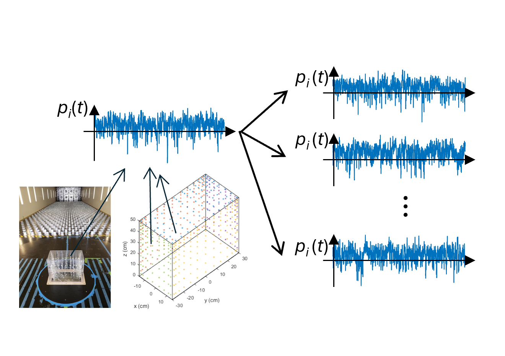
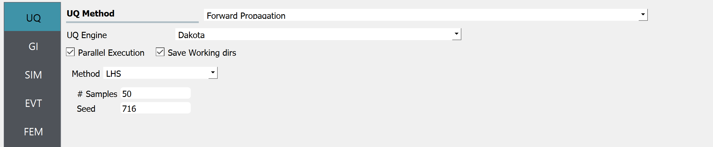
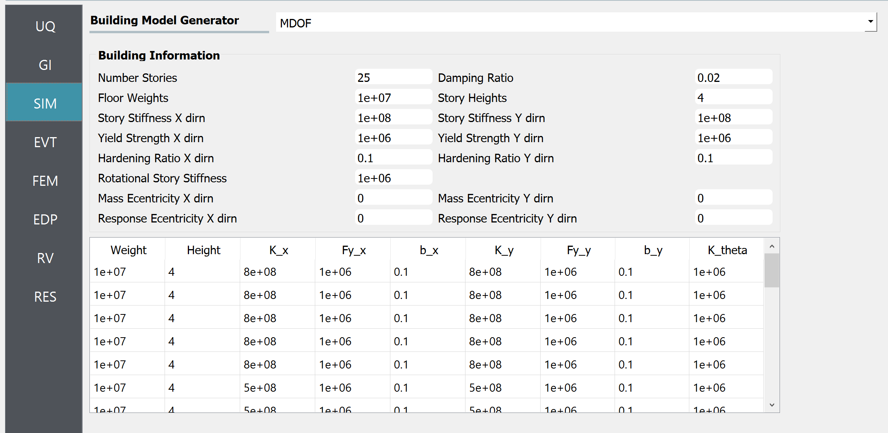
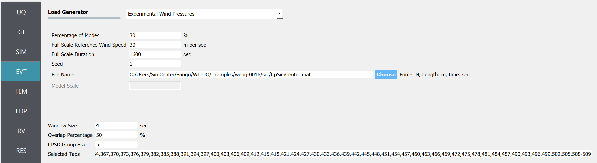
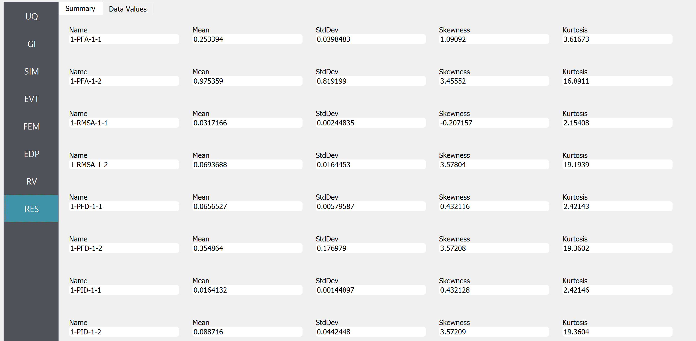
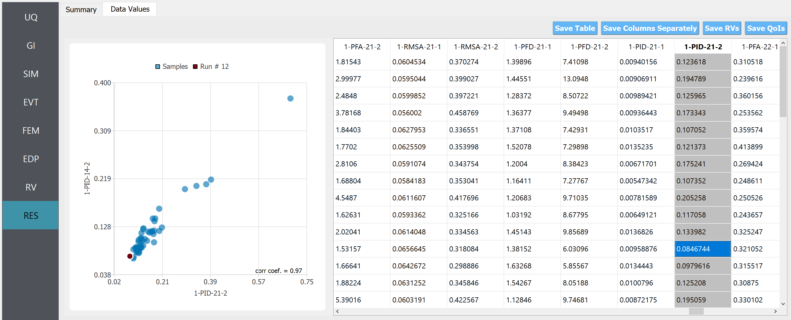

.. _weuq-0016:

Wind Tunnel-Informed Stochastic Wind Pressure Generation
=======================================================================

+----------------+----------------------------------------+
| Problem files  | :github:`Download <Examples/weuq-0016/>` |
+----------------+----------------------------------------+

This example estimates the probabilistic response of a building model excited by wind tunnel-informed stochastic wind **pressure time histories**. This example uses the experimental data obtained at the University of Florida (UF) NHERI Experimental Facility (EF), and applies the simulated wind loads to a 25-story rectangular-shaped building model for response simulation. This example uses the data presented in [Duarte2023]_. Note :ref:`Example 4.3 <weuq-0012>` aims to preserve the statistics of force time history (represented as a stationary Gaussian process model) while the current example preserves those of pressure time history using a stationary non-Gaussian process model.

the image, with multicolored dots representing data points in a cube-shaped coordinate system. On the right, there are four separate single-dimensional plots with blue waveforms, likely representing some fluctuating variable over time or another dimension. The plots are aligned vertically and appear to be related to the data shown in the 3D scatter plot.
   :width: 50%
   :figclass: align-center

   Wind tunnel-informed pressure coefficient generator

.. [Duarte2023] Duarte, T.G., Arunachalam, S., Subgranon, A. and Spence, S.M., (2023). Uncertainty Quantification and Simulation of Wind-Tunnel-Informed Stochastic Wind Loads. Wind, 3(3), pp.375-393.

Preparation of "Wind Pressure Time History File"
^^^^^^^^^^^^^^^^^^^^^^^^^^^^^^^^^^^^^^^^^^^^^^^^^
The experimental records should first be reformatted by the user such that the time histories of **wind pressure coefficient recorded at each pressure tap** can be directly imported in WE-UQ in the EVT tab. The dataset can be imported as either a MATLAB binary file or a json file. Additionally, the model-scale dimensions and additional information on the experiment should be provided. Please refer to :ref:`the User Manual<lblExperimentalWindPressure>` for the list of variables the file should contain. In this example, the variables in the table below are imported as a Matlab file. Note that the time history is recorded at 509 pressure taps for 32 sec with dt=0.0016 sec (20,000 time points). The reference wind speed (windSpeed) was measured at the top of the building model.

.. table:: Variables imported to WE-UQ
   :align: center
    
   +-----------------------+-----------------------------------------------------------------+---------------+
   |Variable               |Values                                                           |Units          |
   +=======================+=================================================================+===============+
   |breadth                |0.3                                                              | m             |
   +-----------------------+-----------------------------------------------------------------+---------------+
   |depth                  |0.6                                                              | m             |
   +-----------------------+-----------------------------------------------------------------+---------------+
   |height                 |0.5                                                              | m             |
   +-----------------------+-----------------------------------------------------------------+---------------+
   |frequency              |625                                                              | Hz            |
   +-----------------------+-----------------------------------------------------------------+---------------+
   |windSpeed              |12.25                                                            | m/s           |
   +-----------------------+-----------------------------------------------------------------+---------------+
   |period                 |32                                                               | s             |
   +-----------------------+-----------------------------------------------------------------+---------------+
   | tapLocations          | [1x509] struct with keys id, face, xLoc, yLoc (all scalar)      | m             |
   +-----------------------+-----------------------------------------------------------------+---------------+
   | pressureCoefficients  | [1x509] struct with keys id (scalar) and data ([1x20000] array) | none          |
   +-----------------------+-----------------------------------------------------------------+---------------+
   | units                 | struct with keys length and time (all scalar)                   | none          |
   +-----------------------+-----------------------------------------------------------------+---------------+
   | t                     | [1x20000] array                                                 | sec           |
   +-----------------------+-----------------------------------------------------------------+---------------+

Note the tapLocations are given in the model scale value. The Matlab file used in this example is named ``CpSimCenter.mat``, and it can be found at :weuq-0016:`/src`. Using this information, WE-UQ will generate the stochastic wind pressures and convert it to wind loads that apply to a full-scale building model with a scaling factor of 200

Workflow
^^^^^^^^^

.. note::
   This example can be directly loaded from the menu bar at the top of the screen by clicking "Examples"-"E8: Wind-tunnel Informed Stochastic Wind Pressure Generator". The user may want to increase the number of samples in the UQ tab for more stable results.

1. In the UQ tab, click "forward propagation" to perform the Monte Carlo simulation. Set the number of samples 50.

de "Parallel Execution," "Save Working dirs," "Method LHS," number of samples set to 50, and a seed value of 716. A vertical navigation bar on the left shows menu items like GI, SIM, EVT, and FEM.
   :width: 90%
   :figclass: align-center

   UQ tab

2. In the GI tab, set **# Stories** 25 as our dataset is for a 25-story building. Multiply the building scaling factor 200 by the model dimensions (0.5m x 0.3m x 0.6m; this information should be imported into the "Wind Force Time History File" at the EVT tab as shown in the previous section) and specify the full-scale building dimension at **Height, Width, and Depth**, which respectively are 100, 60, and 120. Define the **Force and Length Units** of Newtons and Meters.

.. figure:: figures/we16_GI.png
   :align: center
   :alt: Screenshot of a user interface displaying 'Building Information' with fields for Name, Properties (with inputs for Year Built, Number of Stories, Structural Type, Height, Width, Depth, and Plan Area), Location (with coordinates for Latitude and Longitude), and Units for Force, Length, and Temperature. The properties are filled with example data, such as the year 1990, 25 stories, and structural type RM1. The Units fields are set to Newtons, Meters, and Celsius. On the left side of the image is a vertical navigation menu with items labeled UQ, G|, SIM, EVT, FEM, EDP, RV, and RES, with G| currently selected.
   :width: 90%
   :figclass: align-center

   GI tab

3. In the SIM tab, the building properties are specified. We used the floor weights of 1.e7 across the floors, and the stiffness values in each story are given as

d Strength. The interface also has a table with multiple rows of data for weights, heights, and stiffness coefficients, among other factors, representing different story levels of a building in a multi-degree-of-freedom (MDOF) model.
   :width: 90%
   :figclass: align-center

   SIM tab

.. table:: Stiffness of the structure
    
    +---------+---------+
    |Floors   |Stiffness|
    +=========+=========+
    |1-5      |8.e8     |
    +---------+---------+
    |6-11     |5.e8     |
    +---------+---------+
    |12-14    |4.e8     |
    +---------+---------+
    |15-17    |3.e8     |
    +---------+---------+
    |18-19    |2.5e8    |
    +---------+---------+
    |20-21    |1.7e8    |
    +---------+---------+
    |20-21    |1.7e8    |
    +---------+---------+
    |22-24    |1.2e8    |
    +---------+---------+
    |25       |0.7e8    |
    +---------+---------+

4. In the EVT tab, select the "Experimental Wind Pressures" option for the Load Generator. Let us consider 30% of modes for the principal orthogonal decomposition (POD). The Full Scale Reference Wind Speed at the top of the building is set at 30 m/s. The duration of the generated wind loads is set to 1600 sec. The "Wind Pressure Time History File" shown in the previous section is imported next. The model scale is auto-populated only if the datasets are provided in a json file (instead of a Matlab binary file). For estimating the cross-power spectrum density function (CPSD), a window size of 4 sec, and an overlap percentage of 50 % are used. The CPSD group size, which is used to adjust the memory requirement, is set as 5. Finally, ones in every three taps are considered and other taps are ignored as defined in the Selected Taps field. Please refer to :ref:`the user manual<lblExperimentalWindPressure>` for more details of those parameters. 

'Model Scale'. The 'File Name' field contains a file path, and there is a 'Choose' button next to it. Additional parameters are below including 'Window Size', 'Overlap Percentage', 'CPSD Group Size', and 'Selected Taps' with a list of numbers. The sidebar on the left has menu items like UQ, GI, SIM, EVT (highlighted), FEM, EDP, RV, and RES.
   :width: 90%
   :figclass: align-center

   EVT tab

5. The FEM and EDP tabs are kept as default. Under the **Standard Wind** EDP, in this example, the structural model will automatically output peak floor acceleration (PFA), peak floor displacement respective to the ground (PFD), Peak inter-story drift ratio (PID), root-mean-squared acceleration (RMSA). 

6. In the RV tab, only a ``dummy`` variable that is not used in the UQ analysis is specified. This is because, in this example, we are only interested in the uncertainty (stochasticity) that arises in the wind load time histories.

.. figure:: figures/we16_RV.png
   :align: center
   :alt: Screenshot of a software interface with a sidebar on the left showing different menu options like UQ, GI, SIM, EVT, FEM, EDP, and RV highlighted. The main area is titled 'Input Random Variables' with fields for defining a variable named 'dummy' with a 'Normal' distribution, a mean of '10', and a standard deviation of '5'. There are buttons for 'Add', 'Clear All', 'Correlation Matrix', 'Show PDF', 'Export', and 'Import'.
   :width: 90%
   :figclass: align-center

   RV tab

.. note::
   The user can additionally specify random variables for structural parameters by putting a string for some of the structural properties in GI tab (e.g. "W" for the floor weight instead of 1.e7), and specifying the corresponding probability distribution at the RV tab (e.g. name: W, distribution: Normal, Mean: 1.e7, Standard Dev: 1.e6).

7. Once all the information is provided, click the Run or Run at DesignSafe button to run the analysis.

Results
^^^^^^^^^^^^^^^^^^^^^^^^^^^^^^^^^^^^^^^^^^^^^^

Once the analysis is done, the sampling results will be displayed in the RES tab. Note that the EDP name consists of the quantity of interest, story number, and the direction of interest - for example:

      * 1-PFA-0-1 : **peak floor acceleration** at the **ground floor**, **component 1** (x-dir)
      * 1-PFD-1-2 : **peak floor displacement** (respective to the ground) at the **1st floor** ceiling, **component 2** (y-dir)
      * 1-PID-3-1 : **peak inter-story drift ratio** of the **3rd floor**, **component 1** (x-dir)   
      * 1-RMSA-10-1 : **root-mean-squared acceleration** of the **10th floor**, **component 1** (x-dir)   

The response statistics are first displayed.

set with respective statistical measures. The layout is neat, with each measure in its own column, and the information is presented on a grey and white interface.
   :width: 90%
   :figclass: align-center

   RES tab - statistics

Additionally, the user can browse the sample realization values and inspect the correlation between various components. 

lues for various parameters like "1-PFA-21-2," "1-RMSA-21-1," "1-PFD-21-1," and others, with some cells highlighted. There are also buttons for saving data such as "Save Table," "Save Columns Separately," "Save RVs," and "Save QoIs." The interface includes a side menu with options like "UQ," "GI," "SIM," "EVT," "FEM," "EDP," "RV," and "RES."
   :width: 90%
   :figclass: align-center

   RES tab - scatter plots

.. note::

   The user can interact with the plot as follows.

   - Windows: left-click sets the Y axis (ordinate). right-click sets the X axis (abscissa).
   - MAC: fn-clink, option-click, and command-click all set the Y axis (ordinate). ctrl-click sets the X axis (abscissa).

