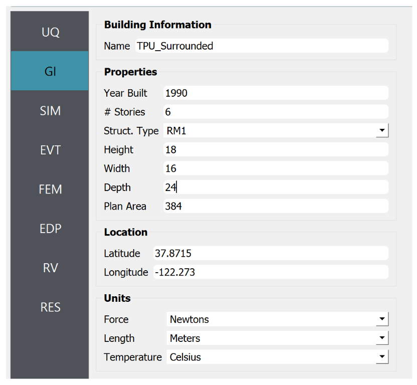
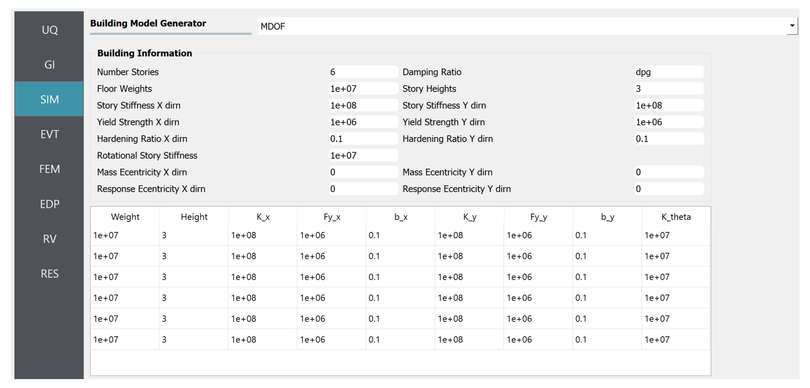
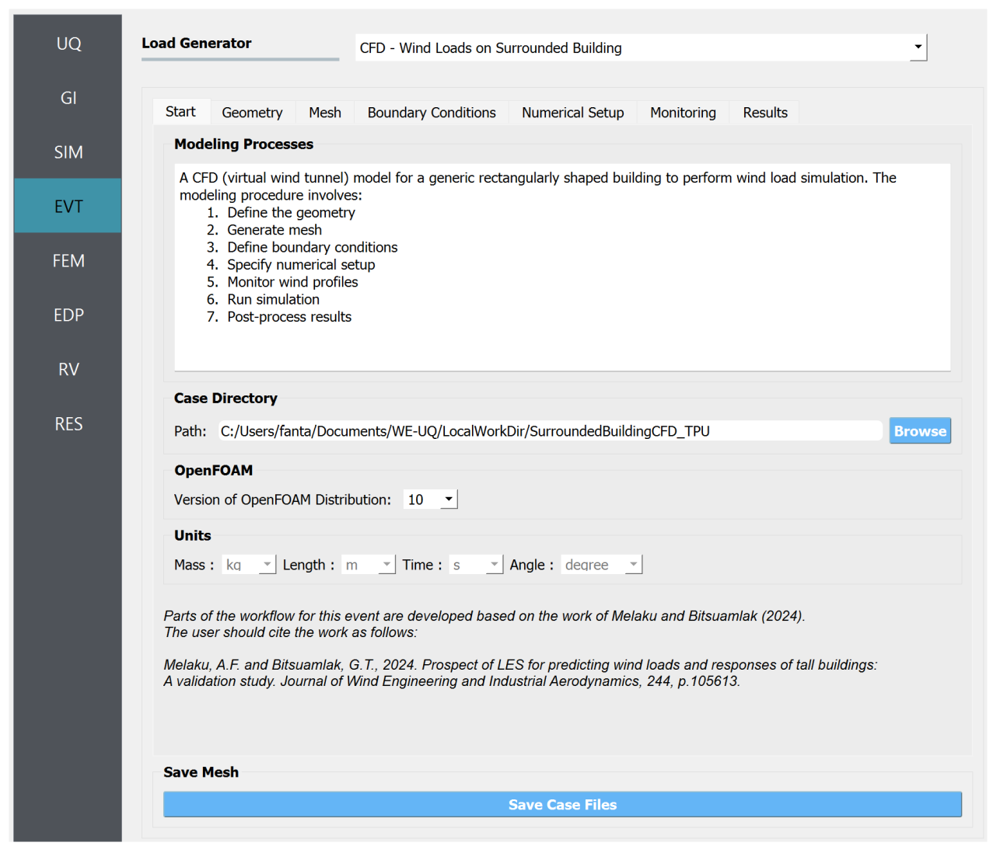
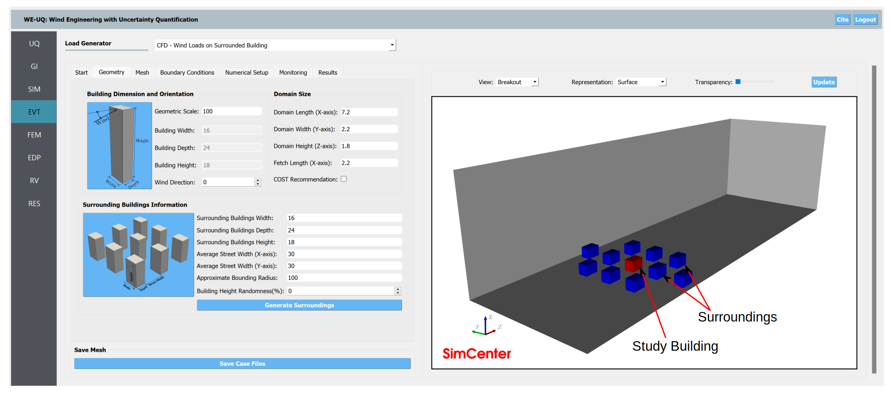

.. _weuq-0017:

Digital Wind Tunnel III: Wind Loads on a Building with Surroundings
=====================================================================

+----------------+-----------------------------------------------------------------------------------------------------------+
| Problem files  | `WE-UQ/Examples/weuq-0017 <https://github.com/NHERI-SimCenter/WE-UQ/tree/master/Examples//weuq-0017//>`_  |
+----------------+-----------------------------------------------------------------------------------------------------------+

This example uses the Digital Twin capability implemented in WE-UQ Version 3.5.0.  It demonstrates a Computational Fluid Dynamics (CFD) based procedure for estimating wind-induced response of a building by modeling the effect of the surroundings. The example demonstrates a step-by-step process for defining the CFD model based on a target experimental data taken from Tokyo Polytechnic University (TPU) aerodynamic database. Finally, employing the wind load generated by the CFD event, uncertainties in the structural properties such as damping are evaluated. No uncertainties were considered in the wind parameters or CFD simulations.

.. _fig-we17-1:

.. figure:: figures/we17_surrounded_building_demo.png
   :align: center
   :width: 60%

   Setup of the CFD model: approaching wind, computational domain, study building, and surrounding buildings.

In full-scale, the main building measures 18 m high with a 24 m x 16 m plan dimensions. For simplicity, the CFD model is created in model scale (at 1:100 geometric scale) resembling that of the experimental version. For ease of demonstration, in this example, some simplifying assumptions are taken to model the approaching wind condition. Important geometric and flow properties are provided in :numref:`tbl-we17-1`.  

.. _tbl-we17-1:

.. table:: Parameters needed to define the CFD model (taken from TPU database)
   :align: center
    
   +---------------------+----------------------------------------------+------------------+---------------+
   |Parameter            |Description                                   |Value             | Unit          |
   +=====================+==============================================+==================+===============+
   |:math:`B`            |Building width                                | 0.16             | m             |
   +---------------------+----------------------------------------------+------------------+---------------+
   |:math:`D`            |Building depth                                | 0.24             | m             | 
   +---------------------+----------------------------------------------+------------------+---------------+
   |:math:`H`            |Building height                               | 0.18             | m             | 
   +---------------------+----------------------------------------------+------------------+---------------+
   |:math:`\lambda_L`    |Geometric scale of the model                  | 1/100            |               | 
   +---------------------+----------------------------------------------+------------------+---------------+
   |:math:`\lambda_V`    |Velocity scale of the model                   | 1/3              |               | 
   +---------------------+----------------------------------------------+------------------+---------------+
   |:math:`\lambda_T`    |Time scale of the model                       | 1/33.33          |               | 
   +---------------------+----------------------------------------------+------------------+---------------+
   |:math:`U_H`          |Roof-height mean wind speed in model scale    | 8.25             | m/s           | 
   +---------------------+----------------------------------------------+------------------+---------------+
   |:math:`T`            |Duration of the simulation in model scale     | 18.0             | s             | 
   +---------------------+----------------------------------------------+------------------+---------------+
   |:math:`\theta`       |Wind direction                                | 0                |degrees        | 
   +---------------------+----------------------------------------------+------------------+---------------+
   |:math:`z_0`          |Aerodynamic roughness length in full-scale    | 0.3              | m             | 
   +---------------------+----------------------------------------------+------------------+---------------+
   |:math:`\rho_{air}`   |Air density                                   | 1.225            | kg/m^3        | 
   +---------------------+----------------------------------------------+------------------+---------------+
   |:math:`\nu_{air}`    |Kinematic viscosity of air                    | :math:`1.5e^{-5}`| m^2/s         | 
   +---------------------+----------------------------------------------+------------------+---------------+
   |:math:`f_{s}`        |Sampling frequency (rate)                     | 500              | Hz            | 
   +---------------------+----------------------------------------------+------------------+---------------+

.. _workflow-section:

Workflow
^^^^^^^^^^^^
The user needs to go through the following procedure to define the Uncertainty Quantification (UQ) technique, building information, structural properties, and CFD model parameters. 

   .. note::
      This example can be directly loaded from the menu bar at the top of the screen by clicking "Examples"-"E9: Wind Load Evaluation on a Building with Surroundings using CFD". 

UQ Method
"""""""""""
Specify the details of uncertainty analysis in the **UQ** panel. This example uses forward uncertainty propagation. Select "Forward Propagation" for the UQ Method and specify "Dakota" for UQ Engine driver. For the UQ algorithm, use Latin Hypercube ("LHC"). Change the number of samples to 500 and set the seed to 870.

.. figure:: figures/we17_UQ_panel.svg
   :align: center
   :width: 85%

   Selection of the Uncertainty Quantification Technique

General Information
"""""""""""""""""""
Next, in the **GI** panel, specify the properties of the building and the unit system. For the **# Stories** use 6 assuming a floor height of 3 m. Set the **Height**, **Width** and **Depth** to 18, 16 and 24 with a **Plan Area** of 1600. Define the units for **Force** and **Length** as "Newtons" and "Meters", respectively. 

   .. warning::
      Note that the CFD model is created at a reduced model scale (i.e., 1 to 100) just like the target wind tunnel model. However, the building dimensions specified here need to be in full-scale (actual building dimensions). 

   Set the building properties in **GI** panel

Structural Properties
"""""""""""""""""""""
In the SIM panel, the structural properties are defined. For the structural model, select "MDOF" generator. The number of stories and floor height are automatically populated based on **GI** panel. For the **Floor Weights** put :math:`1 \times 10^7`. Replace the **Story Stiffness** with :math:`1 \times 10^8`. Here, we assume the damping ratio to be uncertain, thus put **dbg** to designate it as a random variable. Later the statistical properties of this random variable will be defined in **RV** panel. Specify yield strength, hardening ratio and other parameters as shown in :numref:`fig-we17-SIM-panel`. 

.. _fig-we17-SIM-panel:

   Define the structural properties in **SIM** panel

CFD Model
"""""""""""""""""""
In the **EVT** panel, for the **Load Generator** select "CFD - Wind Loads on Surrounded Building" option to create the CFD model. Here, a brief instruction to define the CFD parameters is provided. For a detailed procedure to setup the CFD model, the user is advised to refer :ref:`the user manual<lblSurroundedBuildingCFD>`.   

1. In the *Start* tab, specify the path where your CFD model will be saved by clicking **Browse** button. It is recommended to put it in the default path i.e., ``Documents\WE-UQ\LocalWorkDir\SurroundedBuildingCFD``. Use the steps outlined in **Modeling Process** box to guide you through procedure. 

   Setup the path and version of OpenFOAM in the *Start* tab

2. Specify geometric details related to the building and computational domain in the *Geometry* tab. Change the **Geometric Scale** of the CFD simulation to 1 to 100 based on the experimental setup (see :numref:`tbl-we17-1`). In the **Building Dimension and Orientation** box specify the **Wind Direction** as 0 to simulate wind incidence normal width of the building. Set the length, width, height and fetch length of the domain as shown in :numref:`fig-we17-EVT-Geometry` . For the surrounding buildings, use the same dimension as the study building.    

.. _fig-we17-EVT-Geometry:

   Define the dimensions of the computational domain, study building and surroundings in the *Geometry* tab

3. Generate the computational grid in the *Mesh* tab. Follow these steps to set the mesh parameters:
   
   **Background Mesh:**

   Create a background (base) mesh as a structured grid with **No. of Cells** in *X-axis*, *Y-axis* and *Z-axis* set to 120, 36, 30. The grid size in each direction needs to be approximately the same. 

   .. figure:: figures/we17_EVT_Mesh_tab.svg
      :align: center
      :width: 100%

      Define the computational grid in the *Mesh* tab

   **Regional Refinements:**
   
   Create 3 boxes to set different refinement regions as shown in :numref:`fig-we17-EVT2`. Each refinement box needs to have a name, refinement level, min and max coordinates. Set the **Level** with successive increments of 1 (i.e., 1 for *Box1*, 2 for *Box2* and 3 for *Box3*). The **Mesh Size** for each region is automatically calculated and provided in the last column of the table.

.. _fig-we17-EVT2:

   .. figure:: figures/we17_EVT_Mesh_RegionalRefinement_tab.svg
      :align: center
      :width: 75%

      Create regional refinements

   **Surface Refinements:**
   
   In the *Surface Refinements* sub-tab, check the *Add Surface Refinements* box. Define surface refinements for the study building and the surroundings as shown in :numref:`fig-we17-EVT3`.

.. _fig-we17-EVT3:

   .. figure:: figures/we17_EVT_Mesh_SurfaceRefinement_tab.svg
      :align: center
      :width: 75%

      Create surface refinements
   
   **Edge Refinements:**
   
   Similarly, select the *Edge Refinements* sub-tab and check the *Add Edge Refinements* box. Define edge refinements for the main and the surrounding buildings as shown bellow. 

   .. figure:: figures/we17_EVT_Mesh_EdgeRefinement_tab.svg
      :align: center
      :width: 75%

      Apply further refinements along the building edges

   **Prism Layers:**
   
   For this example, no prism layers are added. Thus, in the *Prism Layers* sub-tab, uncheck the *Add Prism Layers* box. 

   **Run Mesh**
   
   Once all mesh parameters are defined, click the **Run Final Mesh** button to generate the final mesh. The progress of the mesh generation can be monitored on **Program Output**. When the mesh generation finishes successfully, the *Model View* window on the right side will get updated and the user can visualize the mesh. You can actively zoom, rotate and pan the generated mesh in 3D for a detailed view. The following figure shows an inside view of the computational domain after selecting a *Breakout* **View** option in the *Model View* panel. 

   .. figure:: figures/we17_EVT_Mesh_Run.svg
      :align: center
      :width: 80%

      Running the mesh

   .. figure:: figures/we17_EVT_Mesh_View.svg
      :align: center
      :width: 90%

      Breakout View of the Mesh
   
4. In the *Boundary Conditions* tab, define properties of the approaching wind and boundary fields. 

   * First, configure parameters in the **Wind Characteristics** group. Set the **Velocity Scale** to 3, the same value given in :numref:`tbl-we17-1`. The **Time Scale** will be automatically calculated using velocity and length scale information. Similarly, for the **Wind Speed At Reference Height** put :math:`8.25 m/s`, and set the **Reference Height** as building height, which is :math:`0.18 \, m` in model scale. Specify the roughness of the surrounding terrain by changing **Aerodynamic Roughness Length** to a full-scale value of :math:`0.3 m`. For physical properties of the air, use :math:`1.225 \, kg/m^3` for **Air Density** and :math:`1.5 \times 10^{-5} \, m^2/s` for **Kinematic Viscosity**. The Reynolds number (:math:`Re`) of the flow that uses the reference wind speed and height can be computed by clicking the **Calculate** button.

   * Then, define the boundary fields on each face of the domain including the building surface in **Boundary Conditions** group. At the **Inlet** use *MeanABL* which specifies a mean velocity profile based on the logarithmic profile. For **Outlet** use a *zeroPressureOutlet* which sets the pressure at the outlet to zero, and helps to maintain the reference pressure in the domain around zero. On the **Side** and **Top** faces of the domain use *symmetry* boundary conditions. For the **Ground** surface, apply *roughWallFunction* to account for the roughness of the surrounding terrain prescribed by **Aerodynamic Roughness Length** (:math:`z_0`). Whereas, on the **Main Building** and **surrounding Buildings** surface, use *smoothWallFunction* assuming the buildings has a smooth surface.   

   .. figure:: figures/we17_EVT_BoundaryConditions.svg
      :align: center
      :width: 75%

      Setup the *Boundary Conditions*  

5. Specify turbulence modeling, solver type, duration and time step options in the *Numerical Setup* tab. 
   
   * For this example, since time-series of the wind forces are needed for the structural solver, we use transient CFD simulation. Thus, in **Turbulence Modeling** group, set **Simulation Type** to *LES* and select *Smagorinsky* for the **Sub-grid Scale Model**. The coefficients of the standard *Smagorinsky* model are printed in the following text box. 
  
   * For the **Solver Type** select *pimpleFoam* in **Solver Selection** group . Set the **Number of Non-Orthogonal Correctors** to 1 to add additional solver iteration. This option will give better stability to the solver as the generated mesh is non-orthogonal (irregular) near the buildings surface.   
  
   * Specify :math:`19.0 s` for the **Duration** of the simulation based on what is determined in :numref:`tbl-we17-1`. Since we are using *pimpleFoam* solver, check **Adjustable** for time step. Compute the approximate **Time Steep** needed for a stable simulation by clicking **Calculate** button. Then, you can change the calculated time step to a slightly lower or higher value avoiding the use of long significant digits. For this example, the calculated value was :math:`0.00365867` but it was changed to :math:`0.0025` to be safe. For the **Maximum Courant Number** use 4. 

   * Check the **Run Simulation in Parallel** option and specify the **Number of Processors** to the 96. Depending on the number of grids used, the number of processors can be increased to a higher value. 

.. _fig-we17-CFD-num-setup:

.. figure:: figures/we17_EVT_NumericalSetup.svg
   :align: center
   :width: 75%

   Edit the *Numerical Setup* options

6. Select quantities of interest to record from the CFD simulation in the *Monitoring* tab.   
  
   * The integrated story forces are always monitored as the whole workflow needs that. Similarly, here set the **Write Interval** to 2 which writes the story loads with a time interval of :math:`\Delta t \times 2 = 0.005s`. Note that this value is the same as the sampling rate (:math:`f_s = 500 Hz`) used in the experimental model. Ultimately, this is the time step the structural solver will take. 

   .. figure:: figures/we17_EVT_Monitoring.svg
      :align: center
      :width: 75%

      Specify the CFD outputs in the *Monitoring* tab

Finite Element Analysis
"""""""""""""""""""""""""
To set the finite element analysis options, select the **FEM** panel. Here we will keep the default values as seen in :numref:`fig-we17-FEM-panel`. 

.. _fig-we17-FEM-panel:

.. figure:: figures/we17_FEM_panel.svg
   :align: center
   :width: 75%

   Setup the Finite Element analysis options

Engineering Demand Parameter
""""""""""""""""""""""""""""""
Next, select the quantity of interest from the analysis in the **EDP** panel. The Engineering Demand Parameters (EDPs) are structural response quantities that can be used to evaluate the performance of the structure under wind. Here select the *Standard Wind* EDPs which include floor displacement, acceleration and inter-story drift.  

.. figure:: figures/we17_EDP_panel.svg
   :align: center
   :width: 75%

   Select the EDPs to measure

Random Variables
"""""""""""""""""
The random variables are defined in the **RV** tab. Here, the damping ratio named as :math:`dgp` in **SIM** tab is automatically assigned as a random variable. Select *Normal* for the probability **Distribution** of the variable. Then, specify :math:`0.02` for the **Mean** and :math:`0.004` for **Standard Dev**. The user can also click **Show PDF** to inspect the probability density function of the variable as shown in :numref:`fig-we17-RV-panel` 

.. _fig-we17-RV-panel:

.. figure:: figures/we17_RV_panel.svg
   :align: center
   :width: 75%

   Define the Random Variable (RV)

Running the Simulation 
"""""""""""""""""""""""
Considering the high cost of running the CFD simulation, the whole workflow can only be run remotely. Thus, once setting up the workflow is completed, the user needs to first login to *DesignSafe* with their credential by clicking **Login** button at the top right corner of the window as seen :numref:`fig-we17-submit-job`. Then, by pressing **RUN at DesignSafe** information needed for submitting the job to the remote server is specified. Put a meaningful identifier for the **Job Name** e.g., "TPU_LES_Surrounded". Set **Num Nodes** to 2 and **# Processes Per Node** to 48. For **Max Run Time**, specify *12:00:00* which requests a total of 12 hours 0 minutes and 0 seconds. Finally, click the **Submit** button to send the job to *DesignSafe*   

   .. warning::
      Note that the total number of processors used in the simulation equals **Num Nodes** :math:`\times` **# Processes Per Node**. This value must be the same as what is specified for the **Number of Processors** in the **Numerical Setup** tab of the CFD model (see :numref:`fig-we17-CFD-num-setup`). 

.. _fig-we17-submit-job:

.. figure:: figures/we17_RunJob.svg
   :align: center
   :width: 100%

   Submit the simulation to the remote server (DesignSafe-CI)

**Monitor the Simulation**

The progress (status) of the submitted job can be tracked by clicking **GET from DesignSafe**. A new window pops up showing all the jobs run on *DesignSafe*. Here right-click the name of your job, and select the **Refresh Job** option to update the status of the job. If the job started the table will show *RUNNING* for the status. When the simulation is completed it will show *FINISHED*.   

.. _fig-we17-monitor-job:

.. figure:: figures/we17_MonitorJob.svg
   :align: center
   :width: 75%

   Monitor the submitted job

Results
"""""""""
 Once the remote job finishes, the results can be reloaded by clicking the **Retrieve Data** option in :numref:`fig-we17-monitor-job`. Then, the results will be displayed in the **RES** tab. For the *Standard* EDP chosen the responses monitored are displayed for each floor and direction. For example, the naming of the EDPs with:  

      * 1-PFA-0-1: represents **peak floor acceleration** at the **ground floor** for **component 1** (x-dir)
      * 1-PFD-1-2: represents **peak floor displacement** (relative to the ground) at the **1st floor** ceiling for **component 2** (y-dir)
      * 1-PID-3-1: represents  **peak inter-story drift ratio** of the **3rd floor** for **component 1** (x-dir) and
      * 1-RMSA-6-1: represents **root-mean-squared acceleration** of the **6th floor** for **component 1** (x-dir).   

The four statistical moments of the EDPs which include *Mean*, *StdDev*, *Skewness* and *Kurtosis* are provided in the *Summary* tab of the panel. 

.. figure:: figures/we17_RES_Summary.svg
   :align: center
   :width: 75%

   Summary of the recorded EDPs in **RES** panel

In addition, by switching to the *Data Values* tab, you can see all the realizations of the simulation and inspect the relationships between different entries. For instance, if you want to visualize the variation of the top-floor acceleration with floor stiffness, right-click the "1-RMSA-6-2" column in the table. This will show the root-mean-squared acceleration in the cross-wind direction for all runs as shown on the left side of :numref:`fig-we17-RES-scatter`. As you might expect, the floor acceleration generally decreases as the building becomes more stiff.   

.. _fig-we17-RES-scatter:

.. figure:: figures/we17_RES_DataValues.svg
   :align: center
   :width: 75%

   (scatter-plot) Top-floor acceleration vs floor stiffness, (table) Report of EDPs for all realizations   

.. note::

   The user can interact with the plot as follows.

   - Windows: left-click sets the Y axis (ordinate), while right-click sets the X axis (abscissa).
   - MAC: fn-clink, option-click, and command-click all set the Y axis (ordinate). ctrl-click sets the X axis (abscissa).

Visualizing the CFD Output
^^^^^^^^^^^^^^^^^^^^^^^^^^^
Once the results are retried the simulated case directory can be directly accessed from the local case directory given in *Start* tab of the **EVT** panel. The following videos show sample visualization of the instantaneous flow field.  

.. raw:: html

   

      <video controls src="../../../../../_static/videos/WE-UQ/weuq-0017/we17_vis_plane1.mp4" width="1000" height="500"> </video>   
   

.. raw:: html

   

      <video controls src="../../../../../_static/videos/WE-UQ/weuq-0017/we17_vis_plane2.mp4" width="1000" height="500"> </video>   
   

