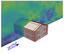
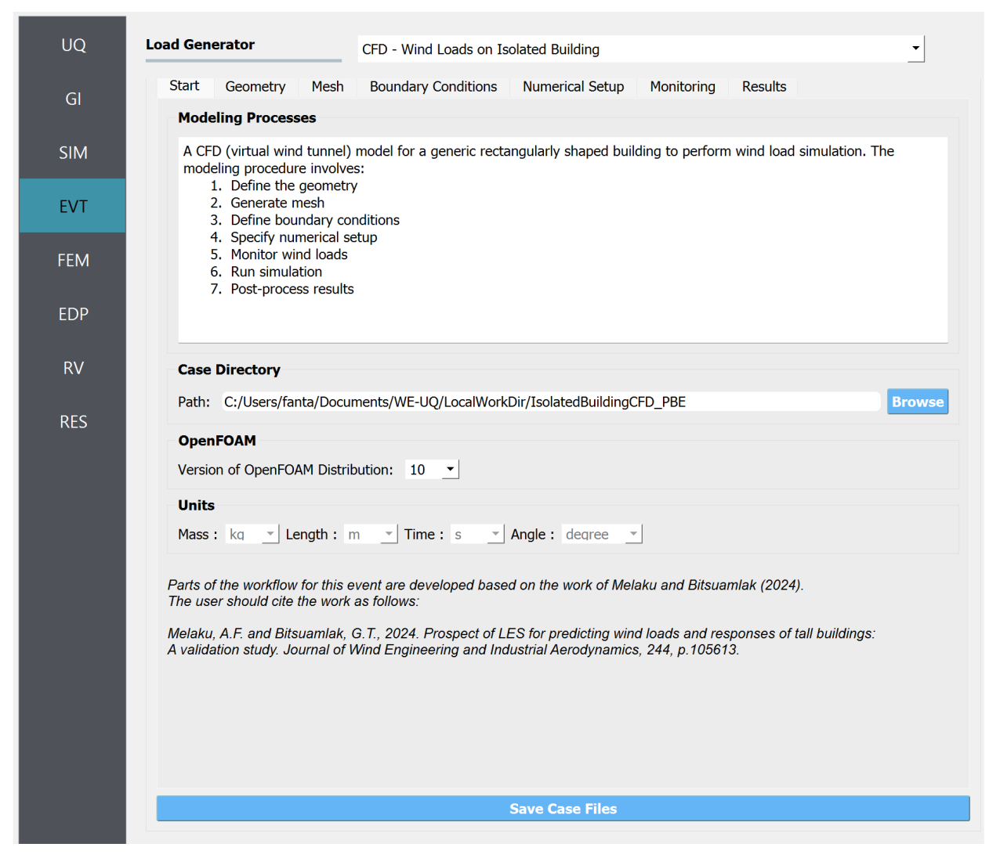

.. _weuq-0019:

Computing Wind Loads on Building Components and Cladding
==========================================================

+----------------+-------------------------+
| Problem files  | :weuq-0019:`/`          |
+----------------+-------------------------+

This examples demonstrated a workflow for evaluating component and cladding loads on buildings. The geometry of the building used for this study is a gable roof low rise building taken from Tokyo Polytechnic University (TPU) aerodynamic database. :numref:`fig-we19-1` shows the study building in the CFD model. The STL geometry of the building can be found :github:`here <Examples/weuq-0019/src/buildingGeometry/tpu_building.stl>` that can be imported to the workflow. Most of the input parameters used in this example are similar to the example in :numref:`weuq-0015`.  

.. _fig-we19-1:

   Study building with definition of the components.

In this example, the simulation is conducted in model-scale. The geometric and flow properties are given in :numref:`tbl-we19-1`. Please refer to the detailed CFD-based workflow in :ref:`workflow-section`.  

.. _tbl-we19-1:
.. table:: Import parameters needed for the wind load calculation 
   :align: center
    
   +---------------------+----------------------------------------------+------------------+---------------+
   |Parameter            |Description                                   |Value             | Unit          |
   +=====================+==============================================+==================+===============+
   |:math:`B`            |Building width                                | 24.0             | m             |
   +---------------------+----------------------------------------------+------------------+---------------+
   |:math:`D`            |Building depth                                | 16.0             | m             | 
   +---------------------+----------------------------------------------+------------------+---------------+
   |:math:`H`            |Building eave height                          | 8.0              | m             | 
   +---------------------+----------------------------------------------+------------------+---------------+
   |:math:`\lambda_L`    |Geometric scale                               | 1:100            |               | 
   +---------------------+----------------------------------------------+------------------+---------------+
   |:math:`\lambda_V`    |Velocity scale                                | 1:3.0            |               | 
   +---------------------+----------------------------------------------+------------------+---------------+
   |:math:`\lambda_T`    |Time scale                                    | 1:33.33          |               | 
   +---------------------+----------------------------------------------+------------------+---------------+
   |:math:`H_{ref}`      |Reference height (mean roof height)           | 8.8              | m/s           | 
   +---------------------+----------------------------------------------+------------------+---------------+
   |:math:`U_H`          |Reference mean wind speed (model-scale)       | 7.14822          | m/s           | 
   +---------------------+----------------------------------------------+------------------+---------------+
   |:math:`T`            |Duration of the simulation (model-scale)      | 19.0             | s             | 
   +---------------------+----------------------------------------------+------------------+---------------+
   |:math:`\theta`       |Wind direction                                | 90.0             |degrees        | 
   +---------------------+----------------------------------------------+------------------+---------------+
   |:math:`z_0`          |Aerodynamic roughness length in (full-scale)  | 0.30             | m             | 
   +---------------------+----------------------------------------------+------------------+---------------+
   |:math:`\rho_{air}`   |Air density                                   | 1.225            | kg/m^3        | 
   +---------------------+----------------------------------------------+------------------+---------------+
   |:math:`\nu_{air}`    |Kinematic viscosity of air                    | :math:`1.5e^{-5}`| m^2/s         | 
   +---------------------+----------------------------------------------+------------------+---------------+
   |:math:`f_{s}`        |Sampling frequency (rate)                     | 500              | Hz            | 
   +---------------------+----------------------------------------------+------------------+---------------+

The upwind condition chosen for this example is open exposure type with aerodynamic roughness length of :math:`z_0 = 0.3` m for wind direction :math:`\theta = 90^o`. To represent the effect of the upcoming terrain a turbulent inflow boundary condition is adopted at the inlet.  
    
.. _workflow-section:

Workflow
^^^^^^^^^^^^

The input to the whole workflow can be found in a JSON file :github:`here <Examples/weuq-0019/src/input.json>`

In this example, the overall workflow is demonstrated by introducing uncertainty in the design wind speed. The user needs to go through the following procedure to define the Uncertainty Quantification (UQ) technique, building information, structural properties, and CFD model parameters. 

   .. note::
      This example can be directly loaded from the menu bar at the top of the screen by clicking "Examples"-"E10: Computing Wind Loads on Building Components and Cladding". 

UQ Method
"""""""""""
Specify the details of uncertainty analysis in the **UQ** panel. This example uses forward uncertainty propagation. Select "Forward Propagation" for UQ Method and specify "Dakota" for the UQ Engine driver. For specific UQ algorithms, use Latin Hypercube ("LHC"). Change the number of samples to 500 and set the seed to 101.

.. figure:: figures/we19_UQ_panel.svg
   :align: center
   :alt: Image showing error in description
   :width: 80%
   :figclass: align-center

   Selection of the Uncertainty Quantification Technique

General Information
"""""""""""""""""""
Next, in the **GI** panel, specify the properties of the building and the unit system. For the **# Stories** use 2 assuming a floor height of approximately 4.0 m. Set the **Height**, **Width** and **Depth** to 8.8, 24.0 and 16.0 with a **Plan Area** of 384.0. Define the units for **Force** and **Length** as "Newtons" and "Meters", respectively. 

.. figure:: figures/we19_GI_panel.svg
   :align: center
   :alt: Image showing error in description
   :width: 75%

   Set the building properties in **GI** panel

Structural Properties
"""""""""""""""""""""
Please leave the **SIM** panel of the workflow as it is, this example does not involve any structural analysis. 

CFD Model
"""""""""""""""""""
To set up the CFD model, in the **EVT** panel, select "CFD - Wind Loads on Isolated Building" for **Load Generator**.  Detailed documentation on how to define the CFD model can be found in :ref:`the user manual<lblIsolatedBuildingCFD>`.   

1. Specify the path to the case directory in *Start* tab, by clicking **Browse** button. Use version 10 for **Version of OpenFOAM Distribution**. 

   Setting up the case directory and OpenFOAM version in the *Start* tab

2. In the *Geometry* tab, first set the **Input Dimension Normalization** to *Relative* to put the size of the domain relative to the building height. For **Geometric Scale** of the CFD model use 100.0 as the simulation is conducted at model scale. Set the **Shape Type** to *Complex* and import the building geometry by clicking **Import STL** from :github:`here <Examples/weuq-0019/src/buildingGeometry/tpu_building.stl>`. Set the **Wind Direction** to 90.0 to simulate wind incidence normal to the building width. See :numref:`fig-we19-geometry-tab` for the details.

.. _fig-we19-geometry-tab:
.. figure:: figures/we19_EVT_Geometry_tab.svg
   :align: center
   :width: 95%

   Defining the domain dimensions and the building geometry.  

2. Define the computational in *Mesh* tab with *Background Mesh*, *Regional Refinements*, *Surface Refinements*, *Edge Refinements* and *Edge Refinements* as shown bellow.
   
   .. figure:: figures/we19_EVT_Mesh_tab.svg
      :align: center
      :width: 75%

      Define the computational grid in the *Mesh* tab

   .. figure:: figures/we19_EVT_Mesh_RegionalRefinement_tab.svg
      :align: center
      :width: 75%

      Create regional refinements

   .. figure:: figures/we19_EVT_Mesh_SurfaceRefinement_tab.svg
      :align: center
      :width: 75%

      Create surface refinements
   
   .. figure:: figures/we19_EVT_Mesh_EdgeRefinement_tab.svg
      :align: center
      :width: 75%

      Apply further refinements along the building edges

   **Run Mesh**
   
   To generate the computational grid with all the refinements applied, click the **Run Final Mesh** button in the *Mesh* tab. Once meshing is done, in the side window, the model will be updated automatically displaying the generated grid. 

   .. figure:: figures/we19_EVT_Mesh_View.svg
      :align: center
      :width: 85%

      Breakout View of the Mesh
   
4. To define initial and boundary conditions, select *Boundary Conditions* tab. 

   * Based on the values given in :numref:`tbl-we14-1`, set the **Velocity Scale** to 1, **Wind Speed At Reference Height** to :math:`60 m/s`, and the **Reference Height** as building height, which is :math:`442.1 m`. For the **Aerodynamic Roughness Length** use :math:`0.03 m`. Set  **Air Density** and **Kinematic Viscosity** to :math:`1.225 \, kg/m^3` and :math:`1.5 \times 10^{-5} \, m^2/s`, respectively. The Reynolds number (:math:`Re`) can be determined by clicking **Calculate** button, which gives :math:`1.77 \times 10^{9}`.

   * At the **Inlet** of the domain use *MeanABL* which specifies a mean velocity profile based on the logarithmic profile. For **Outlet** set a *zeroPressureOutlet* boundary condition. On the **Side** and **Top** faces of the domain use *slip* wall boundary conditions. For the **Ground** surface, apply *roughWallFunction*. Finally, the **Building** surface uses *smoothWallFunction* assuming the building has a smooth surface.   

   .. figure:: figures/we19_EVT_BoundaryConditions.svg
      :align: center
   :alt: Image showing error in description
      :width: 75%

      Setup the *Boundary Conditions*  

5. Specify turbulence modeling, solver type, duration and time step options in the *Numerical Setup* tab. 
   
   * In **Turbulence Modeling** group, set **Simulation Type** to *LES* and select *Smagorinsky* for the **Sub-grid Scale Model**.
  
   * For the **Solver Type**, specify *pisoFoam* and put 1 for **Number of Non-Orthogonal Correctors** to add an additional iteration for the non-orthogonal grid close to the building surface.  
  
   * For the **Duration** of the simulation, use :math:`1200 s` based on what is defined in :numref:`tbl-we14-1`. Determined the approximate **Time Steep** by clicking the **Calculate** button. For this example, the estimated time step that gives a Courant number close to unity is :math:`0.0143913 s`, which is changed to :math:`0.01 s` for convenience.  

   * Check the **Run Simulation in Parallel** option and specify the **Number of Processors** to the 56. 

.. _fig-we14-CFD-num-setup:

.. figure:: figures/we14_EVT_NumericalSetup.svg
   :align: center
   :alt: Image showing error in description
   :width: 75%

   Edit inputs in the *Numerical Setup* tab

6. Monitor wind loads from the CFD simulation in the *Monitoring* tab.  
 
   * Check **Monitor Base Loads** to record integrated loads at the base of the building, and set the **Write Interval** to 10.
  
   * Change the **Write Interval** for story loads to 10, which gives records the loads at an interval of :math:`\Delta t \times 10 = 0.1s`. 
  
   * Since only integrated loads are needed for the analysis, uncheck the **Sample Pressure Data on the Building Surface** option. 
  
   .. figure:: figures/we14_EVT_Monitoring.svg
      :align: center
   :alt: Image showing error in description
      :width: 75%

      Select the outputs from CFD in the *Monitoring* tab

Finite Element Analysis
"""""""""""""""""""""""""
The finite element analysis options are specified in the **FEM** panel. For this example, keep the default values as seen in :numref:`fig-we14-FEM-panel`. 

.. _fig-we14-FEM-panel:

.. figure:: figures/we14_FEM_panel.svg
   :align: center
   :alt: Image showing error in description
   :width: 75%

   Setup the Finite Element analysis options

Engineering Demand Parameter
""""""""""""""""""""""""""""""
Next, specify Engineering Demand Parameters (EDPs) in the **EDP** panel. Select *Standard Wind* EDPs which include floor displacement, acceleration and inter-story drift.  

.. figure:: figures/we14_EDP_panel.svg
   :align: center
   :alt: Image showing error in description
   :width: 75%

   Select the EDPs to measure

Random Variables
"""""""""""""""""
The random variables are defined in **RV** tab. Here, the floor stiffness named as :math:`k` in **SIM** panel is automatically assigned as a random variable. Select *Normal* for its probability **Distribution**  with :math:`5 \times 10^{8}` for the **Mean** and :math:`5 \times 10^{7}` for **Standard Dev**. 

.. figure:: figures/we14_RV_panel.svg
   :align: center
   :alt: Image showing error in description
   :width: 75%

   Define the Random Variable (RV)

Running the Simulation 
"""""""""""""""""""""""
 To run the CFD simulation, first login to *DesignSafe* with your credential. Then, run the job remotely by clicking **RUN at DesignSafe**. Give the simulation a **Job Name**.  Set **Num Nodes** to 1 and **# Processes Per Node** to 56. For the **Max Run Time**, specify *20:00:00*. Finally, click the **Submit** button to send the job to *DesignSafe*.  

.. figure:: figures/we14_RunJob.svg
   :align: center
   :alt: Image showing error in description
   :width: 80%

   Submit the simulation to the remote server (DesignSafe-CI)

Results
"""""""""
The status of the remote job can be tracked by clicking **GET from DesignSafe**. Once the remote job finishes, the results can be reloaded by selecting the **Retrieve Data** option by right-clicking on the job name. Then, the results will be displayed in the **RES** tab. The responses qualitative reported for *Standard* EDP include statistics of floor displacement, acceleration and inter-story drift, e.g.,    

      * 1-PFA-0-1: represents **peak floor acceleration** at the **ground floor** for **component 1** (x-dir)
      * 1-PFD-1-2: represents **peak floor displacement** (relative to the ground) at the **1st floor** ceiling for **component 2** (y-dir)
      * 1-PID-3-1: represents  **peak inter-story drift ratio** of the **3rd floor** for **component 1** (x-dir) and
      * 1-RMSA-108-1: represents **root-mean-squared acceleration** of the **106th floor** for **component 1** (x-dir).   

The *Summary* tab of the panel shows the four statistical moments of the EDPs which include *Mean*, *StdDev*, *Skewness* and *Kurtosis*. 

.. figure:: figures/we14_RES_Summary.svg
   :align: center
   :alt: Image showing error in description
   :width: 75%

   Summary of the recorded EDPs in **RES** panel

By switching to the *Data Values* tab, the user can also visualize all the realizations of the simulation. The figure below shows the variation of the top-floor acceleration with floor stiffness. 

.. figure:: figures/we14_RES_DataValues.svg
   :align: center
   :alt: Image showing error in description
   :width: 75%
   :figclass: align-center

   (scatter-plot) Top-floor acceleration vs floor stiffness, (table) Report of EDPs for all realizations   

Flow visualization 
^^^^^^^^^^^^^^^^^^^^^^^^^^^
The full simulation data can be retrieved from *DesignSafe* and visualized remotely using Paraview. :numref:`fig-we14-CFD-result` shows the streamlines and velocity contour taken on a vertical stream-wise section. From the plots, it is visible that important flow features such as vortex shading and turbulence at the wake are captured.  

.. _fig-we14-CFD-result:

.. figure:: figures/we14_CFD_Results.svg
   :align: center
   :alt: Image showing error in description
   :width: 100%
   :figclass: align-center

   Instantaneous velocity field around the building.

.. [Franke2007] Franke, J., Hellsten, A., Schlünzen, K.H. and Carissimo, B., 2007. COST Action 732: Best practice guideline for the CFD simulation of flows in the urban environment.

