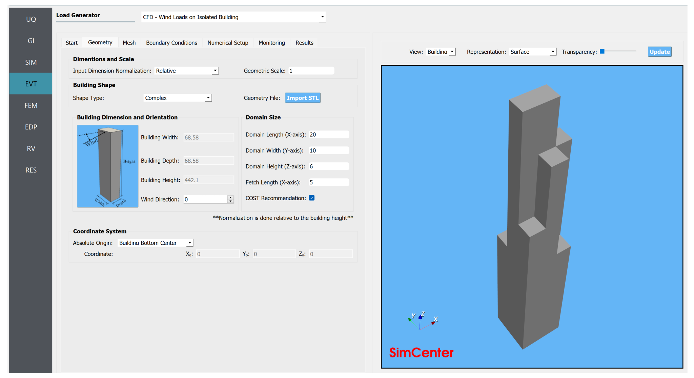
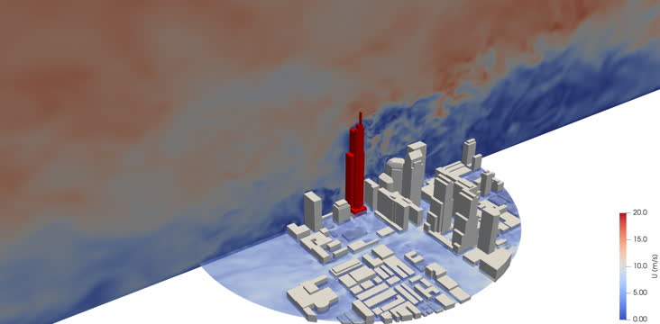

#

  
  
  
  

    

      <h3 class="subtitle"><b>WE-UQ - Desktop App</b></h3>
      <h3>Wind Engineering with Uncertainty Quantification</h3>
      <h5><i>Frank McKenna , Abiy F. Melaku, Fei Ding, Jiawei Wan, Peter Mackenzie-Helnwein, Wael Elhaddad, Michael Gardner, Dae Kun Kwon</i></h5>
      <h5>NHERI SimCenter, 2017-2024</h5>
       
    

  

---

                        

---

    
    

---

# Why Use WE-UQ?

### Wind Engineering with Uncertainty Quantification ###

This open-source research application provides an application that can be used to predict the response of a building subjected to wind events. The application is focused on quantifying the uncertainties in the predicted response, given the that the properties of the buildings and the wind events are not known exactly, and that both the simulation software and the user make simplifying assumptions in the numerical modeling of that structure. In this application, the user is required to characterize the uncertainties in the input. The application will, after utilizing the users selected sampling method, provide information that characterizes the uncertainties in the computed response measures. As the computations to make these determinations can be prohibitively expensive to perform on a user's local computer, the user has the option to perform the computations remotely on HPC resources located at the Texas Advanced Computing Center (TACC) and made available to the user through NHERI DesignSafe, the cyberinfrastructure provider for the distributed NSF funded Natural Hazards in Engineering Research Infrastructure (NHERI) facility.

This tool is under active development. Researchers are encouraged to comment on what additional
features and applications they would like to see in this
application. If you want it, chances are many of your colleagues also
would benefit from it. Additional requests should be posted at the [SimCenter forum](https://simcenter-messageboard.designsafe-ci.org/smf/index.php?board=5.0).

Please visit the [WE-UQ Research Tool webpage](https://simcenter.designsafe-ci.org/research-tools/we-uq/)
for more resources related to this tool. Additionally, this page
provides more information on the NHERI SimCenter, including other SimCenter
applications, FAQ, and how to collaborate.

### Acknowledgement

This material is based upon work supported by the National Science Foundation under grants #1612843 and #2131111

### Contact

NHERI-SimCenter nheri-simcenter@berkeley.edu
